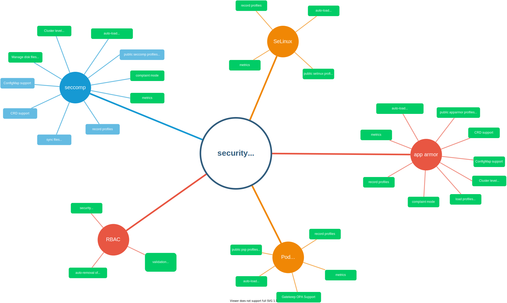

# Kubernetes Security Profiles Operator

This project is the starting point for the _Security Profiles Operator_ (SPO), an
out-of-tree Kubernetes enhancement which aims to make it easier for users to use
SELinux, seccomp and AppArmor in Kubernetes clusters.

- [Testgrid Dashboard](https://testgrid.k8s.io/sig-node-security-profiles-operator)
- [Installation and Usage](installation-usage.md)
- [Container Images](https://console.cloud.google.com/gcr/images/k8s-staging-sp-operator/GLOBAL/security-profiles-operator)
- [Release Process](./release.md)

## About

The motivation behind the project can be found in the corresponding [RFC][0].

[0]: RFC.md

Related Kubernetes Enhancement Proposals (KEPs) which have direct influence on
this project:

- [Promote seccomp to GA][1]
- [Add ConfigMap support for seccomp custom profiles][2]
- [Add KEP to create seccomp built-in profiles and add complain mode][3]

Next to those KEPs, here are existing approaches for security profiles in
the Kubernetes world:

- [AppArmor Loader][4]
- [OpenShift's Machine config operator, in charge of file management and security profiles on hosts][5]
- [seccomp-config][6]

[1]: https://github.com/kubernetes/enhancements/pull/1148
[2]: https://github.com/kubernetes/enhancements/pull/1269
[3]: https://github.com/kubernetes/enhancements/pull/1257
[4]: https://github.com/kubernetes/kubernetes/tree/c30da3839c8e13fdff59ef5115e982362b2c90ed/test/images/apparmor-loader
[5]: https://github.com/openshift/machine-config-operator/tree/master/docs
[6]: https://github.com/UKHomeOffice/seccomp-config

## Features

The SPO's features are implemented for each one of the underlying
supported technologies, namely: Seccomp, SELinux and AppArmor. 
Here's the feature parity status across them:

|                                  | Seccomp | SELinux | AppArmor |
|----------------------------------|---------|---------|----------|
|                      Profile CRD |   Yes   |   Yes   |    Yes   |
|                   ProfileBinding |   Yes   |   No    |    No    |
|       Deploy profiles into nodes |   Yes   |   Yes   |    Yes   |
| Remove profiles no longer in use |   Yes   |   Yes   |    Yes   |
|   Profile Auto-generation (logs) |   Yes   |   WIP   |    No    |
|   Profile Auto-generation (ebpf) |   Yes   |   No    |    No    |
|             Audit log enrichment |   Yes   |   WIP   |    Yes   |

For information about the security model and what permissions each features requires,
refer to SPO's [security model](security-model.md).

## Personas & User Stories

As any other piece of software, this operator is meant to help people. Thus,
the target personas have been reflected in [a document in this repo](doc/personas.md).

The functionality that this operator is meant to enable is captured
[as user stories](doc/user-stories.md). If you feel that a user story is not captured
properly, feel free to submit a Pull Request. The team will be more than happy
to review and help you reflect the requirement.

## Roadmap

The project tries to not overlap with those existing implementations to provide
valuable additions in a more secure Kubernetes context. We created a mind map to
get a better feeling about all features we want to implement to better support
some security areas within Kubernetes:

Going forwards, the operator will extend its purpose to assist Kubernetes users
to create, distribute and apply security profiles for seccomp, AppArmor, SeLinux,
PodSecurityPolicies and RBAC permissions.

## Community, discussion, contribution, and support

If you're interested in contributing to SPO, please see the [developer focused 
document](hacking.md)

We schedule a monthly meeting every last Thursday of a month.

- [Meeting Notes][8]

[8]: https://docs.google.com/document/d/1FQHYdyd7PTCi7_Vd8erPS4nztp0blvivK87HhXqz4uc/edit?usp=sharing

Learn how to engage with the Kubernetes community on the [community
page](http://kubernetes.io/community/).

You can reach the maintainers of this project at:

- [Slack #security-profiles-operator](https://kubernetes.slack.com/messages/security-profiles-operator)
- [Mailing List](https://groups.google.com/forum/#!forum/kubernetes-dev)

### Code of conduct

Participation in the Kubernetes community is governed by the [Kubernetes Code of
Conduct](code-of-conduct.md).

[owners]: https://git.k8s.io/community/contributors/guide/owners.md
[creative commons 4.0]: https://git.k8s.io/website/LICENSE
