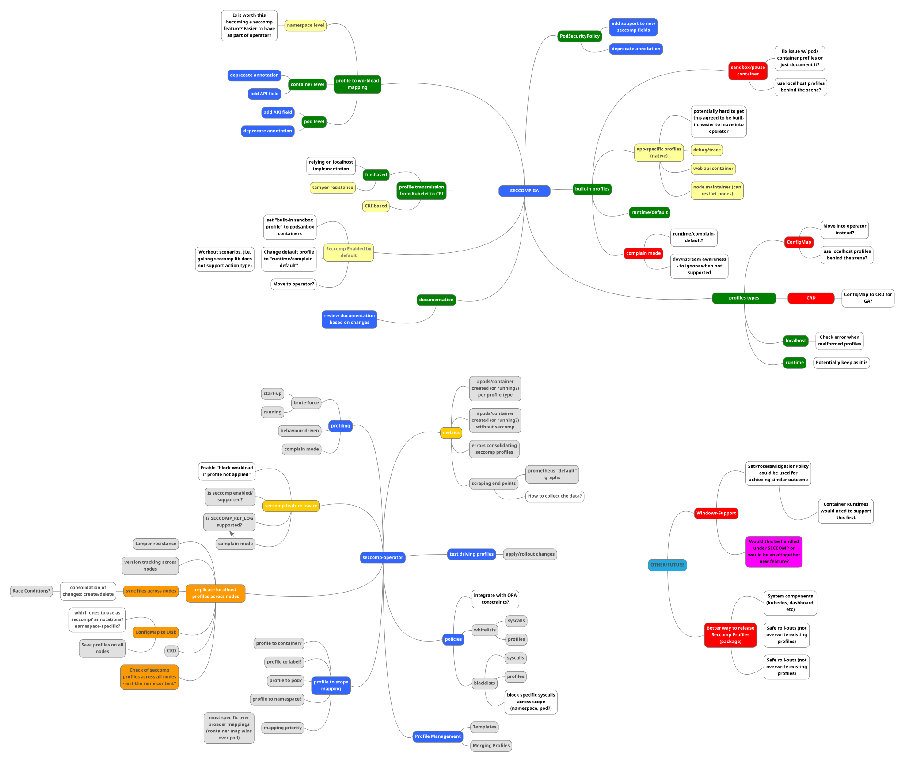

# Kubernetes Seccomp Operator

This project is the starting point for the _Seccomp Operator_, an out-of-tree
Kubernetes enhancement which aims to make managing and applying seccomp profiles
more easy and straight forward in Kubernetes.

- [Testgrid Dashboard](https://testgrid.k8s.io/sig-node-seccomp-operator)
- [Installation and Usage](installation-usage.md)
- [Container Images](https://console.cloud.google.com/gcr/images/k8s-staging-seccomp-operator/GLOBAL/seccomp-operator)

## About

The motivation behind the project can be found in the corresponding [RFC][0].

[0]: RFC.md

Related Kubernetes Enhancement Proposals (KEPs) which have direct influence on
this project:

- [Promote seccomp to GA][1]
- [Add ConfigMap support for seccomp custom profiles][2]
- [Add KEP to create seccomp built-in profiles and add complain mode][3]

Next to those KEPs, here are existing approaches for security profiles in
the Kubernetes world:

- [AppArmor Loader][4]
- [OpenShift's Machine config operator, in charge of file management and security profiles on hosts][5]
- [seccomp-config][6]

[1]: https://github.com/kubernetes/enhancements/pull/1148
[2]: https://github.com/kubernetes/enhancements/pull/1269
[3]: https://github.com/kubernetes/enhancements/pull/1257
[4]: https://github.com/kubernetes/kubernetes/tree/c30da3839c8e13fdff59ef5115e982362b2c90ed/test/images/apparmor-loader
[5]: https://github.com/openshift/machine-config-operator/tree/master/docs
[6]: https://github.com/UKHomeOffice/seccomp-config

The project tries to not overlap with those existing implementations to provide
valuable additions in a more secure Kubernetes context. We created a [MindMup
Mind-Map][7] to get a better feeling about the current situation around the
operator and seccomp support in Kubernetes in general:

[7]: https://app.mindmup.com

## Community, discussion, contribution, and support

We schedule a monthly meeting every last Thursday of a month.

- [Meeting Notes][8]

[8]: https://docs.google.com/document/d/1FQHYdyd7PTCi7_Vd8erPS4nztp0blvivK87HhXqz4uc/edit?usp=sharing

Learn how to engage with the Kubernetes community on the [community
page](http://kubernetes.io/community/).

You can reach the maintainers of this project at:

- [Slack #seccomp-operator](https://kubernetes.slack.com/messages/seccomp-operator)
- [Mailing List](https://groups.google.com/forum/#!forum/kubernetes-dev)

### Code of conduct

Participation in the Kubernetes community is governed by the [Kubernetes Code of
Conduct](code-of-conduct.md).

[owners]: https://git.k8s.io/community/contributors/guide/owners.md
[creative commons 4.0]: https://git.k8s.io/website/LICENSE
