# Documentation

The Security Profiles Operator (SPO) provides:

- A `SeccompProfile` CRD to store seccomp profiles.
- An `AppArmorProfile` CRD to store AppArmor profiles.
- A `SelinuxProfile` CRD to store SELinux profiles, and a `RawSelinuxProfile`
  CRD for policies written directly in CIL.
- A `ProfileBinding` CRD to bind security profiles to pods.
- A `ProfileRecording` CRD to record security profiles from workloads.
- A `SecurityProfilesOperatorDaemon` (SPOD) CRD to configure the operator and
  its per-node daemon.
- A `SecurityProfileNodeStatus` CRD reporting the installation state of each
  profile on each node.
- Synchronization of seccomp, AppArmor and SELinux profiles across all worker
  nodes.
- Metrics endpoints.
- A command line interface, `spoc`, for use cases outside of Kubernetes.

> **Upgrading to v1?** See the [Migration Guide](migration-guide-v1.md) for
> details on API version changes, enum normalization, and the required upgrade
> path through 1.0.x.

## Guides

- [Installation and Configuration](installation.md): installing,
  [upgrading](installation.md#upgrading) and configuring the operator
- [Security Profiles](profiles.md): creating, recording and using seccomp,
  AppArmor and SELinux profiles
- [Command Line Interface (CLI)](cli.md): using `spoc` for standalone profile
  management
- [Command Line Reference](reference/security-profiles-operator.md): flags and
  environment variables of the operator binary; see also the
  [spoc reference](reference/spoc.md)
- [Metrics](metrics.md): available metrics and Prometheus integration
- [Troubleshooting](troubleshooting.md): debugging, profiling and
  OpenShift-specific notes
- [Audit Logging Guide](audit-logging-guide.md): auditing in-pod activity with
  the JSON enricher
- [Security Model](security-model.md): the permissions each feature requires
- [Verifying Releases](verification.md): checking signatures, SBOMs and
  provenance of released artifacts
- [Migration Guide: API v1 Graduation](migration-guide-v1.md)

## Project

- [Architecture](architecture.svg)
- [RFC](RFC.md)
- [User Stories](user-stories.md)
- [Personas](personas.md)
- [Development](hacking.md)
- [Release Process](release.md)
- [Base Profiles Release Process](release-baseprofiles.md)
- [Container Images](verification.md#container-image): the released images
  below `registry.k8s.io/security-profiles-operator`, see also the
  [staging images](verification.md#staging-images)
- [Testgrid Dashboard](https://testgrid.k8s.io/sig-node-security-profiles-operator)

## Architecture

The operator consists of three components, which run in the operator namespace:

- The **manager** (Deployment `security-profiles-operator`) watches the SPOD
  configuration and creates the daemon and the webhook from it. It also merges
  recorded profiles, aggregates the per node state of each profile into its
  status, and deletes the seccomp profiles which the SPOD allow lists reject.
- The **daemon** (DaemonSet `spod`) runs on every node. It installs the
  seccomp, AppArmor and SELinux profiles on the node, the latter through
  `selinuxd`, and reports their state as `SecurityProfileNodeStatus`. Its
  optional containers record profiles (`bpf-recorder`, `log-enricher`) and
  audit in-pod activity (`json-enricher`).
- The **webhook** (Deployment `security-profiles-operator-webhook`) admits
  pods: it applies the profiles of `ProfileBinding` objects, marks the pods of
  a `ProfileRecording` for recording, and adds the metadata which the JSON
  enricher needs for `kubectl exec` and node debugging sessions. It also
  validates `RawSelinuxProfile` objects.

## Tutorials and Demos

- [Improving Containers Isolation in Kubernetes](https://www.youtube.com/watch?v=Padw5duODy4&list=PLbzoR-pLrL6prBc8UnTQ9wI3BvFYp17Xp&index=8)
  from @ccojocar - May 2023

- [Using the EBPF Superpowers To Generate Kubernetes Security Policies](https://youtu.be/3dysej_Ydcw)
  from [@mauriciovasquezbernal](https://github.com/mauriciovasquezbernal) and [@alban](https://github.com/alban) - Oct 2022

- [Securing Kubernetes Applications by Crafting Custom Seccomp Profiles](https://youtu.be/alx38YdvvzA)
  from [@saschagrunert](https://github.com/saschagrunert) - May 2022

- [Enhancing Kubernetes with the Security Profiles Operator](https://youtu.be/xisAIB3kOJo)
  from [@cmurphy](https://github.com/cmurphy) and [@saschagrunert](https://github.com/saschagrunert) - Oct 2021

- [Introduction to Seccomp and the Kubernetes Seccomp Operator](https://youtu.be/exg_zrg16SI)
  from [@saschagrunert](https://github.com/saschagrunert) and [@hasheddan](https://github.com/hasheddan) - Aug 2020
