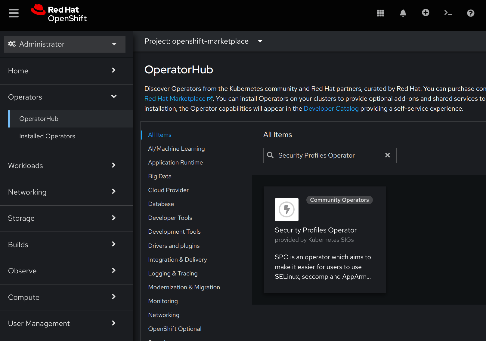

[Documentation](README.md) | **Installation** | [Profiles](profiles.md) | [CLI](cli.md) | [Metrics](metrics.md) | [Troubleshooting](troubleshooting.md)

<!-- toc -->
- [Install Operator](#install-operator)
  - [Requirements](#requirements)
  - [Installation using OLM from operatorhub.io](#installation-using-olm-from-operatorhubio)
    - [OpenShift](#openshift)
    - [Other Kubernetes distributions](#other-kubernetes-distributions)
  - [Installation using OLM using upstream catalog and bundle](#installation-using-olm-using-upstream-catalog-and-bundle)
  - [Installation using helm](#installation-using-helm)
    - [Troubleshooting and maintenance](#troubleshooting-and-maintenance)
  - [Installation on AKS](#installation-on-aks)
- [Upgrading](#upgrading)
- [Configure Operator](#configure-operator)
  - [Configure a custom kubelet root directory](#configure-a-custom-kubelet-root-directory)
  - [Set a custom priority class name for spod daemon pod](#set-a-custom-priority-class-name-for-spod-daemon-pod)
  - [Set logging verbosity](#set-logging-verbosity)
  - [Pull images from private registry](#pull-images-from-private-registry)
  - [Configure the SELinux type](#configure-the-selinux-type)
  - [Configure SELinux support](#configure-selinux-support)
  - [Customise the daemon resource requirements](#customise-the-daemon-resource-requirements)
  - [Restrict the allowed syscalls in seccomp profiles](#restrict-the-allowed-syscalls-in-seccomp-profiles)
  - [Constrain spod scheduling](#constrain-spod-scheduling)
  - [Enable memory optimization in spod](#enable-memory-optimization-in-spod)
  - [Restricting to a Single Namespace](#restricting-to-a-single-namespace)
    - [Restricting to a Single Namespace with upstream deployment manifests](#restricting-to-a-single-namespace-with-upstream-deployment-manifests)
    - [Restricting to a Single Namespace when installing using OLM](#restricting-to-a-single-namespace-when-installing-using-olm)
  - [Configuring webhooks](#configuring-webhooks)
<!-- /toc -->

## Install Operator

### Requirements

The operator requires Kubernetes v1.30 or later. The operator container image
consists of an image manifest which supports the architectures `amd64`,
`arm64` and `ppc64le`.

To deploy the operator, first install
cert-manager via `kubectl`, if you're **not** running on
[OpenShift](https://www.redhat.com/en/technologies/cloud-computing/openshift):

```sh
$ kubectl apply -f https://github.com/cert-manager/cert-manager/releases/download/v1.21.2/cert-manager.yaml
$ kubectl --namespace cert-manager wait --for condition=ready pod -l app.kubernetes.io/instance=cert-manager
```

OpenShift ships its own CA injector which means we can skip installing
cert-manager. After this step, apply the operator manifest of the desired
release:

```sh
$ kubectl apply -f https://raw.githubusercontent.com/kubernetes-sigs/security-profiles-operator/v1.1.0/deploy/operator.yaml
```

The manifests on the `main` branch reference the development images from the
staging registry and are not meant for production use.

### Installation using OLM from operatorhub.io

It is also possible to install packages from [operatorhub.io](https://operatorhub.io/operator/security-profiles-operator)
using [OLM](https://olm.operatorframework.io/).

#### OpenShift

To be able to use the OperatorHub.io resources in OpenShift, create a new
`CatalogSource` like this:

```yaml
apiVersion: operators.coreos.com/v1alpha1
kind: CatalogSource
metadata:
  name: operatorhubio
  namespace: openshift-marketplace
spec:
  displayName: Community Operators
  image: quay.io/operatorhubio/catalog:latest
  publisher: OperatorHub.io
  sourceType: grpc
```

After that, the Security Profiles Operator should then be installable via OperatorHub.



#### Other Kubernetes distributions

To install SPO, first make sure that OLM
itself is [installed](https://olm.operatorframework.io/docs/getting-started/). Then install
SPO using the provided manifest:

```sh
$ kubectl apply -f https://raw.githubusercontent.com/kubernetes-sigs/security-profiles-operator/main/examples/olm/operatorhub-io.yaml
```

SPO would be then installed in the `security-profiles-operator` namespace. To troubleshoot the installation,
check the state of the `Subscription`, `CSV` and `InstallPlan` objects in the `security-profiles-operator` namespace:

```sh
$ kubectl get ip,csv,sub -nsecurity-profiles-operator
```

### Installation using OLM using upstream catalog and bundle

The SPO upstream also creates bundles and catalogs for both released versions
and after every commit to the `main` branch. Provided that your cluster uses OLM
(see above) you can install a released version using:

```sh
$ kubectl apply -f https://raw.githubusercontent.com/kubernetes-sigs/security-profiles-operator/v1.1.0/examples/olm/install-resources.yaml
```

The same file on the `main` branch installs the latest development catalog from
the staging registry.

Note that on OpenShift, the OLM catalogs are deployed into the `openshift-marketplace` namespace, so you'd
need to replace the namespaces before deploying:

```shell
manifest=https://raw.githubusercontent.com/kubernetes-sigs/security-profiles-operator/v1.1.0/examples/olm/install-resources.yaml
$ curl $manifest | sed "s#olm#openshift-marketplace#g" | oc apply -f -
```

### Installation using helm

A helm chart is also available for installation. The chart is attached to each
[GitHub release](https://github.com/kubernetes-sigs/security-profiles-operator/releases)
as an artifact, and can be installed by executing the following shell commands:

You may also specify a different target namespace with `--namespace mynamespace` or `--namespace mynamespace --create-namespace` if it still doesn't exist.

```shell
# Install cert-manager if it is not already installed (TODO: The helm
# chart might do this one day - see issue 1062 for details):
kubectl apply -f https://github.com/cert-manager/cert-manager/releases/download/v1.21.2/cert-manager.yaml
kubectl --namespace cert-manager wait --for condition=ready pod -l app.kubernetes.io/instance=cert-manager

# Create the namespace beforehand
export spo_ns=security-profiles-operator
kubectl create ns $spo_ns

# Label and annotate the ns to make it manageable by helm. Ensure it is
# running on the privileged Pod Security Standard.
kubectl label ns $spo_ns \
  app=security-profiles-operator \
  pod-security.kubernetes.io/audit=privileged \
  pod-security.kubernetes.io/enforce=privileged \
  pod-security.kubernetes.io/warn=privileged \
  app.kubernetes.io/managed-by=Helm \
  --overwrite=true

kubectl annotate ns $spo_ns \
  "meta.helm.sh/release-name"="security-profiles-operator" \
  "meta.helm.sh/release-namespace"="$spo_ns" \
  --overwrite

# Install the chart from the release URL (or a file path if desired).
# Replace $VERSION with the desired release version. The chart archive is
# signed and has SLSA build provenance, see below.
helm install security-profiles-operator --namespace security-profiles-operator https://github.com/kubernetes-sigs/security-profiles-operator/releases/download/v${VERSION}/security-profiles-operator-${VERSION}.tgz
# Or update it with
# helm upgrade --install security-profiles-operator --namespace security-profiles-operator https://github.com/kubernetes-sigs/security-profiles-operator/releases/download/v${VERSION}/security-profiles-operator-${VERSION}.tgz
```

To verify a downloaded chart archive before installing it, see
[verifying the released artifacts](verification.md#helm-chart).

Since v1.1.0, the chart is also published as OCI artifact to
`registry.k8s.io`, and can be installed with the same preparation from there.
Note that only the release-attached `.tgz` above can be verified today: the OCI
chart is packaged separately, so its digest differs from the release archive,
and its signature and attestations currently stay in the staging registry rather
than being promoted alongside the artifact (see
[staging attestations](release.md#staging-attestations)):

```shell
helm install security-profiles-operator --namespace security-profiles-operator \
  oci://registry.k8s.io/security-profiles-operator/charts/security-profiles-operator \
  --version ${VERSION}
```

#### Troubleshooting and maintenance

These CRDs are not templated, but will be installed by default when running a helm install for the chart.
Helm does not upgrade or delete CRDs [[docs](https://helm.sh/docs/chart_best_practices/custom_resource_definitions/)],
see [Upgrading](#upgrading) for how to update them.

To remove everything or to do a new installation from scratch be sure to remove them first.

```shell
# Check in which ns is your release
helm list --all --all-namespaces

# Set here the target namespace to clean
export spo_ns=spo

# WARNING: following command will DELETE every CRD related to this project
kubectl get crds --no-headers |grep security-profiles-operator |cut -d' ' -f1 |xargs kubectl delete crd

# Uninstall the chart release from the namespace
helm uninstall --namespace $spo_ns security-profiles-operator
# WARNING: Delete the namespace
kubectl delete ns $spo_ns

# Install it again
helm upgrade --install --create-namespace --namespace $spo_ns security-profiles-operator deploy/helm/
```

### Installation on AKS

In case you installed SPO on an [AKS cluster](https://azure.microsoft.com/en-us/products/kubernetes-service/#overview), it is recommended to [configure webhook](#configuring-webhooks) to respect the [control-plane](https://learn.microsoft.com/en-us/azure/aks/faq#can-i-use-admission-controller-webhooks-on-aks) label as follows:

```sh
$ kubectl -nsecurity-profiles-operator patch spod spod  --type=merge \
    -p='{"spec":{"webhook":{"options":[{"name":"binding.spo.io","namespaceSelector":{"matchExpressions":[{"key":"control-plane","operator":"DoesNotExist"}]}},{"name":"recording.spo.io","namespaceSelector":{"matchExpressions":[{"key":"control-plane","operator":"DoesNotExist"}]}}]}}}'
```

Afterwards, validate spod has been patched successfully by ensuring the `Running` state:

```sh
$ kubectl -nsecurity-profiles-operator get spod spod
NAME   STATE
spod   Running
```

## Upgrading

Read the release notes of every release between the installed one and the
target release before upgrading. Upgrades from releases before v1.0.0 have to
go through the latest v1.0.x release first, see the
[Migration Guide](migration-guide-v1.md).

For installations from the release manifests, apply the manifest of the new
release, for example:

```sh
kubectl apply -f https://raw.githubusercontent.com/kubernetes-sigs/security-profiles-operator/v1.1.0/deploy/operator.yaml
```

For Helm installations, apply the CRDs of the new release before upgrading the
chart, because Helm never updates the CRDs of an installed chart. Replace
`$VERSION` with the target release version, as in the installation
instructions above:

```shell
kubectl apply --server-side --force-conflicts -f \
  "https://raw.githubusercontent.com/kubernetes-sigs/security-profiles-operator/v${VERSION}/deploy/helm/crds/crds.yaml"
helm upgrade security-profiles-operator --namespace security-profiles-operator \
  https://github.com/kubernetes-sigs/security-profiles-operator/releases/download/v${VERSION}/security-profiles-operator-${VERSION}.tgz
```

OLM installations are upgraded by OLM according to the `installPlanApproval`
of their `Subscription`, including the CRDs.

## Configure Operator

### Configure a custom kubelet root directory

You can configure a custom kubelet root directory in case your cluster is not using the default `/var/lib/kubelet` path.
You can achieve this by setting the environment variable `KUBELET_DIR` in the operator deployment. This environment variable will
be then set in the manager container as well as it will be propagated into the containers part of spod daemonset.

Furthermore, you can configure a custom kubelet root directory for each node or a pool of worker nodes inside the cluster. This
can be achieved by applying the following label on each node object which has a custom path:

```
kubelet.kubernetes.io/directory-location: mnt-resource-kubelet
```

Where the value of the label is the kubelet root directory path, by replacing `/` with `-`. For example the value above is translated
by the operator from `mnt-resource-kubelet` into path `/mnt/resource/kubelet`.

The last component of the path has to be `kubelet`, for example `var-lib-k0s-kubelet` (`/var/lib/k0s/kubelet`) or
`var-snap-microk8s-common-var-lib-kubelet` (`/var/snap/microk8s/common/var/lib/kubelet`). Kubelets can set this label
on their own node, so the operator ignores other values, reports them as `InvalidKubeletDirLabel` warning event on the
spod object and uses the default kubelet root directory for such nodes.

The spod daemonset only mounts the kubelet root directories from the host, not the whole host filesystem. Because
the daemonset uses the same pod template on every node, each distinct directory from these labels gets mounted
(and created if missing) on all nodes. Adding a node with a new kubelet root directory, or changing the label to a
new directory, rolls out the spod daemonset on all nodes. Directories which are no longer referenced by any node,
for example after removing the label or the last node using it, stay mounted until the spod daemonset gets rolled
out for another reason, like a spod configuration change or a new kubelet root directory.

### Set a custom priority class name for spod daemon pod

The default priority class name of the spod daemon pod is set to `system-node-critical`. A custom priority class name can be configured
in the SPOD configuration by setting a value in the `priorityClassName` field.

```
> kubectl -n security-profiles-operator patch spod spod --type=merge -p '{"spec":{"scheduling":{"priorityClassName":"my-priority-class"}}}'
securityprofilesoperatordaemon.security-profiles-operator.x-k8s.io/spod patched
```

This is useful in situations when the spod daemon pod remains in `Pending` state, because there isn't enough capacity on the related
node to be scheduled.

### Set logging verbosity

The operator supports the default logging verbosity of `0` and an enhanced `1`.
To switch to the enhanced logging verbosity, patch the spod config by adjusting
the value:

```
> kubectl -n security-profiles-operator patch spod spod --type=merge -p '{"spec":{"verbosity":1}}'
securityprofilesoperatordaemon.security-profiles-operator.x-k8s.io/spod patched
```

The daemon should now indicate that it's using the new logging verbosity:

```
> kubectl -n security-profiles-operator logs --selector name=spod -c security-profiles-operator | head -n1
I1111 15:13:16.942837       1 main.go:182]  "msg"="Set logging verbosity to 1"
```

### Pull images from private registry

The container images from spod pod can be pulled from a private registry. This can be achieved by defining the `imagePullSecrets`
inside of the SPOD configuration.

### Configure the SELinux type

The operator uses by default the `spc_t` SELinux type in the security context of the daemon pod. This can be easily
changed to a different SELinux type by patching the spod config as follows:

```
> kubectl -n security-profiles-operator patch spod spod --type=merge -p '{"spec":{"selinux":{"typeTag":"unconfined_t"}}}'
securityprofilesoperatordaemon.security-profiles-operator.x-k8s.io/spod patched
```

The `ds/spod` should now be updated by the manager with the new SELinux type, and all daemon pods recreated:

```
> kubectl -n security-profiles-operator get ds spod -o yaml | grep unconfined_t -B2
          runAsUser: 65535
          seLinuxOptions:
            type: unconfined_t
--
          runAsUser: 0
          seLinuxOptions:
            type: unconfined_t
--
          runAsUser: 0
          seLinuxOptions:
            type: unconfined_t
```

### Configure SELinux support

Besides `selinux.enable` and `selinux.typeTag`, the `selinux` section of the
SPOD configuration provides the following settings:

- `enableRawSelinuxProfiles` (default `true`): set it to `false` to not start
  the `RawSelinuxProfile` controller.
- `customTemplatesConfigMap`: the name of a ConfigMap in the operator namespace
  containing `.cil` files which replace the templates bundled with selinuxd.
  This is useful on distributions like Flatcar Linux, whose SELinux policy base
  is incompatible with the bundled templates. Changes to the ConfigMap contents
  require restarting the daemon pods.
- `options`: restrictions for the `SelinuxProfile` objects, see the
  [SELinux profile](profiles.md#selinux-profile) section.

```
kubectl -n security-profiles-operator patch spod spod --type merge -p \
  '{"spec":{"selinux":{"enableRawSelinuxProfiles":false,"customTemplatesConfigMap":"my-templates"}}}'
```

### Customise the daemon resource requirements

The default resource requirements of the daemon container can be adjusted by using the field `daemonResourceRequirements`
from the SPOD configuration as follows:

```
kubectl -n security-profiles-operator patch spod spod --type merge -p \
  '{"spec":{"daemonResourceRequirements": {"requests": {"memory": "256Mi", "cpu": "250m"}, "limits": {"memory": "512Mi", "cpu": "500m"}}}}'
```

These values can also be specified via the Helm chart.

### Restrict the allowed syscalls in seccomp profiles

The operator doesn't restrict by default the allowed syscalls in the seccomp profiles. This means that any
syscall can be allowed in a seccomp profile installed via the operator. This can be changed by defining the
list of allowed syscalls in the spod configuration as follows:

```
kubectl -n security-profiles-operator patch spod spod --type merge -p \
  '{"spec":{"security":{"allowedSyscalls": ["exit", "exit_group", "futex", "nanosleep"]}}}'
```

From now on, the operator will only install the seccomp profiles which have only a subset of syscalls defined
into the allowed list. All profiles not complying with this rule, it will be rejected.

Also every time when the list of allowed syscalls is modified in the spod configuration, the operator will
automatically identify the already installed profiles which are not compliant and remove them.

By default, the syscalls of all rules using the actions `SCMP_ACT_ALLOW`, `SCMP_ACT_LOG`, `SCMP_ACT_TRACE` and
`SCMP_ACT_NOTIFY` are checked against the allowed list, and profiles using one of these actions as
`defaultAction` are rejected. The checked actions can be limited to a subset of them by using
`security.allowedSeccompActions`:

```
kubectl -n security-profiles-operator patch spod spod --type merge -p \
  '{"spec":{"security":{"allowedSeccompActions": ["SCMP_ACT_ALLOW"]}}}'
```

### Constrain spod scheduling

You can constrain the spod scheduling via the spod configuration by setting either the `tolerations` or `affinity`.

```
kubectl -n security-profiles-operator patch spod spod --type merge -p \
  '{"spec":{"scheduling":{"tolerations": [{...}]}}}'
```

```
kubectl -n security-profiles-operator patch spod spod --type merge -p \
  '{"spec":{"scheduling":{"affinity": {...}}}}'
```

These settings are also available in the Helm chart.

### Enable memory optimization in spod

The controller running inside of spod daemon process is watching all pods available in the cluster when profile recording
is enabled. It will perform some pre-filtering before the reconciliation to select only the pods running on local
node as well as pods annotated for recording, but this operation takes place after all pods objects are loaded
into the cache memory of the informer. This can lead to very high memory usage in large clusters with 1000s of pods, resulting
in spod daemon running out of memory or crashing.

In order to prevent this situation, the spod daemon can be configured to only load into the cache memory the pods explicitly
labeled for profile recording. This can be achieved by enabling memory optimization as follows:

```
kubectl -n security-profiles-operator patch spod spod --type=merge -p '{"spec":{"enableMemoryOptimization":true}}'
```

If you want now to record a security profile for a pod, this pod needs to be explicitly labeled with `spo.x-k8s.io/enable-recording`,
as follows:

```
apiVersion: v1
kind: Pod
metadata:
  name: my-recording-pod
  labels:
    spo.x-k8s.io/enable-recording: "true"
```

### Restricting to a Single Namespace

The security-profiles-operator can optionally be restricted to a single
namespace. The profiles are cluster scoped and not affected by this, but the
namespaced resources, like `ProfileBinding` and `ProfileRecording` objects and
the pods they select, are only watched in that namespace. To modify the
operator deployment to run in a single namespace, use the
`namespace-operator.yaml` manifest with your namespace of choice:

#### Restricting to a Single Namespace with upstream deployment manifests

```sh
NAMESPACE=<your-namespace>

curl https://raw.githubusercontent.com/kubernetes-sigs/security-profiles-operator/v1.1.0/deploy/namespace-operator.yaml | sed "s/NS_REPLACE/$NAMESPACE/g" | kubectl apply -f -
```

#### Restricting to a Single Namespace when installing using OLM

Since restricting the operator to a single namespace amounts to setting the `RESTRICT_TO_NAMESPACE`
environment variable, the easiest way to set that (or any other variable for SPO) is by editing the
`Subscription` object and setting the `spec.config.env` field:

```yaml
spec:
  config:
    env:
      - name: RESTRICT_TO_NAMESPACE
        value: <your-namespace>
```

OLM would then take care of updating the operator `Deployment` object with the new environment variable.
Please refer to the [OLM documentation](https://github.com/operator-framework/operator-lifecycle-manager/blob/master/doc/design/subscription-config.md#res)
for more details on tuning the operator's configuration with the `Subscription` objects.

### Configuring webhooks

Both profile binding and profile recording make use of webhooks. Their configuration (an instance of
`MutatingWebhookConfiguration` CR) is managed by SPO itself and not part of the deployed YAML manifests.
The mutating webhooks are `binding.spo.io`, `recording.spo.io`, `execmetadata.spo.io` and
`nodedebuggingpod.spo.io`.
While the defaults should be acceptable for the majority of users and the webhooks do nothing unless an
instance of either `ProfileBinding` or `ProfileRecording` exists in a namespace and in addition the
namespace must be labeled with either `spo.x-k8s.io/enable-binding` or `spo.x-k8s.io/enable-recording`
respectively by default, it might still be useful to configure the webhooks.

In order to change webhook's configuration, the `spod` CR exposes
`webhook.options` that allows the `failurePolicy`, `namespaceSelector`
and `objectSelector` to be set. This way you can set the webhooks to
"soft-fail" or restrict them to a subset of a namespaces and inside those namespaces
select only a subset of object matching the `objectSelector` so that even
if the webhooks had a bug that would prevent them from running at all,
other namespaces or resources wouldn't be affected.

For example, to set the `binding.spo.io` webhook's configuration to ignore errors as well as restrict it
to a subset of namespaces labeled with `spo.x-k8s.io/bind-here=true`, create the following patch file
`/tmp/spod-wh.patch`:

```yaml
spec:
  webhook:
    options:
      - name: binding.spo.io
        failurePolicy: Ignore
        namespaceSelector:
          matchExpressions:
            - key: spo.x-k8s.io/bind-here
              operator: In
              values:
                - "true"
```

And patch the `spod/spod` instance:

```shell
$ kubectl -n security-profiles-operator patch spod spod --patch-file /tmp/spod-wh.patch --type=merge
```

To view the resulting `MutatingWebhookConfiguration`, call:

```shell
$ kubectl get MutatingWebhookConfiguration spo-mutating-webhook-configuration -oyaml
```

The webhook configuration and its related resources can also be deployed statically, for example by using the
`deploy/webhook-operator.yaml` manifest, which runs the operator with `--webhook=false`. In this case, the operator
sets `webhook.staticConfig` to `true` in the SPOD it creates, and does not create or update the webhook configuration
and its related resources, so `webhook.options` do not apply either.

The Exec Metadata and Node Debugging Pod Metadata Webhook works in conjunction with the JSON Log Enricher. It's enabled only when JSON Log Enricher is
enabled. For details on its configuration, please refer to the [JSON Log Enricher](profiles.md#audit-json-log-enricher) section.

Next to the mutating webhooks, SPO manages the `spo-validating-webhook-configuration`
`ValidatingWebhookConfiguration`. Its `rawselinuxprofile-validation.spo.io` webhook
rejects `RawSelinuxProfile` objects with CIL statements which would affect the
whole node instead of the profile, like `class`, `role` or `typepermissive`. It uses
the `Fail` failure policy and cannot be configured with `webhook.options`.
