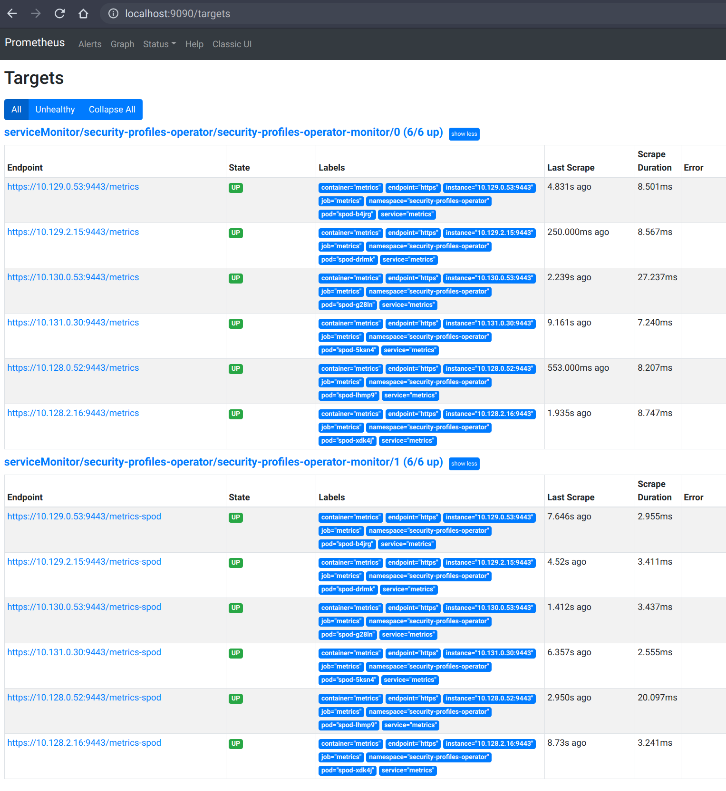
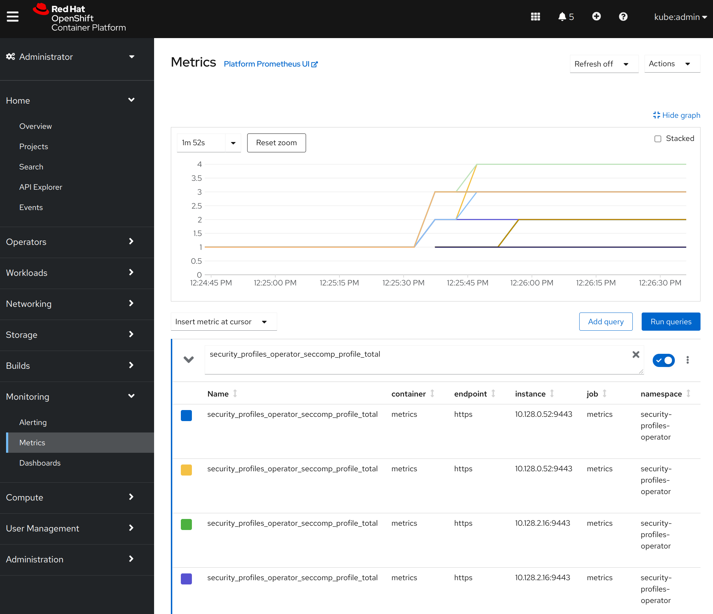

[Documentation](README.md) | [Installation](installation.md) | [Profiles](profiles.md) | [CLI](cli.md) | **Metrics** | [Troubleshooting](troubleshooting.md)

<!-- toc -->
- [Metrics](#metrics)
  - [Available metrics](#available-metrics)
  - [Metric cardinality](#metric-cardinality)
  - [Automatic ServiceMonitor deployment](#automatic-servicemonitor-deployment)
<!-- /toc -->

## Metrics

The security-profiles-operator provides two metrics endpoints, which are secured
by default using the [`WithAuthenticationAndAuthorization`](https://pkg.go.dev/sigs.k8s.io/controller-runtime/pkg/metrics/filters#WithAuthenticationAndAuthorization)
feature of the controller-runtime. All metrics are exposed via the `metrics` service within the
`security-profiles-operator` namespace:

```
> kubectl get svc/metrics -n security-profiles-operator
NAME      TYPE        CLUSTER-IP   EXTERNAL-IP   PORT(S)   AGE
metrics   ClusterIP   10.0.0.228   <none>        443/TCP   43s
```

The operator ships the `spo-metrics-client` cluster role, which allows reading
the metrics, and binds it to the `spo-metrics-client` service account in the
`security-profiles-operator` namespace. There are two metrics paths available:

- `metrics.security-profiles-operator/metrics`: for controller runtime metrics
- `metrics.security-profiles-operator/metrics-spod`: for the operator daemon metrics

The service account does not mount its token into pods by default. To retrieve
the metrics, request a token for it and query the service endpoint with it:

```
> TOKEN=$(kubectl create token spo-metrics-client -n security-profiles-operator)
> kubectl run --rm -i --restart=Never --image=registry.fedoraproject.org/fedora-minimal:latest \
    -n security-profiles-operator metrics-test --env TOKEN="$TOKEN" -- bash -c \
    'curl -ks -H "Authorization: Bearer $TOKEN" https://metrics.security-profiles-operator/metrics-spod'
…
# HELP security_profiles_operator_seccomp_profile_total Amount of seccomp profile operations.
# TYPE security_profiles_operator_seccomp_profile_total counter
security_profiles_operator_seccomp_profile_total{operation="delete"} 1
security_profiles_operator_seccomp_profile_total{operation="update"} 2
…
```

The `spo-metrics-client-token` secret holds a long lived token of the same
service account, which the [automatically deployed `ServiceMonitor`](#automatic-servicemonitor-deployment)
uses. Other pods in the namespace, which run with the `default` service
account, have no access to the metrics. The `metrics-token` secret of earlier
releases holds a token of the `default` service account, which does not grant
access anymore, so it can be deleted.

If the metrics have to be retrieved with a different service account, add it
to the `spo-metrics-client` `ClusterRoleBinding` or create a new binding to the
`spo-metrics-client` cluster role:

```
> kubectl get clusterrolebinding spo-metrics-client -o wide
NAME                 ROLE                             AGE   USERS   GROUPS   SERVICEACCOUNTS
spo-metrics-client   ClusterRole/spo-metrics-client   35m                    security-profiles-operator/spo-metrics-client
```

Every metrics server pod from the DaemonSet runs with the same set of certificates
(secret `metrics-server-cert`: `tls.crt` and `tls.key`) in the
`security-profiles-operator` namespace. This means a pod like this can be used
to omit the `--insecure/-k` flag:

```yaml
---
apiVersion: v1
kind: Pod
metadata:
  name: test-pod
spec:
  serviceAccountName: spo-metrics-client
  # The service account does not mount its token by default.
  automountServiceAccountToken: true
  containers:
    - name: test-container
      image: registry.fedoraproject.org/fedora-minimal:latest
      command:
        - bash
        - -c
        - |
          curl -s --cacert /var/run/secrets/metrics/ca.crt \
            -H "Authorization: Bearer $(cat /var/run/secrets/kubernetes.io/serviceaccount/token)" \
            https://metrics.security-profiles-operator/metrics-spod
      volumeMounts:
        - mountPath: /var/run/secrets/metrics
          name: metrics-cert-volume
          readOnly: true
  restartPolicy: Never
  volumes:
    - name: metrics-cert-volume
      secret:
        defaultMode: 420
        secretName: metrics-server-cert
```

The operator and webhook pods serve their own controller-runtime metrics on
port 8443 via TLS, with a self-signed certificate. These endpoints are not part
of the `metrics` service and require a bearer token of a service account bound
to the `spo-metrics-client` cluster role as well:

```
> TOKEN=$(kubectl create token spo-metrics-client -n security-profiles-operator)
> curl -ks -H "Authorization: Bearer $TOKEN" https://<pod-ip>:8443/metrics
```

Access to the metrics endpoints of the daemon can be made unauthenticated by
setting `enableInsecureMetricsAccess` in the SPOD configuration. This disables
TLS and authentication for those endpoints, and the automatically deployed
`ServiceMonitor` (see below) then scrapes them via HTTP. Only use this in
trusted environments:

```
> kubectl -n security-profiles-operator patch spod spod --type=merge -p '{"spec":{"enableInsecureMetricsAccess":true}}'
```

Setting the environment variable `ENABLE_INSECURE_METRICS_ACCESS=true` in the
operator deployment makes the daemon endpoints unauthenticated as well, but
does not switch the `ServiceMonitor` to HTTP, so prefer the SPOD field.

### Available metrics

The controller-runtime (`/metrics`) as well as the DaemonSet endpoint
(`/metrics-spod`) already provide a set of default metrics. Besides that, those
additional metrics are provided by the daemon, which are always prefixed with
`security_profiles_operator_`:

| Metric Key                      | Labels                                                                  | Type    | Purpose                                                                                       |
| ------------------------------- | ----------------------------------------------------------------------- | ------- | --------------------------------------------------------------------------------------------- |
| `seccomp_profile_total`         | `operation`                                                             | Counter | Amount of seccomp profile operations.                                                         |
| `seccomp_profile_audit_total`   | `node`, `namespace`, `pod`, `container`, `syscall`                      | Counter | Amount of seccomp profile audits. Requires the log enricher to be enabled.                    |
| `seccomp_profile_bpf_total`     | `node`, `mount_namespace`, `profile`                                    | Counter | Amount of seccomp profile bpf events. Requires the bpf recorder to be enabled.                |
| `seccomp_profile_error_total`   | `reason`                                                                | Counter | Amount of seccomp profile errors.                                                             |
| `selinux_profile_total`         | `operation`                                                             | Counter | Amount of SELinux profile operations.                                                         |
| `selinux_profile_audit_total`   | `node`, `namespace`, `pod`, `container`, `scontext`, `tcontext`         | Counter | Amount of SELinux profile audits. Requires the log enricher to be enabled.                    |
| `selinux_profile_error_total`   | `reason`                                                                | Counter | Amount of SELinux profile errors.                                                             |
| `apparmor_profile_total`        | `operation`                                                             | Counter | Amount of AppArmor profile operations.                                                        |
| `apparmor_profile_audit_total`  | `node`, `namespace`, `pod`, `container`, `profile`, `operation`, `apparmor` | Counter | Amount of AppArmor profile audits. Requires the log enricher to be enabled.               |
| `apparmor_profile_error_total`  | `profile`, `reason`                                                     | Counter | Amount of AppArmor profile errors.                                                            |
| `apparmor_profile_denial_total` | `profile`, `operation`                                                  | Counter | Amount of AppArmor profile denials. Requires the log enricher to be enabled.                  |

The labels have the following meaning:

- `operation` of `seccomp_profile_total`, `selinux_profile_total` and
  `apparmor_profile_total` is `update` when the daemon installed a new or
  changed profile on its node, and `delete` when it removed a profile from its
  node.
- `node`, `namespace`, `pod` and `container` identify the container which
  caused the audit event. `node` is the node of the daemon.
- `syscall` is the name of the audited system call.
- `scontext` and `tcontext` are the SELinux source and target contexts of the
  audited access.
- `profile` of the AppArmor audit and denial metrics is the AppArmor profile
  the kernel reported for the event. `profile` of `apparmor_profile_error_total`
  is the name of the `AppArmorProfile` object which failed to reconcile.
- `operation` of `apparmor_profile_audit_total` and
  `apparmor_profile_denial_total` is the AppArmor operation of the audit
  event, for example `open`, `exec` or `capable`.
- `apparmor` of `apparmor_profile_audit_total` is the action which AppArmor
  reported for the event, for example `DENIED`, `ALLOWED` (a profile in
  complain mode) or `AUDIT`. Every event with `DENIED` also increments
  `apparmor_profile_denial_total`.
- `mount_namespace` and `profile` of `seccomp_profile_bpf_total` are the mount
  namespace of a new process the bpf recorder saw, and the name of the profile
  which gets recorded for its container.
- `reason` of the error metrics is the reason of the failure, which the daemon
  also uses for the warning event on the profile or node.

The error metrics use these reasons:

- `seccomp_profile_error_total`: `SeccompNotSupportedOnNode`,
  `InvalidSeccompProfile`, `ProfileNotAllowed`, `CannotPullSeccompProfile`,
  `CannotSaveSeccompProfile`, `CannotRemoveSeccompProfile`,
  `CannotUpdateSeccompProfile`, `SeccompProfileFileConflict` and
  `CannotUpdateNodeStatus`.
- `selinux_profile_error_total`: `CannotSaveSelinuxPolicy`,
  `CannotUpdatePolicyStatus`, `CannotRemoveSelinuxPolicy`,
  `CannotContactSelinuxd`, `CannotWritePolicyFile`, `CannotGetPolicyStatus`,
  `SystemModuleConflict` and `SelinuxPolicyNameConflict`.
- `apparmor_profile_error_total`: `AppArmorNotSupportedOnNode`,
  `CannotLoadAppArmorProfile`, `CannotUnloadAppArmorProfile`,
  `CannotUpdateAppArmorProfile` and `CannotUpdateNodeStatus`.

### Metric cardinality

The `*_audit_total` metrics and `seccomp_profile_bpf_total` are labeled per
workload. Their label sets contain values which change constantly on a busy
cluster:

- `pod` is unique per pod and turns over on every restart, rollout or job run
- `syscall` has a few hundred possible values
- `mount_namespace` is a raw kernel identifier, unique per container

Every observed label combination becomes a distinct Prometheus time series. The
spod DaemonSet drops a series after one hour without increments, but Prometheus
keeps the scraped series for its whole retention. On clusters with a lot of pod
churn, or when the log enricher is enabled cluster wide, this adds up quickly.

These metrics are most useful while recording or debugging a workload. If you
scrape them permanently, consider dropping the high cardinality labels in the
scrape config, for example:

```yaml
metricRelabelings:
  - sourceLabels: [__name__]
    regex: security_profiles_operator_.*_audit_total
    targetLabel: pod
    replacement: ""
    action: replace
```

Alternatively, restrict the log enricher to the namespaces you are actively
recording via `spec.enricher.logEnricherFilters`.

### Automatic ServiceMonitor deployment

If the Kubernetes cluster has the [Prometheus
Operator](https://github.com/prometheus-operator/prometheus-operator) deployed,
then the Security Profiles Operator will automatically create a `ServiceMonitor`
resource within its namespace. This monitor allows automatic metrics discovery
within the cluster, which is pointing to the right service, TLS certificates as
well as bearer token secret.

When running on OpenShift and deploying upstream manifests or upstream OLM
bundles, then the only configuration to be done is enabling user workloads
by applying the following config map:

```yaml
apiVersion: v1
kind: ConfigMap
metadata:
  name: cluster-monitoring-config
  namespace: openshift-monitoring
data:
  config.yaml: |
    enableUserWorkload: true
```

Note that the above is not needed when deploying the Security Profiles Operator
on OpenShift from the Red Hat catalog, in that case, the Security Profiles
Operator should be auto-configured and Prometheus should be able to scrape
metrics automatically.

After that, the Security Profiles Operator can be deployed or updated, which
will reconcile the `ServiceMonitor` into the cluster:

```
> kubectl -n security-profiles-operator logs security-profiles-operator-d7c8cfc86-47qh2 | grep monitor
I0520 09:29:35.578165       1 spod_controller.go:282] spod-config "msg"="Deploying operator service monitor"
```

```
> kubectl -n security-profiles-operator get servicemonitor
NAME                                 AGE
security-profiles-operator-monitor   35m
```

We can now verify in the Prometheus targets that all endpoints are serving the
metrics:

```
> kubectl port-forward -n openshift-user-workload-monitoring pod/prometheus-user-workload-0 9090
Forwarding from 127.0.0.1:9090 -> 9090
Forwarding from [::1]:9090 -> 9090
```



The OpenShift UI is now able to display the operator metrics, too:


