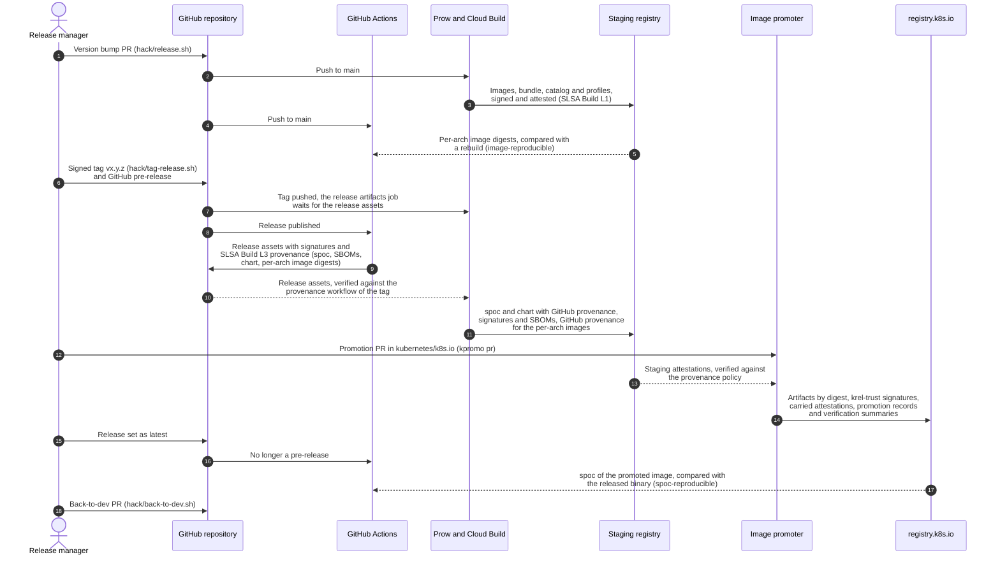

# Releasing a new version of the security-profiles-operator

A new security-profiles-operator release is done by overall three Pull
Requests (PRs): the version bump, the image promotion in
[kubernetes/k8s.io](https://github.com/kubernetes/k8s.io) and the back-to-dev
PR. Track it in a new `Release vx.y.z` issue from the
[release template](../.github/ISSUE_TEMPLATE/release.md).

No other PR may get merged between the version bump and the merge of the
promotion PR. Add the `tide/merge-blocker` label to the release issue as soon
as the version bump PR is merged, and remove it only after the promotion PR is
merged, before the back-to-dev PR. Every build of `main` tags its staging
images with the version of the [`VERSION`](../VERSION) file, so a commit merged
in between moves the `vx.y.z` tags, which `kpromo pr` promotes, to images of
another commit. Those either fail the release artifacts job or, if they are
pushed after it ran, get promoted without the GitHub provenance of the
release, with only the SLSA Build L1 provenance of Cloud Build, see
[per-arch images](#per-arch-images).

The release takes several hours, most of it waiting for the staging build, the
release workflows, the release artifacts job and the review of the promotion
PR, and needs one of the repository [owners](../OWNERS) at hand to merge the
PRs.

## Who does what

A release passes through four instances. Each of them signs with identities
of its own. The commands of [verification.md](verification.md) check the ones
of the builds and the image promoter, and `git verify-tag vx.y.z` the
signature of the release manager on the tag:

| Instance | What it does | Signs as |
| -------- | ------------ | -------- |
| Release manager | version bump PR, release tag, GitHub release, promotion PR, back-to-dev PR | the git signing key of the tag |
| Prow with Cloud Build, in the `k8s-staging-images` project | builds every push to `main` and pushes the images, the bundle, the catalog and the profiles to staging with their attestations (`post-security-profiles-operator-push-image`); publishes `spoc` and the chart of a `v*` tag to staging and attaches the GitHub provenance (`post-security-profiles-operator-push-release-artifacts`) | `sp-operator-sa@k8s-staging-images.iam.gserviceaccount.com` |
| GitHub Actions | builds `spoc`, the SBOMs and the chart and attaches them with their SLSA Build L3 provenance to the GitHub release, rebuilds the per-arch images and attaches the provenance of their digests | the `build.yml` and `helm-chart-package.yaml` workflows of the tag for the signatures, the `provenance.yml` workflow of the tag for the provenance |
| Image promoter, the promotion jobs of [kubernetes/k8s.io](https://github.com/kubernetes/k8s.io) | verifies the staging attestations against the provenance policy, copies the artifacts by digest to `registry.k8s.io`, carries the attestations and writes a verification summary | `krel-trust@k8s-releng-prod.iam.gserviceaccount.com`, and `promoter-summaries@k8s-releng-prod.iam.gserviceaccount.com` for the summaries |

The steps of a release in their order, the sections below describe each of
them:



Solid arrows trigger or write something, dashed ones show what the instance
they point to reads and verifies. Users and verifiers like
[nri-supply-chain](https://github.com/saschagrunert/nri-supply-chain) only
read from `registry.k8s.io` and the GitHub release, see
[verification.md](verification.md).

## Release steps

Run the `./hack/release.sh x.y.z` script by replacing the appropriate version.
The script basically:

- bumps the [`VERSION`](../VERSION) file to the target version
- changes the `images` `newName`/`newTag` fields of
  [./deploy/kustomize-deployment/kustomization.yaml](../deploy/kustomize-deployment/kustomization.yaml)
  from `us-central1-docker.pkg.dev/k8s-staging-images/sp-operator/security-profiles-operator` to
  `registry.k8s.io/security-profiles-operator/security-profiles-operator` (`newName`) and the
  corresponding tag (`newTag`).
- changes the `image` in the `CatalogSource` in the same way at
  [./examples/olm/install-resources.yaml](/examples/olm/install-resources.yaml)
- changes the image of the webhook overlay
  [./deploy/overlays/webhook/kustomization.yaml](../deploy/overlays/webhook/kustomization.yaml)
  and the image, tag and pull policy in the Helm chart
  [values](../deploy/helm/values.yaml) and its [README](../deploy/helm/README.md)
  in the same way
- changes [`hack/ci/e2e-olm.sh`](/hack/ci/e2e-olm.sh) and the e2e tests to
  use the released images from `registry.k8s.io` instead of the staging ones,
  for example `registry.k8s.io/security-profiles-operator/security-profiles-operator-catalog:vx.y.z`
  instead of
  `us-central1-docker.pkg.dev/k8s-staging-images/sp-operator/security-profiles-operator-catalog:latest`
- updates [./dependencies.yaml](../dependencies.yaml) `spo-current` version as
  well as its linked files. Run `make verify-dependencies` to verify the
  results.
- updates the versioned install manifests in
  [`installation.md`](installation.md) and the `spoc` image and version in
  [`cli.md`](cli.md)
- updates ./hack/deploy-localhost.patch to match the new deployment
- updates [./deploy/base/clusterserviceversion.yaml](../deploy/base/clusterserviceversion.yaml)
  to change `replaces` to the latest available version on OperatorHub as well as
  update the `containerImage`.
- runs `make bundle`

Create a new PR from the proposed changes and wait for the CI to succeed.

After this PR has been merged, we have to watch out the successful build of the
container image via the automatically triggered
`post-security-profiles-operator-push-image` post submit job in prow. All jobs of this
type can be found either on the commit status on the `main` branch or [in prow
directly](https://prow.k8s.io/?job=post-security-profiles-operator-push-image).

Before tagging, also check that the
[`image-reproducible`](../.github/workflows/image-reproducible.yml) workflow
succeeded for the push of the version bump commit to `main`. It rebuilds the
per-arch images on GitHub Actions and compares them with the ones Cloud Build
pushed to staging for the commit. The release attests the digests of its own
rebuild, so staging images that are not reproducible fail the release
artifacts job later, see [per-arch images](#per-arch-images).

If the image got built successfully, tag the release. Tags created in the
GitHub UI are lightweight and unsigned, so check out the merged commit of the
first PR and run [`hack/tag-release.sh`](../hack/tag-release.sh). If another PR
got merged after the version bump anyway, tag the newest commit of `main`
instead, as long as its `VERSION` file still says x.y.z, once its staging
build and `image-reproducible` run succeeded: the `vx.y.z` staging tags point
to its images. Staging builds of two commits can run at the same time, and
the `vx.y.z` tags point to the images of the one that finished last, so check
before tagging that `crane digest` gives the same digest for the `vx.y.z` tag
and for the tag of the commit, which ends with `-g<abbreviated commit>`, of
the manifest list and of every per-arch image:

```console
> for image in security-profiles-operator{,-amd64,-arm64,-ppc64le}; do
    repo=us-central1-docker.pkg.dev/k8s-staging-images/sp-operator/$image
    tag=$(crane ls $repo | grep -- "-g$(git rev-parse --short=7 HEAD)" | tail -1)
    echo "$image $(crane digest $repo:vx.y.z) $(crane digest $repo:$tag)"
  done
```

The script creates the signed, annotated tag `vx.y.z` for the version in the
[`VERSION`](../VERSION) file, which needs a git signing key
(`user.signingkey`, GPG or SSH with `gpg.format=ssh`), and verifies it with
`git verify-tag`. It refuses to tag a development version, a dirty tree or an
existing tag, and pushes nothing. Check the signature once more and push the
tag to `kubernetes-sigs/security-profiles-operator`:

```console
> git verify-tag vx.y.z
> git push <upstream remote> vx.y.z
```

The script prints the push command with the remote whose push URL is
`kubernetes-sigs/security-profiles-operator`, which is often not `origin` but
a fork, or with that URL if no remote pushes there (for example with a
`no_push` push URL), set `REMOTE` to use another one. A tag pushed only to a
fork is missing upstream, and creating the release for it in the GitHub UI
silently creates a lightweight, unsigned tag instead.
The `v*` tags have to be protected in the repository settings (a tag ruleset
which restricts their creation, update and deletion to the release managers),
since the release workflows trust a tag to be a reviewed release commit, and
the `post-security-profiles-operator-push-release-artifacts` job runs the
Cloud Build configuration of any pushed `v*` tag with the staging service
account.

Right after pushing the tag, [create the
release](https://github.com/kubernetes-sigs/security-profiles-operator/releases/new)
on GitHub from the pushed tag as a **pre-release** and add the release notes.
Pick the existing tag, if the GitHub UI offers to create it on publish, the
tag is not upstream. It stays a pre-release until its images are promoted.
The changelog is auto-generated based on PR labels and the configuration in
[`.github/release.yml`](../.github/release.yml). The introduction above it is
written by hand, start from
[`.github/release-notes-template.md`](../.github/release-notes-template.md),
the only template for it, and replace the version. The verification commands
live in [`verification.md`](verification.md), so the release only links them
and they stay correct for all releases.

Publishing the pre-release triggers the [`build`](../.github/workflows/build.yml)
workflow, which attaches the `spoc` binaries for all architectures and the
`spoc.spdx.json` and `spoc-native.spdx.json` SBOMs with their signatures
(`*.sigstore.json`), checksums and SLSA build provenance (`spoc.intoto.jsonl`)
to the release. The
[`helm-chart-package`](../.github/workflows/helm-chart-package.yaml) workflow
attaches the chart archive with its signature and provenance. Both also attach
the signed OCI layout of their artifacts (`spoc-oci-layout.tar` and
`security-profiles-operator-x.y.z-oci-layout.tar`), see
[OCI artifacts](#oci-artifacts). Nothing has to be built or uploaded by hand,
`make nix-spoc` is only meant for local builds. Verify that the files are
present. The reusable [`provenance`](../.github/workflows/provenance.yml)
workflow creates the provenance of both workflows, see
[SLSA build levels](verification.md#slsa-build-levels). If a job of them
fails, re-run only the failed jobs. `helm package` stamps the chart archive
with the current time, so re-running all jobs packages another archive, which
the `helm-chart-package` workflow does not upload because the release keeps
the assets of the first run.

The [`image-reproducible`](../.github/workflows/image-reproducible.yml)
workflow builds the per-arch images of the tagged commit once more and
attaches their SLSA build provenance (`images.intoto.jsonl`) to the release,
see [per-arch images](#per-arch-images). Verify that it is present too. If a
job of it fails, re-run the failed jobs, the release keeps the provenance of
the first run.

The pushed tag triggers the `post-security-profiles-operator-push-release-artifacts`
post submit job in prow ([`cloudbuild-release.yaml`](../cloudbuild-release.yaml)),
which waits up to two hours for these release assets and publishes the `spoc`
binaries and the Helm chart from them to the staging registry, as
`us-central1-docker.pkg.dev/k8s-staging-images/sp-operator/spoc:vx.y.z` and
`us-central1-docker.pkg.dev/k8s-staging-images/sp-operator/charts/security-profiles-operator:x.y.z`.
After that, it waits up to 45 more minutes for the provenance of the
per-arch images, attaches it to the staging images of the tagged commit, and
fails if their digests are not the attested ones, see
[per-arch images](#per-arch-images). A late or failed `image-reproducible`
workflow only fails the job at the end, after `spoc` and the chart are
published, and running the job again once the provenance is on the release
attaches it.
If the job timed out because the release was created too late, run it again
from [prow](https://prow.k8s.io/?job=post-security-profiles-operator-push-release-artifacts).

If the job succeeded, we can create a second PR to [the k8s.io GitHub
repository](https://github.com/kubernetes/k8s.io). This PR promotes the built
container images (the manifest list as well as the builds for `amd64`, `arm64`
and `ppc64le`), the operator bundle and catalog images, `spoc` and the Helm
chart.

The tool [`kpromo`](https://github.com/kubernetes-sigs/promo-tools#kpromo)
looks up the digests of the staging images and creates the PR, see
[creating promotion pull requests](https://github.com/kubernetes-sigs/promo-tools/blob/main/docs/promotion-pull-requests.md).
[Install](https://github.com/kubernetes-sigs/promo-tools#installation) its
latest release, then run:

```bash
> export GITHUB_TOKEN=<YOUR_TOKEN>
> kpromo pr \
    --fork <YOUR_GH_USERNAME> \
    --project sp-operator \
    --staging-repo us-central1-docker.pkg.dev/k8s-staging-images/sp-operator \
    --tag v0.x.y \
    --tag 0.x.y
```

This will automatically create a PR in the k/k8s.io repository. The first
`--tag` picks up the images and `spoc`, the second one the Helm chart, which
is tagged with the version without the `v` prefix. `--staging-repo` is
required, without it `kpromo` looks for the images in
`gcr.io/k8s-staging-sp-operator`, which is not where the staging build and
the release artifacts job push them.

Before merging the promotion PR, check that it promotes the attested per-arch
images: the digests of `security-profiles-operator-amd64`, `-arm64` and
`-ppc64le` in it, and the platforms of the `security-profiles-operator`
manifest list digest in it, have to be the subjects of `images.intoto.jsonl`:

```console
> gh release download vx.y.z -R kubernetes-sigs/security-profiles-operator -p images.intoto.jsonl
> jq -r '.dsseEnvelope.payload | @base64d | fromjson | .subject[] | "\(.name) sha256:\(.digest.sha256)"' images.intoto.jsonl
> crane manifest us-central1-docker.pkg.dev/k8s-staging-images/sp-operator/security-profiles-operator@<digest of the manifest list in the PR> |
    jq -r '.manifests[] | "\(.platform.architecture) \(.digest)"'
```

The release artifacts job checked the `vx.y.z` staging tags when it ran, but
`kpromo pr` reads them later. A commit merged in between, before the
back-to-dev PR, moves them to images that only have the provenance of Cloud
Build, which still passes the policy, at level 1. That's why the
`tide/merge-blocker` label of the release issue stays until the promotion PR
is merged.

Promote within 90 days. The staging registry deletes images 90 days after
their push: the container images were pushed by the build of the release
commit on `main`, and `spoc` and the released chart by the
`post-security-profiles-operator-push-release-artifacts` job of the tag.
Running that job again from prow after the cleanup publishes `spoc` and the
chart again with the same digests, but with new signatures and SBOM
attestations; before it, a rerun adds nothing.

The promotion copies the images by digest, and the image promoter carries the
attestations that pass the provenance policy of this project along, see
[attestations on registry.k8s.io](#attestations-on-registryk8sio). Once the
promotion PR is merged, check that the attestations still apply to what users
install: the per-architecture images on `registry.k8s.io` have to have the
digests the staging build attested, which the commands in
[verification.md](verification.md#container-image) verify for a release, and
`spoc` and the chart the digests of the GitHub provenance, see
[verification.md](verification.md#oci-artifacts-on-registryk8sio).

Also check that the promoter carried the attestations to `registry.k8s.io`:
the provenance and SBOMs of the per-arch images in their
`security-profiles-operator-<arch>` repositories, and the GitHub provenance and
SBOMs of the `spoc` index and the chart, with the commands of
[verification.md](verification.md#container-image) and
[OCI artifacts](verification.md#oci-artifacts-on-registryk8sio). The platform
manifests of `spoc` keep theirs in staging, because the promoter manifest
doesn't list them. `cosign tree` lists what a promoted digest carries. While
the policy is in `warn` mode, a violation doesn't block the promotion, the
attestations are just missing then. Also check that the manifest list, its
platform manifests, `spoc` and the chart have a passed verification summary
of the promoter, see
[verification summaries](verification.md#verification-summaries). The
promotion jobs repair a missing attestation or summary for a limited time
only, see [attestations on registry.k8s.io](#attestations-on-registryk8sio).

Then edit the release on GitHub, unset the pre-release and set it as the
latest release. That triggers the
[`spoc-reproducible`](../.github/workflows/spoc-reproducible.yml) workflow,
which checks that the released `spoc.amd64` is bit for bit the `spoc` of the
promoted image of the release. If the release was published as a full release
right away, the workflow ran before the promotion and failed, re-run it once
the promotion PR is merged.

Remove the `tide/merge-blocker` label of the release issue, so that the
back-to-dev PR can get merged.

After that, run the `./hack/back-to-dev.sh` script, which:

- bumps the [`VERSION`](../VERSION) file to the next patch version, but now
  including the suffix `-dev`, for example `1.1.1-dev` after `1.1.0`.
- points the images of the generated deployment manifests in
  [`deploy`](../deploy) and of the bundle
  [ClusterServiceVersion](../bundle/manifests/security-profiles-operator.clusterserviceversion.yaml)
  back to `us-central1-docker.pkg.dev/k8s-staging-images/sp-operator/security-profiles-operator:latest`,
  and sets the development version in them. It edits the generated files
  directly instead of running `make bundle`.
- comments the `registry.k8s.io` `newName`/`newTag` fields of
  [./deploy/kustomize-deployment/kustomization.yaml](../deploy/kustomize-deployment/kustomization.yaml)
  out again and the staging ones in, with the next version as commented
  `newTag`.
- points the catalog image of the OLM example manifest at
  [./examples/olm/install-resources.yaml](../examples/olm/install-resources.yaml),
  [`hack/ci/e2e-olm.sh`](../hack/ci/e2e-olm.sh),
  [`hack/deploy-localhost.patch`](../hack/deploy-localhost.patch), the e2e tests
  and the webhook overlay back to the staging registry, and the image of
  [`deploy/openshift-dev.yaml`](../deploy/openshift-dev.yaml) to the OpenShift
  internal registry.
- reverts the Helm chart [values](../deploy/helm/values.yaml) to the staging
  image with the `Always` pull policy.
- sets the development version in
  [./dependencies.yaml](../dependencies.yaml), the catalog preamble
  [`deploy/catalog-preamble.json`](../deploy/catalog-preamble.json), the
  [Helm chart](../deploy/helm/Chart.yaml) and its
  [README](../deploy/helm/README.md). Run `make verify-dependencies` to verify
  the results.

Create a new pull request in the OperatorHub.io [community
operators](https://github.com/k8s-operatorhub/community-operators) repository to
add the new version like in [this
PR](https://github.com/k8s-operatorhub/community-operators/pull/1672).

The last step about the release creation is to send a release announcement to
the [#security-profiles-operator Slack channel](https://kubernetes.slack.com/messages/security-profiles-operator).

## Per-arch images

The per-arch images are built on Cloud Build, which only reaches SLSA Build
L1, see [staging attestations](#staging-attestations). They are reproducible
though, so the GitHub workflows of a release build them once more and attest
their digests with the SLSA Build L3 provenance of `spoc` and the chart:

- Publishing the release runs the
  [`image-reproducible`](../.github/workflows/image-reproducible.yml) workflow
  for the tag. Its build job holds no OIDC token and no write access. It runs
  `PUSH=false hack/image-cross.sh` for the tagged commit, which pushes
  nothing, and passes the manifest digests of the per-arch images to the
  isolated [`provenance`](../.github/workflows/provenance.yml) workflow as
  subjects named after their repositories, for example
  `security-profiles-operator-amd64`. A job that runs no repository code
  attaches the provenance to the release as `images.intoto.jsonl`, and never
  replaces the one of a first run.
- The `post-security-profiles-operator-push-release-artifacts` job verifies
  `images.intoto.jsonl` like the provenance of `spoc` and the chart, for the
  `image-reproducible.yml` workflow of the tag and the tagged commit, on a
  GitHub hosted runner. It looks up the staging images Cloud Build pushed for
  the tagged commit, by the tags `vYYYYMMDD-<git describe>`, which end with
  `-g<abbreviated commit>`, or are `vYYYYMMDD-vx.y.z` when the build ran after
  the tag was pushed, and by the `vx.y.z` tag that `kpromo pr` promotes. The
  job fails unless every per-arch image with these tags and every platform
  manifest of the manifest lists with these tags has the attested digest of
  its architecture, and the provenance attests no other images. So a commit
  merged after the version bump, which moves the `vx.y.z` tags, fails the
  job, like Cloud Build images that are not reproducible would.
- Then it attaches the provenance bundle as OCI referrer to each per-arch
  digest, in the per-arch repository, which the image promoter carries the
  attestations of to `registry.k8s.io`, and in the repository of the manifest
  list, where the promoter verifies the platform manifests. A rerun adds
  nothing. The images are neither pushed nor signed again, and the manifest
  list gets no provenance of its own: the promoter verifies a manifest list
  without build provenance through its platform manifests, at the lowest of
  their levels, while provenance about the manifest list would have to pass
  the policy on its own.
- Last, the job verifies that every per-arch digest carries the provenance in
  both repositories, signed by the `provenance.yml` workflow of the tag. This
  needs no signing, so it runs with `SIGN=false` too.

The job publishes `spoc` and the chart before it waits for
`images.intoto.jsonl`, for up to 45 minutes (`IMAGE_WAIT_TIMEOUT`), so the
image workflow can't hold them back. If it is late or failed, re-run its
failed jobs and then the release artifacts job from prow. If the job fails
because the staging digests are not the attested ones, either cut a new patch
release, or promote anyway and accept that the container images of this
release only have the L1 provenance of Cloud Build. `spoc` and the chart are
not affected either way.

Every per-arch digest of a release then has two SLSA provenances: the one of
Cloud Build, signed as `sp-operator-sa@k8s-staging-images`, whose builder ID
stays at level 1, and the GitHub one at level 3. With the GitHub builder bound
to its signer in the policy, see [OCI artifacts](#oci-artifacts), each passes
at its own level, and the image promoter reports the highest level of the
provenances of a digest that pass the policy, so the per-arch images, their
platform manifests and so the manifest list of a release verify at level 3,
see [verification.md](verification.md#github-provenance-of-the-container-images)
for the commands.

## OCI artifacts

Releases publish the `spoc` binaries and the Helm chart to `registry.k8s.io`
as OCI artifacts, with the SLSA Build L3 provenance of the GitHub release
assets. GitHub Actions has no access to the staging registry and Cloud Build
can't produce L3 provenance, so the GitHub workflows build the OCI manifests
and attest their digests, and the staging job only verifies and copies them:

- The release workflows wrap the release assets with
  [`hack/oci-layout.sh`](../hack/oci-layout.sh) into OCI image layouts. `spoc`
  is an index with one manifest per architecture, each holding the binary as
  its only, uncompressed layer with the artifact type
  `application/vnd.k8s.security-profiles-operator.spoc.v1`, so the layer
  digest is the sha256 of the binary. The chart is the manifest which
  `helm push` writes for the chart archive. The manifests only depend on the
  wrapped files, the version, the commit and the commit time, which is their
  creation time, and for the chart on the helm version, which the workflow
  pins to the one of [`hack/push-chart.sh`](../hack/push-chart.sh). The
  digests of the manifests are provenance subjects next to the files, and the
  layouts without the layers are release assets.
- The `post-security-profiles-operator-push-release-artifacts` job runs
  [`hack/push-release-artifacts.sh`](../hack/push-release-artifacts.sh) for
  every `v*` tag. It waits for the release assets, restores the layouts,
  checks every blob against its digest and verifies with cosign that the
  provenance was signed by the `provenance.yml` workflow of the tag for the
  tagged commit and the GitHub release event, on a GitHub hosted runner, and
  that every manifest and every file they wrap is one of its subjects. It pushes the manifests byte
  for byte, so they keep the attested digests, attaches the provenance bundle
  to the index and to every manifest as OCI referrer, the way cosign attaches
  Sigstore bundles, and signs them as `sp-operator-sa@k8s-staging-images`. It
  attests SBOMs (`https://spdx.dev/Document`) for them as the same account,
  like the staging build does for its artifacts: the `spoc.spdx.json` and
  `spoc-native.spdx.json` release assets, whose provenance it verifies too,
  for the `spoc` index and every platform manifest, and an SBOM of the chart
  archive and the files in it, written with bom like the one of the `-dev`
  charts, for the chart. The job checks for an existing signature and SBOM
  attestation of the account first, so a rerun adds no duplicates. Last, it
  verifies that every manifest carries the signature, the GitHub provenance
  and the SBOMs, like
  [`hack/verify-attestations.sh`](../hack/verify-attestations.sh) does for the
  staging build, so that a missing one fails the job rather than the
  promotion. An existing tag with another digest fails the job, the job can
  be run again.

The image promoter copies the manifests by digest like the images. The
`-dev` charts of `main` are still packaged and attested in the staging build
by [`hack/push-chart.sh`](../hack/push-chart.sh).

For the promoter to accept and carry the GitHub provenance, the provenance
policy of this project, the `provenance` section of
[its promoter manifest](https://github.com/kubernetes/k8s.io/blob/main/registry.k8s.io/manifests/k8s-staging-sp-operator/promoter-manifest.yaml),
needs the signer and the builder that GitHub puts into it. Both are the
reusable workflow, not the calling `build.yml` or `helm-chart-package.yaml`,
whose path is in
`buildDefinition.externalParameters.workflow` instead. Next to the signer and
the Cloud Build builder of the staging build, the GitHub builder names its
signer, so that only that signer may claim it, see
[provenance policies](https://github.com/kubernetes-sigs/promo-tools/blob/main/docs/image-promotion.md#provenance-policies).
The promoter manifest is what counts, this is the part of it that the release
flow depends on:

```yaml
signers:
  - sigstore::https://accounts.google.com::sp-operator-sa@k8s-staging-images.iam.gserviceaccount.com
  - sigstore(identityMatch=regex)::https://token.actions.githubusercontent.com::https://github\.com/kubernetes-sigs/security-profiles-operator/\.github/workflows/provenance\.yml@refs/tags/v[0-9]+\.[0-9]+\.[0-9]+
builders:
  - id: https://cloudbuild.googleapis.com/projects/k8s-staging-images/serviceAccounts/sp-operator-sa@k8s-staging-images.iam.gserviceaccount.com/cloudbuild.yaml
    level: 1
  - id: https://github.com/kubernetes-sigs/security-profiles-operator/.github/workflows/provenance.yml
    level: 3
    signers:
      - sigstore(identityMatch=regex)::https://token.actions.githubusercontent.com::https://github\.com/kubernetes-sigs/security-profiles-operator/\.github/workflows/provenance\.yml@refs/tags/v[0-9]+\.[0-9]+\.[0-9]+
sources:
  - github.com/kubernetes-sigs/security-profiles-operator
```

The regexp has to match the whole identity, so it needs no anchors, and the
builder names the signer exactly as written in `signers`. The staging build
identity may then only claim the Cloud Build builder, which names no signers,
and the GitHub identity only the GitHub builder. So what the staging build
attests verifies at level 1, and `spoc` and the released chart at level 3.
When a digest carries provenance of both builders, the promoter reports the
highest level that passes.
[Attestations on registry.k8s.io](#attestations-on-registryk8sio) explains
the `mode` of the policy. With
`predicateTypes: [https://spdx.dev/Document]` the policy can require an SBOM
too, since the staging build and the release artifacts job attest one as
`sp-operator-sa@k8s-staging-images` for every artifact they publish.

### Rehearsing the release artifacts job

[`hack/push-release-artifacts.sh`](../hack/push-release-artifacts.sh) can run
against a release in a fork and a local registry, without signing anything:

1. In a fork with GitHub Actions enabled, commit the changes of
   `./hack/release.sh x.y.z`, push a `vx.y.z` tag of that commit to the fork
   and publish a pre-release for it there. Its `build`, `helm-chart-package`
   and `image-reproducible` workflows attach the release assets with
   provenance signed by the `provenance.yml` workflow of the fork.
1. Start a local registry, for example with
   `docker run -d -p 5000:5000 registry:3`.
1. Check out the tag and run the script for the fork:

   ```console
   > SPO_REPOSITORY_URL=https://github.com/<user>/security-profiles-operator \
       TAG=vx.y.z \
       REGISTRY=localhost:5000/sp-operator \
       SIGN=false \
       IMAGE_WAIT_TIMEOUT=0 \
       hack/push-release-artifacts.sh
   ```

The script downloads the release assets of the fork and verifies their
provenance against the `provenance.yml` identity, repository, ref and trigger
of the fork, then pushes `spoc` and the chart to the local registry and
attaches the provenance. `SIGN=false` skips the signatures and SBOM
attestations of the staging build and their verification. The per-arch
images need the images Cloud Build pushes for the tagged commit, so without
them in the registry the run fails at the per-arch images, after `spoc` and
the chart are published. Another `SPO_REPOSITORY_URL` than
`https://github.com/kubernetes-sigs/security-profiles-operator` needs
`SIGN=false`, the scripts refuse to sign with it, and
[`cloudbuild-release.yaml`](../cloudbuild-release.yaml) doesn't set it, so the
real job always verifies the provenance of this repository.

## The provenance signer

The policy trusts provenance signed by `provenance.yml` at a `v*` tag at
level 3, and the release artifacts job and the commands of
[verification.md](verification.md) verify the same identity. That identity,
the subject alternative name of the signing certificate, is the reusable
workflow at the ref its caller referenced it with, the `job_workflow_ref`
claim of the OIDC token of the job. Any workflow can call a reusable workflow
of a public repository, also one on a branch, in a pull request or in another
repository, as
`kubernetes-sigs/security-profiles-operator/.github/workflows/provenance.yml@vx.y.z`,
which would get it the identity of that tag for subjects of its choice. So the
first step of [`provenance.yml`](../.github/workflows/provenance.yml) reads
the claims of an OIDC token, which are what Fulcio puts into the certificate,
and fails the job before anything is signed, unless:

- the identity is `provenance.yml` of the calling repository at the ref of the
  run, which is what the `./.github/workflows/provenance.yml` of the callers
  gives,
- for a tag, the run is for a `release` event of a `v*` tag, and the caller is
  the `build.yml`, `helm-chart-package.yaml` or `image-reproducible.yml`
  workflow of the tag,
- otherwise, the ref is `main` and the run is for a push, by `build.yml`,
  which gives the `spoc` builds of `main` provenance with the identity
  `provenance.yml@refs/heads/main`.

So the identity of a `v*` tag only stems from a release of that tag in this
repository, which only the release managers can create, see the tag ruleset
above. Releases up to v1.1.0 have no `provenance.yml`, so no tag has it without
these checks. A fork gets identities of its own repository, which is what
allows to [rehearse](#rehearsing-the-release-artifacts-job) the release
artifacts job there. The release artifacts job and the `cosign` commands of
[verification.md](verification.md) check the repository, ref and trigger of
the certificate as well, the image promoter only checks the identity, which
these checks bind to a release.

## Staging attestations

The `post-security-profiles-operator-push-image` job builds and signs everything
in the staging registry as the `sp-operator-sa@k8s-staging-images` service
account. Signatures and attestations are Sigstore bundles attached as OCI
referrers, `SIGN=false` skips all of them. The released chart and `spoc` come
from the `post-security-profiles-operator-push-release-artifacts` job, which
signs them as the same account, attests their SBOMs and attaches the
provenance of the GitHub release ("GitHub" below), see
[OCI artifacts](#oci-artifacts).

| Artifact                                           | Signature | Provenance | SBOM | Vulnerability scan, VEX | Build environment, Scorecard |
| -------------------------------------------------- | --------- | ---------- | ---- | ----------------------- | ---------------------------- |
| `security-profiles-operator-{amd64,arm64,ppc64le}` | yes       | yes        | yes  | yes                     | yes                          |
| `security-profiles-operator` (manifest list)       | yes       |            |      |                         |                              |
| `security-profiles-operator` (platform images)     | yes       | yes        | yes  | yes                     | yes                          |
| `security-profiles-operator-bundle`                | yes       | yes        | yes  |                         |                              |
| `security-profiles-operator-catalog`               | yes       | yes        | yes  | yes, of opm             |                              |
| `charts/security-profiles-operator` (`-dev`)       | yes       | yes        | yes  |                         |                              |
| `charts/security-profiles-operator` (releases)     | yes       | GitHub     | yes  |                         |                              |
| `spoc` (index and platform manifests)              | yes       | GitHub     | yes  |                         |                              |
| `base/*` and `seccomp-test-profiles`               | yes       | yes        | yes  |                         |                              |

The per-arch images of a release, and the platform images of its manifest
list, also get the GitHub provenance of the release, see
[per-arch images](#per-arch-images).

Profiles that are already published are not pushed again, but get
their signature, provenance and SBOM from the next build when the build
identity has not signed or attested them yet, for example because they were
published before the build attested anything
([`hack/attest-artifact.sh`](../hack/attest-artifact.sh)). The build checks for
an existing signature and attestation of each predicate type first, so later
builds add no duplicates, and only signs and attests a published artifact when
it has the content the build would push. A published artifact with other
content, for example a base profile recorded again against the same runtime
version, is left alone with a warning and not verified at the end of the
build, because its tag is taken and the build can't replace it. Publishing the
new content needs a new tag, or, for a base profile that is
not promoted yet, a run with `SKIP_EXISTING=false`, see
[base profiles](release-baseprofiles.md).

A promoted digest that is gone from staging can't get attestations anymore.
That is the case for the first `seccomp-test-profiles` digests and the first
base profile versions on `registry.k8s.io`, which were promoted before the
build attested anything: their staging tags point to digests pushed again
later, with the same profile layer but another creation time in the manifest.
The build signs and attests the new `seccomp-test-profiles` digests only, and
of the base profiles only the version recorded in
`examples/baseprofile-<runtime>.yaml`, which is all it publishes. The promoted
digests keep the `krel-trust` signature of the promoter and get no
attestations, and since tags in `registry.k8s.io` can't be repointed, attested
versions of them need new tags.

The manifest list only carries the signature: verifiers like
[nri-supply-chain](https://github.com/saschagrunert/nri-supply-chain) use the
attestations of an index digest instead of the platform ones as soon as there
are any, so partial attestations on the manifest list would hide the per-arch
ones. The platform images it holds are
signed and get the attestations of their per-arch images in the
`security-profiles-operator` repository too, because container runtimes pull
them by digest from there and verifiers and the image promoter look up
signatures and attestations in the repository of the image. The SBOMs keep the
name of the per-arch image. That layout only exists in staging: the image
promoter carries the attestations of the per-arch images into their per-arch
repositories on `registry.k8s.io`, not those of the platform manifests into
the repository of the manifest list, see
[container image](verification.md#container-image). There, nri-supply-chain
verifies the promoter's verification summary of the manifest list instead,
which covers it through the provenance of its platform manifests, see
[enforcing the verification in a cluster](verification.md#enforcing-the-verification-in-a-cluster).

The attestations are:

- SLSA build provenance (`https://slsa.dev/provenance/v1`), written by
  [`hack/attest-provenance.sh`](../hack/attest-provenance.sh). This section
  documents its build type, the `buildType` of a provenance links to this
  section of the built commit: `externalParameters.source` is the git
  repository and ref with the built commit, `config` the Cloud Build
  configuration and `tag` the image tag. `resolvedDependencies` lists the
  source and what else went into the artifact: the image the binaries are
  built in, the nixpkgs revision and the BuildKit image that builds them for
  the per-arch images, the opm release binary that renders the catalog, the
  opm image it is built on and the bundle for the catalog, the helm release
  archive for the chart, and the `spoc` binary, with the image it was copied
  from, for the profiles.
  `internalParameters` names the Cloud Build project and service account,
  `runDetails.metadata.invocationId` links to the build. The build writes and
  signs the provenance itself, which makes it SLSA Build L1, so
  `runDetails.builder.id` names the Cloud Build configuration of the repository
  and the service account it runs as,
  `https://cloudbuild.googleapis.com/projects/k8s-staging-images/serviceAccounts/sp-operator-sa@k8s-staging-images.iam.gserviceaccount.com/cloudbuild.yaml`.
  The build fails rather than attesting provenance without the service
  account.
- SPDX SBOMs (`https://spdx.dev/Document`). For the images,
  [`hack/attest-sbom.sh`](../hack/attest-sbom.sh) lets bom list the image
  layers, the operating system packages and the Go binary dependencies
  directly from the image, so the SPDX 3 SBOM includes the actual build-time
  module versions. The bundle holds manifests only, so its SBOM lists the image
  and its layers. The catalog is built on the opm image, so its SBOM lists the
  Debian packages of that image and the Go modules of the opm binaries. The
  operator binaries link C libraries like libseccomp and libbpf statically,
  which the image build lists from the nix build inputs in an SPDX 2.3 SBOM at
  `/sbom/native-libraries.spdx.json` of the image
  ([`hack/native-sbom.sh`](../hack/native-sbom.sh)), which is attested as well.
  The SBOMs of the profiles and the chart, written by
  [`hack/attest-artifact.sh`](../hack/attest-artifact.sh) with bom, list what
  the artifact holds: the profile file, or the chart archive and the files in
  it, with their checksums.
- Vulnerability scan (`https://in-toto.io/attestation/vulns/v0.2`) and OpenVEX
  document (`https://openvex.dev/ns`) from govulncheck in binary mode, written
  by [`hack/attest-vulns.sh`](../hack/attest-vulns.sh), for the binaries of the
  per-arch images and for the `opm` and `grpc_health_probe` binaries of the
  catalog. The VEX document marks a vulnerability as affected if one of the
  binaries uses the vulnerable symbols. The opm binaries have no symbol table,
  so for them govulncheck can only tell which vulnerable modules they contain,
  not whether they use the vulnerable code.
  A clean scan has an empty result and no VEX document, because OpenVEX needs at
  least one statement. Affected statements point to the vulnerability entry and
  the fixed version, if there is one. Maintainers assess findings in the
  OpenVEX document, see
  [vulnerability checks and assessments](hacking.md#vulnerability-checks-and-assessments).
  The scan result still lists every finding. The products of a statement are
  the image digest as `pkg:oci` package URL without a repository, which
  matches it wherever it is pulled from, and with the `repository_url` of
  every staging repository it is attested in and of the `registry.k8s.io`
  repository it is promoted to, for VEX consumers that compare qualifiers.
- Build environment (`https://in-toto.io/attestation/build-env/v1`) from the Go
  build information of the binaries, written by
  [`hack/attest-build-env.sh`](../hack/attest-build-env.sh).
- OpenSSF Scorecard result (`https://scorecard.dev/result/v0.1`, a provisional
  predicate type) of this repository from the public Scorecard API, written by
  [`hack/attest-scorecard.sh`](../hack/attest-scorecard.sh). It describes the
  commit Scorecard scanned last, and is skipped with a warning when the API is
  unavailable.

The last step of the build,
[`hack/verify-attestations.sh`](../hack/verify-attestations.sh), verifies every
digest the build pushed, or found published with the content it would push,
against the build identity: the cosign signature
(`https://sigstore.dev/cosign/sign/v1`), and, like the provenance policy of the
image promoter, SLSA provenance about the digest with the builder ID above and
this repository as source, for the per-arch images in both repositories. It
also checks the SBOMs, the vulnerability scan, the VEX document when the scan
found vulnerabilities and the build environment that the table above lists for
the artifact. A missing signature or attestation fails the build. It only
reads from the registry, so it can verify other digests too, see the script.

To verify an attestation by hand, use the predicate type and the signing
identity, for example:

```console
> # Needs cosign v3 or later.
> cosign verify-attestation \
    --type https://slsa.dev/provenance/v1 \
    --certificate-identity sp-operator-sa@k8s-staging-images.iam.gserviceaccount.com \
    --certificate-oidc-issuer https://accounts.google.com \
    us-central1-docker.pkg.dev/k8s-staging-images/sp-operator/security-profiles-operator-amd64:latest
```

### Attestations on registry.k8s.io

The promotion keeps the digests, and `registry.k8s.io` gets the attestations
of an artifact because the promoter manifest of the project has a
[provenance policy](https://github.com/kubernetes-sigs/promo-tools/blob/main/docs/image-promotion.md#provenance-policies).
The image promoter verifies the staging attestations of every digest against
that policy,
[copies the ones it accepts](https://github.com/kubernetes-sigs/promo-tools/blob/main/docs/image-promotion.md#carrying-staging-attestations)
next to the promoted digest in `registry.k8s.io`, and publishes a
[SLSA verification summary](https://github.com/kubernetes-sigs/promo-tools/blob/main/docs/image-promotion.md#verification-summaries)
(`https://slsa.dev/verification_summary/v1`) of its own for it, signed as
`promoter-summaries@k8s-releng-prod.iam.gserviceaccount.com`, see
[verification summaries](verification.md#verification-summaries). The policy
of this project trusts the attestations of the build identity and of the
provenance workflow of a release, and checks the builder ID and source of the
provenance like the verification above, see [OCI artifacts](#oci-artifacts)
for its content. In `warn` mode it reports violations without blocking the
promotion, and a digest that violates it gets no attestations carried and a
failed summary. In `require` mode a violation blocks the promotion.

The attestations land where the promoter manifest lists the digests: those of
the per-arch images in the per-arch repositories, and those of the `spoc`
index, the chart, the bundle, the catalog and the profiles in their
repositories. The repository of the manifest list gets the signatures of the
manifest list and what the promoter writes itself, see
[container image](verification.md#container-image).

The promoter carries and summarizes a digest when it promotes it. If that
fails, the
[repair phase](https://github.com/kubernetes-sigs/promo-tools/blob/main/docs/image-promotion.md#repairing-carried-attestations-and-summaries)
of a later run fills in what is missing, but the production jobs only parse
the digests that were added to the promoter manifests recently, within the
`--manifest-diff-since` window of the periodic promotion job. So check the
attestations and summaries right after a promotion, as described above. Older
digests only get them from a promoter run that parses all manifests, and only
while they are still in staging, which deletes images after 90 days.

Digests that were promoted before this project had the policy only have the
`krel-trust` signature of the promoter on `registry.k8s.io`, unless such a
run repaired them, and the staging registry is the only place to verify their
attestations, by digest, see
[where the signatures and attestations are](verification.md#where-the-signatures-and-attestations-are).
That includes the images and the chart of v1.1.0. Their provenance has the
builder ID of a former build job,
`https://prow.k8s.io/job-history/gs/kubernetes-ci-logs/logs/post-security-profiles-operator-push-image`,
which the policy doesn't trust, so they don't satisfy it and the promoter
carries none of their attestations, not even in a repair, see
[older releases](verification.md#older-releases).
