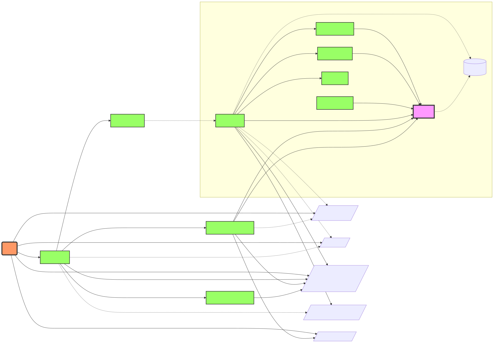

# Installation and Usage

## Features

The feature scope of the security-profiles-operator is right now limited to:

- Adds a `SeccompProfile` CRD (v1) to store seccomp profiles.
- Adds an `AppArmorProfile` CRD (v1) to store AppArmor profiles.
- Adds a `SelinuxProfile` CRD (v1) to store SELinux profiles.
- Adds a `ProfileBinding` CRD (v1) to bind security profiles to pods.
- Adds a `ProfileRecording` CRD (v1) to record security profiles from workloads.
- Synchronize seccomp, AppArmor and SELinux profiles across all worker nodes.
- Providing metrics endpoints
- Providing a Command Line Interface `spoc` for use cases not including Kubernetes.

> **Upgrading to v1?** See the [Migration Guide](doc/migration-guide-v1.md) for
> details on API version changes, enum normalization, and conversion webhooks.

## Architecture

## Tutorials and Demos

- [Improving Containers Isolation in Kubernetes](https://www.youtube.com/watch?v=Padw5duODy4&list=PLbzoR-pLrL6prBc8UnTQ9wI3BvFYp17Xp&index=8)
  from @ccojocar - May 2023

- [Using the EBPF Superpowers To Generate Kubernetes Security Policies](https://youtu.be/3dysej_Ydcw)
  from [@mauriciovasquezbernal](https://github.com/mauriciovasquezbernal) and [@alban](https://github.com/alban) - Oct 2022

- [Securing Kubernetes Applications by Crafting Custom Seccomp Profiles](https://youtu.be/alx38YdvvzA)
  from [@saschagrunert](https://github.com/saschagrunert) - May 2022

- [Enhancing Kubernetes with the Security Profiles Operator](https://youtu.be/xisAIB3kOJo)
  from [@cmurphy](https://github.com/cmurphy) and [@saschagrunert](https://github.com/saschagrunert) - Oct 2021

- [Introduction to Seccomp and the Kubernetes Seccomp Operator](https://youtu.be/exg_zrg16SI)
  from [@saschagrunert](https://github.com/saschagrunert) and [@hasheddan](https://github.com/hasheddan) - Aug 2020

## Documentation

- [Installation and Configuration](installation.md) - Installing and configuring the operator
- [Security Profiles](profiles.md) - Creating, recording and using seccomp, AppArmor and SELinux profiles
- [Command Line Interface (CLI)](cli.md) - Using `spoc` for standalone profile management
- [Metrics](metrics.md) - Available metrics and Prometheus integration
- [Troubleshooting](troubleshooting.md) - Debugging, profiling and OpenShift-specific notes
