# Installation and Usage

<!-- toc -->
- [Features](#features)
- [Architecture](#architecture)
- [Tutorials and Demos](#tutorials-and-demos)
- [Install Operator](#install-operator)
  - [Installation using OLM from operatorhub.io](#installation-using-olm-from-operatorhubio)
    - [OpenShift](#openshift)
    - [Other Kubernetes distributions](#other-kubernetes-distributions)
  - [Installation using OLM using upstream catalog and bundle](#installation-using-olm-using-upstream-catalog-and-bundle)
  - [Installation using helm](#installation-using-helm)
    - [Troubleshooting and maintenance](#troubleshooting-and-maintenance)
  - [Installation on AKS](#installation-on-aks)
- [Configure Operator](#configure-operator)
  - [Configure a custom kubelet root directory](#configure-a-custom-kubelet-root-directory)
  - [Set a custom priority class name for spod daemon pod](#set-a-custom-priority-class-name-for-spod-daemon-pod)
  - [Set logging verbosity](#set-logging-verbosity)
  - [Pull images from private registry](#pull-images-from-private-registry)
  - [Configure the SELinux type](#configure-the-selinux-type)
  - [Customise the daemon resource requirements](#customise-the-daemon-resource-requirements)
  - [Restrict the allowed syscalls in seccomp profiles](#restrict-the-allowed-syscalls-in-seccomp-profiles)
  - [Constrain spod scheduling](#constrain-spod-scheduling)
  - [Enable memory optimization in spod](#enable-memory-optimization-in-spod)
  - [Restricting to a Single Namespace](#restricting-to-a-single-namespace)
    - [Restricting to a Single Namespace with upstream deployment manifests](#restricting-to-a-single-namespace-with-upstream-deployment-manifests)
    - [Restricting to a Single Namespace when installing using OLM](#restricting-to-a-single-namespace-when-installing-using-olm)
  - [Configuring webhooks](#configuring-webhooks)
- [Create and Install Security Profiles](#create-and-install-security-profiles)
  - [Seccomp profile](#seccomp-profile)
    - [Record Seccomp profile](#record-seccomp-profile)
      - [Recording based on audit log](#recording-based-on-audit-log)
      - [Recording based on eBPF instrumentation](#recording-based-on-ebpf-instrumentation)
    - [Use Seccomp profile](#use-seccomp-profile)
  - [Audit JSON log enricher](#audit-json-log-enricher)
    - [Audit JSON Log Enricher Configuration](#audit-json-log-enricher-configuration)
      - [Audit Log Interval](#audit-log-interval)
      - [Audit Log File Destination](#audit-log-file-destination)
        - [Audit Log File Fine-Tuning (Rotation)](#audit-log-file-fine-tuning-rotation)
        - [Verbosity (Debugging Logs)](#verbosity-debugging-logs)
    - [How to Monitor Audit Logs for a Specific Pod](#how-to-monitor-audit-logs-for-a-specific-pod)
    - [Correlating with API Server Audit Log](#correlating-with-api-server-audit-log)
  - [AppArmor Profile](#apparmor-profile)
    - [Record AppArmor profile](#record-apparmor-profile)
    - [Use AppArmor profile](#use-apparmor-profile)
  - [SELinux profile](#selinux-profile)
    - [Record SELinux profile](#record-selinux-profile)
    - [Use SELinux profile](#use-selinux-profile)
  - [Filtering Logs](#filtering-logs)
    - [Rule Evaluation Logic](#rule-evaluation-logic)
    - [Examples](#examples)
  - [General Considerations](#general-considerations)
    - [Base syscalls for a container runtime](#base-syscalls-for-a-container-runtime)
    - [Recording profiles without applying them](#recording-profiles-without-applying-them)
    - [Disable profile recording](#disable-profile-recording)
    - [OCI Artifact support for base profiles](#oci-artifact-support-for-base-profiles)
    - [Bind workloads to profiles with ProfileBindings](#bind-workloads-to-profiles-with-profilebindings)
    - [Merging per-container profile instances](#merging-per-container-profile-instances)
- [Command Line Interface (CLI)](#command-line-interface-cli)
  - [Record seccomp profiles for a command](#record-seccomp-profiles-for-a-command)
  - [Run commands with seccomp profiles](#run-commands-with-seccomp-profiles)
  - [Pull security profiles from OCI registries](#pull-security-profiles-from-oci-registries)
  - [Push security profiles to OCI registries](#push-security-profiles-to-oci-registries)
  - [Using multiple platforms](#using-multiple-platforms)
- [Metrics](#metrics)
  - [Available metrics](#available-metrics)
  - [Automatic ServiceMonitor deployment](#automatic-servicemonitor-deployment)
- [Troubleshooting](#troubleshooting)
  - [Enable CPU and memory profiling](#enable-cpu-and-memory-profiling)
  - [Use a custom <code>/proc</code> location for nested environments like <code>kind</code>](#use-a-custom-proc-location-for-nested-environments-like-kind)
  - [Notes on OpenShift and SCCs](#notes-on-openshift-and-sccs)
    - [SELinux recording should allow <code>seLinuxContext: RunAsAny</code>](#selinux-recording-should-allow-selinuxcontext-runasany)
    - [Replicating controllers and SCCs](#replicating-controllers-and-sccs)
- [Uninstalling](#uninstalling)
<!-- /toc -->

## Features

The feature scope of the security-profiles-operator is right now limited to:

- Adds a `SeccompProfile` CRD (alpha) to store seccomp profiles.
- Adds a `ApparmorProfile` CRD (alpha) to store apparmor profiles.
- Adds a `SelinuxProfile` CRD (alpha) to store apparmor profiles.
- Adds a `ProfileBinding` CRD (alpha) to bind security profiles to pods.
- Adds a `ProfileRecording` CRD (alpha) to record security profiles from workloads.
- Synchronize seccomp, apparmor and selinux profiles across all worker nodes.
- Providing metrics endpoints
- Providing a Command Line Interface `spoc` for use cases not including Kubernetes.

## Architecture



## Tutorials and Demos

- [Improving Containers Isolation in Kubernetes](https://www.youtube.com/watch?v=Padw5duODy4&list=PLbzoR-pLrL6prBc8UnTQ9wI3BvFYp17Xp&index=8)
  from @ccojocar - May 2023

- [Using the EBPF Superpowers To Generate Kubernetes Security Policies](https://youtu.be/3dysej_Ydcw)
  from [@mauriciovasquezbernal](https://github.com/mauriciovasquezbernal) and [@alban](https://github.com/alban) - Oct 2022

- [Securing Kubernetes Applications by Crafting Custom Seccomp Profiles](https://youtu.be/alx38YdvvzA)
  from [@saschagrunert](https://github.com/saschagrunert) - May 2022

- [Enhancing Kubernetes with the Security Profiles Operator](https://youtu.be/xisAIB3kOJo)
  from [@cmurphy](https://github.com/cmurphy) and [@saschagrunert](https://github.com/saschagrunert) - Oct 2021

- [Introduction to Seccomp and the Kubernetes Seccomp Operator](https://youtu.be/exg_zrg16SI)
  from [@saschagrunert](https://github.com/saschagrunert) and [@hasheddan](https://github.com/hasheddan) - Aug 2020

## Install Operator

The operator container image consists of an image manifest which supports the
architectures `amd64` and `arm64` for now. To deploy the operator, first install
cert-manager via `kubectl`, if you're **not** running on
[OpenShift](https://www.redhat.com/en/technologies/cloud-computing/openshift):

```sh
$ kubectl apply -f https://github.com/cert-manager/cert-manager/releases/download/v1.17.2/cert-manager.yaml
$ kubectl --namespace cert-manager wait --for condition=ready pod -l app.kubernetes.io/instance=cert-manager
```

OpenShift ships it's own CA injector which means we can skip installing
cert-manager. After this step, apply the operator manifest:

```sh
$ kubectl apply -f https://raw.githubusercontent.com/kubernetes-sigs/security-profiles-operator/main/deploy/operator.yaml
```

### Installation using OLM from operatorhub.io

It is also possible to install packages from [operatorhub.io](https://operatorhub.io/operator/security-profiles-operator)
using [OLM](https://operator-framework.github.io/olm-book/).

#### OpenShift

To be able to use the OperatorHub.io resources in OpenShift, create a new
`CatalogResource` like this:

```yaml
apiVersion: operators.coreos.com/v1alpha1
kind: CatalogSource
metadata:
  name: operatorhubio
  namespace: openshift-marketplace
spec:
  displayName: Community Operators
  image: quay.io/operator-framework/upstream-community-operators:latest
  publisher: OperatorHub.io
  sourceType: grpc
```

After that, the Security Profiles Operator should then be installable via OperatorHub.


#### Other Kubernetes distributions

To install SPO, first make sure that OLM
itself is [installed](https://operator-framework.github.io/olm-book/docs/install-olm.html). Then install
SPO using the provided manifest:

```sh
$ kubectl apply -f https://raw.githubusercontent.com/kubernetes-sigs/security-profiles-operator/main/examples/olm/operatorhub-io.yaml
```

SPO would be then installed in the `security-profiles-operator` namespace. To troubleshoot the installation,
check the state of the `Subscription`, `CSV` and `InstallPlan` objects in the `security-profiles-operator` namespace:

```sh
$ kubectl get ip,csv,sub -nsecurity-profiles-operator
```

### Installation using OLM using upstream catalog and bundle

The SPO upstream also creates bundles and catalogs for both released versions
and after every commit to the `main` branch. Provided that your cluster uses OLM
(see above) you can install SPO using:

```sh
$ kubectl apply -f https://raw.githubusercontent.com/kubernetes-sigs/security-profiles-operator/main/examples/olm/install-resources.yaml
```

Note that on OpenShift, the OLM catalogs are deployed into the `openshift-marketplace` namespace, so you'd
need to replace the namespaces before deploying:

```shell
manifest=https://raw.githubusercontent.com/kubernetes-sigs/security-profiles-operator/main/examples/olm/install-resources.yaml
$ curl $manifest | sed "s#olm#openshift-marketplace#g" | oc apply -f -
```

### Installation using helm

A helm chart is also available for installation. The chart is attached to each
[GitHub release](https://github.com/kubernetes-sigs/security-profiles-operator/releases)
as an artifact, and can be installed by executing the following shell commands:

You may also specify a different target namespace with `--namespace mynamespace` or `--namespace mynamespace --create-namespace` if it still doesn't exist.

```shell
# Install cert-manager if it is not already installed (TODO: The helm
# chart might do this one day - see issue 1062 for details):
kubectl apply -f https://github.com/cert-manager/cert-manager/releases/download/v1.17.2/cert-manager.yaml
kubectl --namespace cert-manager wait --for condition=ready pod -l app.kubernetes.io/instance=cert-manager

# Create the namespace beforehand
export spo_ns=security-profiles-operator
kubectl create ns $spo_ns

# Label and annotate the ns to make it manageable by helm. Ensure it is
# running on the privileged Pod Security Standard.
kubectl label ns $spo_ns \
  app=security-profiles-operator \
  pod-security.kubernetes.io/audit=privileged \
  pod-security.kubernetes.io/enforce=privileged \
  pod-security.kubernetes.io/warn=privileged \
  app.kubernetes.io/managed-by=Helm \
  --overwrite=true

kubectl annotate ns $spo_ns \
  "meta.helm.sh/release-name"="security-profiles-operator" \
  "meta.helm.sh/release-namespace"="$spo_ns" \
  --overwrite

# Install the chart from the release URL (or a file path if desired)
helm install security-profiles-operator --namespace security-profiles-operator https://github.com/kubernetes-sigs/security-profiles-operator/releases/download/v0.7.1/security-profiles-operator-0.7.1.tgz
# Or update it with
# helm upgrade --install security-profiles-operator --namespace security-profiles-operator https://github.com/kubernetes-sigs/security-profiles-operator/releases/download/v0.7.1/security-profiles-operator-0.7.1.tgz
```

#### Troubleshooting and maintenance

These CRDs are not templated, but will be installed by default when running a helm install for the chart.
There is no support at this time for upgrading or deleting CRDs using Helm. [[docs](https://helm.sh/docs/chart_best_practices/custom_resource_definitions/)]

To remove everything or to do a new installation from scratch be sure to remove them first.

```shell
# Check in which ns is your release
helm list --all --all-namespaces

# Set here the target namespace to clean
export spo_ns=spo

# WARNING: following command will DELETE every CRD related to this project
kubectl get crds --no-headers |grep security-profiles-operator |cut -d' ' -f1 |xargs kubectl delete crd
kubectl get -n $spo_ns crds --no-headers |grep security-profiles-operator |cut -d' ' -f1 |xargs kubectl delete -n $spo_ns crd

# Uninstall the chart release from the namespace
helm uninstall --namespace $spo_ns security-profiles-operator
# WARNING: Delete the namespace
kubectl delete ns $spo_ns

# Install it again
helm upgrade --install --create-namespace --namespace $spo_ns security-profiles-operator deploy/helm/
```

### Installation on AKS

In case you installed SPO on an [AKS cluster](https://azure.microsoft.com/en-us/products/kubernetes-service/#overview), it is recommended to [configure webhook](#configuring-webhooks) to respect the [control-plane](https://learn.microsoft.com/en-us/azure/aks/faq#can-i-use-admission-controller-webhooks-on-aks) label as follows:

```sh
$ kubectl -nsecurity-profiles-operator patch spod spod  --type=merge \
    -p='{"spec":{"webhookOptions":[{"name":"binding.spo.io","namespaceSelector":{"matchExpressions":[{"key":"control-plane","operator":"DoesNotExist"}]}},{"name":"recording.spo.io","namespaceSelector":{"matchExpressions":[{"key":"control-plane","operator":"DoesNotExist"}]}}]}}'
```

Afterwards, validate spod has been patched successfully by ensuring the `RUNNING` state:

```sh
$ kubectl -nsecurity-profiles-operator get spod spod
NAME   STATE
spod   RUNNING
```

## Configure Operator

### Configure a custom kubelet root directory

You can configure a custom kubelet root directory in case your cluster is not using the default `/var/lib/kubelet` path.
You can achieve this by setting the environment variable `KUBELET_DIR` in the operator deployment. This environment variable will
be then set in the manager container as well as it will be propagated into the containers part of spod daemonset.

Furthermore, you can configure a custom kubelet root directory for each node or a pool of worker nodes inside the cluster. This
can be achieved by applying the following label on each node object which has a custom path:

```
kubelet.kubernetes.io/directory-location: mnt-resource-kubelet
```

Where the value of the label is the kubelet root directory path, by replacing `/` with `-`. For example the value above is translated
by the operator from `mnt-resource-kubelet` into path `/mnt/resource/kubelet`.

### Set a custom priority class name for spod daemon pod

The default priority class name of the spod daemon pod is set to `system-node-critical`. A custom priority class name can be configured
in the SPOD configuration by setting a value in the `priorityClassName` filed.

```
> kubectl -n security-profiles-operator patch spod spod --type=merge -p '{"spec":{"priorityClassName":"my-priority-class"}}'
securityprofilesoperatordaemon.security-profiles-operator.x-k8s.io/spod patched
```

This is useful in situations when the spod daemon pod remains in `Pending` state, because there isn't enough capacity on the related
node to be scheduled.

### Set logging verbosity

The operator supports the default logging verbosity of `0` and an enhanced `1`.
To switch to the enhanced logging verbosity, patch the spod config by adjusting
the value:

```
> kubectl -n security-profiles-operator patch spod spod --type=merge -p '{"spec":{"verbosity":1}}'
securityprofilesoperatordaemon.security-profiles-operator.x-k8s.io/spod patched
```

The daemon should now indicate that it's using the new logging verbosity:

```
> k logs --selector name=spod security-profiles-operator | head -n1
I1111 15:13:16.942837       1 main.go:182]  "msg"="Set logging verbosity to 1"
```

### Pull images from private registry

The container images from spod pod can be pulled from a private registry. This can be achieved by defining the `imagePullSecrets`
inside of the SPOD configuration.

### Configure the SELinux type

The operator uses by default the `spc_t` SELinux type in the security context of the daemon pod. This can be easily
changed to a different SELinux type by patching the spod config as follows:

```
> kubectl -n security-profiles-operator patch spod spod --type=merge -p '{"spec":{"selinuxTypeTag":"unconfined_t"}}'
securityprofilesoperatordaemon.security-profiles-operator.x-k8s.io/spod patched
```

The `ds/spod` should now be updated by the manager with the new SELinux type, and all daemon pods recreated:

```
 kubectl get ds spod -o yaml | grep unconfined_t -B2
          runAsUser: 65535
          seLinuxOptions:
            type: unconfined_t
--
          runAsUser: 0
          seLinuxOptions:
            type: unconfined_t
--
          runAsUser: 0
          seLinuxOptions:
            type: unconfined_t
```

### Customise the daemon resource requirements

The default resource requirements of the daemon container can be adjusted by using the field `daemonResourceRequirements`
from the SPOD configuration as follows:

```
kubectl -n security-profiles-operator patch spod spod --type merge -p
'{"spec":{"daemonResourceRequirements": {"requests": {"memory": "256Mi", "cpu": "250m"}, "limits": {"memory": "512Mi", "cpu": "500m"}}}}'
```

These values can also be specified via the Helm chart.

### Restrict the allowed syscalls in seccomp profiles

The operator doesn't restrict by default the allowed syscalls in the seccomp profiles. This means that any
syscall can be allowed in a seccomp profile installed via the operator. This can be changed by defining the
list of allowed syscalls in the spod configuration as follows:

```
kubectl -n security-profiles-operator patch spod spod --type merge -p
'{"spec":{"allowedSyscalls": ["exit", "exit_group", "futex", "nanosleep"]}}'
```

From now on, the operator will only install the seccomp profiles which have only a subset of syscalls defined
into the allowed list. All profiles not complying with this rule, it will be rejected.

Also every time when the list of allowed syscalls is modified in the spod configuration, the operator will
automatically identify the already installed profiles which are not compliant and remove them.

### Constrain spod scheduling

You can constrain the spod scheduling via the spod configuration by setting either the `tolerations` or `affinity`.

```
kubectl -n security-profiles-operator patch spod spod --type merge -p
'{"spec":{"tolerations": [{...}]}}'
```

```
kubectl -n security-profiles-operator patch spod spod --type merge -p
'{"spec":{"affinity": {...}}}'
```

These settings are also available in the Helm chart.

### Enable memory optimization in spod

The controller running inside of spod daemon process is watching all pods available in the cluster when profile recording
is enabled. It will perform some pre-filtering before the reconciliation to select only the pods running on local
node as well as pods annotated for recording, but this operation takes place after all pods objects are loaded
into the cache memory of the informer. This can lead to very high memory usage in large clusters with 1000s of pods, resulting
in spod daemon running out of memory or crashing.

In order to prevent this situation, the spod daemon can be configured to only load into the cache memory the pods explicitly
labeled for profile recording. This can be achieved by enabling memory optimization as follows:

```
kubectl -n security-profiles-operator patch spod spod --type=merge -p '{"spec":{"enableMemoryOptimization":true}}'
```

If you want now to record a security profile for a pod, this pod needs to be explicitly labeled with `spo.x-k8s.io/enable-recording`,
as follows:

```
apiVersion: v1
kind: Pod
metadata:
  name: my-recording-pod
  labels:
    spo.x-k8s.io/enable-recording: "true"
```

### Restricting to a Single Namespace

The security-profiles-operator can optionally be run to watch SeccompProfiles in
a single namespace. This is advantageous because it allows for tightening the
RBAC permissions required by the operator's ServiceAccount. To modify the
operator deployment to run in a single namespace, use the
`namespace-operator.yaml` manifest with your namespace of choice:

#### Restricting to a Single Namespace with upstream deployment manifests

```sh
NAMESPACE=<your-namespace>

curl https://raw.githubusercontent.com/kubernetes-sigs/security-profiles-operator/main/deploy/namespace-operator.yaml | sed "s/NS_REPLACE/$NAMESPACE/g" | kubectl apply -f -
```

#### Restricting to a Single Namespace when installing using OLM

Since restricting the operator to a single namespace amounts to setting the `RESTRICT_TO_NAMESPACE`
environment variable, the easiest way to set that (or any other variable for SPO) is by editing the
`Subscription` object and setting the `spec.config.env` field:

```yaml
spec:
  config:
    env:
      - name: RESTRICT_TO_NAMESPACE
        value: <your-namespace>
```

OLM would then take care of updating the operator `Deployment` object with the new environment variable.
Please refer to the [OLM documentation](https://github.com/operator-framework/operator-lifecycle-manager/blob/master/doc/design/subscription-config.md#res)
for more details on tuning the operator's configuration with the `Subscription` objects.

### Configuring webhooks

Both profile binding and profile recording make use of webhooks. Their configuration (an instance of
`MutatingWebhookConfiguration` CR) is managed by SPO itself and not part of the deployed YAML manifests.
While the defaults should be acceptable for the majority of users and the webhooks do nothing unless an
instance of either `ProfileBinding` or `ProfileRecording` exists in a namespace and in addition the
namespace must be labeled with either `spo.x-k8s.io/enable-binding` or `spo.x-k8s.io/enable-recording`
respectively by default, it might still be useful to configure the webhooks.

In order to change webhook's configuration, the `spod` CR exposes an object
`webhookOptions` that allows the `failurePolicy`, `namespaceSelector`
and `objectSelector` to be set. This way you can set the webhooks to
"soft-fail" or restrict them to a subset of a namespaces and inside those namespaces
select only a subset of object matching the `objectSelector` so that even
if the webhooks had a bug that would prevent them from running at all,
other namespaces or resources wouldn't be affected.

For example, to set the `binding.spo.io` webhook's configuration to ignore errors as well as restrict it
to a subset of namespaces labeled with `spo.x-k8s.io/bind-here=true`, create a following patch file:

```yaml
spec:
  webhookOptions:
    - name: binding.spo.io
      failurePolicy: Ignore
      namespaceSelector:
        matchExpressions:
          - key: spo.x-k8s.io/bind-here
            operator: In
            values:
              - "true"
```

And patch the `spod/spod` instance:

```shell
$ kubectl -n security-profiles-operator patch spod spod -p $(cat /tmp/spod-wh.patch) --type=merge
```

To view the resulting `MutatingWebhookConfiguration`, call:

```shell
$ kubectl get MutatingWebhookConfiguration spo-mutating-webhook-configuration -oyaml
```

The Exec Metadata and Node Debugging Pod Metadata Webhook works in conjunction with the JSON Log Enricher. It's enabled only when JSON Log Enricher is 
enabled. For details on its configuration, please refer to the [JSON Log Enricher](#audit-json-log-enricher) section

## Create and Install Security Profiles

The next sections will describe how to record and install security profiles for a container. The namespace
where the recording takes place needs to be labeled with `spo.x-k8s.io/enable-recording` in order to enable
recording in that namespaces, as following:

```sh
$ kubectl label ns spo-test spo.x-k8s.io/enable-recording=
```

Note that the label value is not important, only their presence matters.

### Seccomp profile

#### Record Seccomp profile

The operator is capable of recording seccomp profiles by the usage of the
built-in [eBPF](https://ebpf.io) recorder or by evaluating the [audit][auditd] or [syslog][syslog] files. Each method has
its pros and cons as well as separate technical requirements.

##### Recording based on audit log

The operator ships with a log enrichment feature, which is disabled per
default. The reason for that is that the log enricher container runs in
privileged mode to be able to read the audit logs from the local node. It is also
required that the enricher is able to read the host processes and therefore runs
within host PID namespace (`hostPID`).

One of the following requirements to the Kubernetes node have to be fulfilled to
use the log enrichment feature:

- [auditd][auditd] needs to run and has to be configured to log into
  `/var/log/audit/audit.log`
- [syslog][syslog] can be used as fallback to auditd and needs to log into
  `/var/log/syslog`. Depending on the system configuration, a printk rate limiting may be
  in place which has direct influence on the log enrichment. To disable the rate
  limiting, set the following sysctls:
  ```
  > sysctl -w kernel.printk_ratelimit=0
  > sysctl -w kernel.printk_ratelimit_burst=0
  ```

[auditd]: https://man7.org/linux/man-pages/man8/auditd.8.html
[syslog]: https://man7.org/linux/man-pages/man3/syslog.3.html

If all requirements are met, then the feature can be enabled by patching the
`spod` configuration:

```
> kubectl -n security-profiles-operator patch spod spod --type=merge -p '{"spec":{"enableLogEnricher":true}}'
securityprofilesoperatordaemon.security-profiles-operator.x-k8s.io/spod patched
```

Alternatively, make sure the operator deployment sets the `ENABLE_LOG_ENRICHER` variable,
to `true`, either by setting the environment variable in the deployment or by enabling
the variable trough a `Subscription` resource, when installing the operator using OLM.
See [Constrain spod scheduling](#constrain-spod-scheduling) for an example of
setting `tolerations` and `affinity` on the SPOD.

Now the operator will take care of re-deploying the `spod` DaemonSet and the
enricher should listening on new changes to the audit logs:

```
> kubectl -n security-profiles-operator logs -f ds/spod log-enricher
I0623 12:51:04.257814 1854764 deleg.go:130] setup "msg"="starting component: log-enricher"  "buildDate"="1980-01-01T00:00:00Z" "compiler"="gc" "gitCommit"="unknown" "gitTreeState"="clean" "goVersion"="go1.16.2" "platform"="linux/amd64" "version"="0.4.0-dev"
I0623 12:51:04.257890 1854764 enricher.go:44] log-enricher "msg"="Starting log-enricher on node: 127.0.0.1"
I0623 12:51:04.257898 1854764 enricher.go:46] log-enricher "msg"="Connecting to local GRPC server"
I0623 12:51:04.258061 1854764 enricher.go:69] log-enricher "msg"="Reading from file /var/log/audit/audit.log"
2021/06/23 12:51:04 Sought /var/log/audit/audit.log - &{Offset:0 Whence:2}
```

To record by using the log enricher, create a `ProfileRecording` which is using
`recorder: logs`:

```yaml
apiVersion: security-profiles-operator.x-k8s.io/v1alpha1
kind: ProfileRecording
metadata:
  name: test-recording
spec:
  kind: SeccompProfile
  recorder: logs
  podSelector:
    matchLabels:
      app: my-app
```

Then we can create a workload to be recorded, for example two containers within
a single pod:

```yaml
apiVersion: v1
kind: Pod
metadata:
  name: my-pod
  labels:
    app: my-app
spec:
  containers:
    - name: nginx
      image: quay.io/security-profiles-operator/test-nginx:1.19.1
    - name: redis
      image: quay.io/security-profiles-operator/redis:6.2.1
```

If the pod is up and running:

```
> kubectl get pods
NAME     READY   STATUS    RESTARTS   AGE
my-pod   2/2     Running   0          18s
```

Then the enricher should indicate that it receives audit logs for those containers:

```
> kubectl -n security-profiles-operator logs --since=1m --selector name=spod -c log-enricher
…
I0705 12:08:18.729660 1843190 enricher.go:136] log-enricher "msg"="audit"  "container"="redis" "executable"="/usr/local/bin/redis-server" "namespace"="default" "node"="127.0.0.1" "pid"=1847839 "pod"="my-pod" "syscallID"=232 "syscallName"="epoll_wait" "timestamp"="1625486870.273:187492" "type"="seccomp"
```

Now, if we remove the pod:

```
> kubectl delete pod my-pod
```

Then the operator will reconcile two seccomp profiles:

```
> kubectl get sp
NAME                   STATUS      AGE
test-recording-nginx   Installed   15s
test-recording-redis   Installed   15s
```

Please note that log based recording does not have any effect if the recorded container
is privileged, that is, the container's security context sets `privileged: true`. This
is because privileged containers are not subject to SELinux or seccomp policies at all
and the log based recording makes use of a special seccomp or SELinux profile respectively
to record the syscalls or SELinux events.

##### Recording based on eBPF instrumentation

The operator also supports an [eBPF](https://ebpf.io) based recorder. This
recorder only supports seccomp and apparmor profiles for now. Recording via ebpf works for
kernels which expose the `/sys/kernel/btf/vmlinux` file per default as well as a
[custom list of selected Linux kernels](bpf-support.md). In addition, this
feature requires new library versions and thus might not be enabled. You
can find out if your SPO build has the eBPF feature disabled by looking at
the build tags:

```
> kubectl logs --selector name=security-profiles-operator | grep buildTags
```

If the output contains `no_bpf` then the feature has been disabled.

To use the recorder, enable it by patching the `spod` configuration:

```
> kubectl -n security-profiles-operator patch spod spod --type=merge -p '{"spec":{"enableBpfRecorder":true}}'
securityprofilesoperatordaemon.security-profiles-operator.x-k8s.io/spod patched
```

Alternatively, make sure the operator deployment sets the `ENABLE_BPF_RECORDER`
environment variable to `true`. This method can be easier to set up during
installation than patching the `spod`.

We can verify that the recorder is up and running after the spod rollout has
been finished:

```
> kubectl -n security-profiles-operator logs --selector name=spod -c bpf-recorder
Found 6 pods, using pod/spod-h7dpm
I1115 12:02:45.991786  110307 main.go:182]  "msg"="Set logging verbosity to 0"
I1115 12:02:45.991901  110307 deleg.go:130] setup "msg"="starting component: bpf-recorder"  "buildDate"="1980-01-01T00:00:00Z" "compiler"="gc" "gitCommit"="unknown" "gitTreeState"="clean" "goVersion"="go1.16.9" "libseccomp"="2.5.1" "platform"="linux/amd64" "version"="0.4.0-dev"
I1115 12:02:45.991955  110307 bpfrecorder.go:105] bpf-recorder "msg"="Setting up caches with expiry of 1h0m0s"
I1115 12:02:45.991973  110307 bpfrecorder.go:121] bpf-recorder "msg"="Starting log-enricher on node: ip-10-0-228-234.us-east-2.compute.internal"
I1115 12:02:45.994232  110307 bpfrecorder.go:152] bpf-recorder "msg"="Connecting to metrics server"
I1115 12:02:48.373469  110307 bpfrecorder.go:168] bpf-recorder "msg"="Got system mount namespace: 4026531840"
I1115 12:02:48.373518  110307 bpfrecorder.go:170] bpf-recorder "msg"="Doing BPF load/unload self-test"
I1115 12:02:48.373529  110307 bpfrecorder.go:336] bpf-recorder "msg"="Loading bpf module"
I1115 12:02:48.373570  110307 bpfrecorder.go:403] bpf-recorder "msg"="Using system btf file"
I1115 12:02:48.373770  110307 bpfrecorder.go:356] bpf-recorder "msg"="Loading bpf object from module"
I1115 12:02:48.403766  110307 bpfrecorder.go:362] bpf-recorder "msg"="Getting bpf program sys_enter"
I1115 12:02:48.403792  110307 bpfrecorder.go:368] bpf-recorder "msg"="Attaching bpf tracepoint"
I1115 12:02:48.406205  110307 bpfrecorder.go:373] bpf-recorder "msg"="Getting syscalls map"
I1115 12:02:48.406287  110307 bpfrecorder.go:379] bpf-recorder "msg"="Getting comms map"
I1115 12:02:48.406862  110307 bpfrecorder.go:396] bpf-recorder "msg"="Module successfully loaded, watching for events"
I1115 12:02:48.406908  110307 bpfrecorder.go:677] bpf-recorder "msg"="Unloading bpf module"
I1115 12:02:48.411636  110307 bpfrecorder.go:176] bpf-recorder "msg"="Starting GRPC API server"
```

The recorder does a system sanity check on startup to ensure everything works as
expected. This includes a `load` and `unload` of the BPF module. If this fails,
please open an issue so that we can find out what went wrong.

To record seccomp profiles by using the BPF recorder, create a
`ProfileRecording` which is using `recorder: bpf`:

```yaml
apiVersion: security-profiles-operator.x-k8s.io/v1alpha1
kind: ProfileRecording
metadata:
  name: my-recording
spec:
  kind: SeccompProfile
  recorder: bpf
  podSelector:
    matchLabels:
      app: my-app
```

Then we can create a workload to be recorded, for example this one:

```yaml
apiVersion: v1
kind: Pod
metadata:
  name: my-pod
  labels:
    app: my-app
spec:
  containers:
    - name: nginx
      image: quay.io/security-profiles-operator/test-nginx:1.19.1
```

If the pod is up and running:

```
> kubectl get pods
NAME     READY   STATUS    RESTARTS   AGE
my-pod   1/1     Running   0          10s
```

Then the BPF recorder should indicate that it found the container:

```
> kubectl -n security-profiles-operator logs --since=1m --selector name=spod -c bpf-recorder
…
I1115 12:12:30.029216   66106 bpfrecorder.go:654] bpf-recorder "msg"="Found container ID in cluster"  "containerID"="c2e10af47011f6a61cd7e92073db2711796f174af35b34486967588ef7f95fbc" "containerName"="nginx"
I1115 12:12:30.029264   66106 bpfrecorder.go:539] bpf-recorder "msg"="Saving PID for profile"  "mntns"=4026533352 "pid"=74384 "profile"="my-recording-nginx-1636978341"
I1115 12:12:30.029428   66106 bpfrecorder.go:512] bpf-recorder "msg"="Using short path via tracked mount namespace"  "mntns"=4026533352 "pid"=74403 "profile"="my-recording-nginx-1636978341"
I1115 12:12:30.029575   66106 bpfrecorder.go:512] bpf-recorder "msg"="Using short path via tracked mount namespace"  "mntns"=4026533352 "pid"=74402 "profile"="my-recording-nginx-1636978341"
…
```

Now, if we remove the pod:

```
> kubectl delete pod my-pod
```

Then the operator will reconcile the seccomp profile:

```
> kubectl get sp
NAME                 STATUS      AGE
my-recording-nginx   Installed   15s
```

#### Use Seccomp profile

Use the `SeccompProfile` kind to create profiles. Example:

```yaml
apiVersion: security-profiles-operator.x-k8s.io/v1beta1
kind: SeccompProfile
metadata:
  name: profile1
spec:
  defaultAction: SCMP_ACT_LOG
```

This seccomp profile will be saved at the path:

`/var/lib/kubelet/seccomp/operator/my-namespace/profile1.json`.

An init container will set up the root directory of the operator to be able to
run it without root G/UID. This will be done by creating a symlink from the
rootless profile storage `/var/lib/security-profiles-operator` to the default seccomp root
path inside of the kubelet root `/var/lib/kubelet/seccomp/operator`.

Create a pod using one of the created profiles. On Kubernetes >= 1.19, the
profile can be specified as part of the pod's security context:

```yaml
apiVersion: v1
kind: Pod
metadata:
  name: test-pod
spec:
  securityContext:
    seccompProfile:
      type: Localhost
      localhostProfile: operator/my-namespace/profile1.json
  containers:
    - name: test-container
      image: nginx
```

Prior to Kubernetes 1.19, the seccomp profile is controlled by an annotation:

```yaml
apiVersion: v1
kind: Pod
metadata:
  name: test-pod
  annotations:
    seccomp.security.alpha.kubernetes.io/pod: "localhost/operator/my-namespace/profile1.json"
spec:
  containers:
    - name: test-container
      image: nginx
```

You can find the profile path of the seccomp profile by checking the
`seccompProfile.localhostProfile` attribute (remember to use the `wide`
output mode):

```sh
$ kubectl get seccompprofile profile1 --output wide
NAME       STATUS   AGE   SECCOMPPROFILE.LOCALHOSTPROFILE
profile1   Active   14s   operator/my-namespace/profile1.json
```

You can apply the profile to an existing application, such as a Deployment or
DaemonSet:

```sh
kubectl --namespace my-namespace patch deployment myapp --patch '{"spec": {"template": {"spec": {"securityContext": {"seccompProfile": {"type": "Localhost", "localhostProfile": "'$(kubectl --namespace my-namespace get seccompprofile profile1 --output=jsonpath='{.status.seccompProfile\.localhostProfile}')'}}}}}}'
deployment.apps/myapp patched
```

The pods in the Deployment will be automatically restarted. Check that the
profile was applied correctly:

```sh
$ kubectl --namespace my-namespace get deployment myapp --output=jsonpath='{.spec.template.spec.securityContext}' | jq .
{
  "seccompProfile": {
    "localhostProfile": "operator/my-namespace/profile1.json",
    "type": "Localhost"
  }
}
```

Note that a security profile that is in use by existing pods cannot be
deleted unless the pods exit or are removed - the profile deletion is
protected by finalizers.

### Audit JSON log enricher
Similar to the log enricher feature above, audit JSON log enricher watches auditd (`/var/log/audit/audit.log`) 
or the syslog (`/var/log/syslog`) and generates a audit log in JSON lines format. Each JSON line will include the 
following:
- **Timestamp**: When the activity happened, shown in a standard ISO format
- **Executable Name**: The name of the program that was run (e.g., bash, ls).
- **Command Line Arguments (cmdline)**: The extra instructions given when the program was started (e.g., ls -l /home).
- **User and Group IDs (uid/gid)**: The identification numbers of the system user who ran the program.
- **System Calls (syscalls)**: A list of system calls (syscalls) that the process made

This log format and the configuration is similar to how Kubernetes itself records audit logs. This is useful for:
- Seeing what users and automated processes are doing inside a pod.
- Tracking when someone uses commands like kubectl exec to get into a running container and run commands or scripts.
- Monitoring activities in debug containers where users might run various tools.

To start using this feature, you need to have the Security Profiles Operator installed in your Kubernetes cluster. 
Once it's installed, you can enable the JSON log enricher with this command:
```sh
kubectl -n security-profiles-operator patch spod spod --type=merge -p '{"spec":{"enableJsonEnricher":true}}'
```

#### Audit JSON Log Enricher Configuration
Here's how to set up and fine-tune your audit logs.

##### Audit Log Interval
Set how often audit logs are created using the auditLogIntervalSeconds option. For example to configure audit log interval to 30 seconds use the command:
```sh
kubectl -n security-profiles-operator patch spod spod --type=merge -p '{"spec":{"enableJsonEnricher":true,"verbosity":0,"jsonEnricherOptions":{"auditLogIntervalSeconds":30}}}'
```
##### Audit Log File Destination
By default, audit logs go to your standard output in JSON lines format. You can send them to a file instead.

1. Configure the Volume Mount
   First, tell the security profiles operator where to store the log file on the node. You'll update the `security-profiles-operator-profile` ConfigMap with two keys:
    - `json-enricher-log-volume-source.json`: Defines the type of volume (e.g., host path, empty directory) where logs will be stored. This must be a JSON string representing a `corev1.VolumeSource` object. Refer to this [link](https://github.com/kubernetes/kubernetes/blob/master/pkg/apis/core/types.go#L58) for more details.
    - `json-enricher-log-volume-mount-path`: Specifies the directory path where the log file will be generated. 

   Here's an example to set up a host path volume at `/tmp/logs`:
   ```json
   {
    "data": {
      "json-enricher-log-volume-mount-path": "/tmp/logs",
      "json-enricher-log-volume-source.json": "{\"hostPath\": {\"path\": \"/tmp/logs\",\"type\": \"DirectoryOrCreate\"}}"
    }
   }
   ```
   One of the ways to update the config map is to save this JSON in a file(`patch-volume-source.json`) and update the config map:
   ```sh
   kubectl patch configmap security-profiles-operator-profile -n security-profiles-operator --patch-file patch-volume-source.json
   ```

2. Restart the Operator

   The security profiles operator won't automatically pick up ConfigMap changes. You need to restart its pods for the new volume mount to take effect.
   ```sh
   kubectl rollout restart deployment security-profiles-operator -n security-profiles-operator
   ```

3. Set the Audit Log File Path

   Tell the JSON log enricher the full path to your audit log file (including the filename).
   ```sh
   kubectl -n security-profiles-operator patch spod spod --type=merge -p '{"spec":{"enableJsonEnricher":true,"verbosity":0,"jsonEnricherOptions":{"auditLogPath":"/tmp/logs/audit1.log"}}}'
   ```
###### Audit Log File Fine-Tuning (Rotation)
For audit logging to a file, you can manage their size and how long they're kept. These options are similar to [Kubernetes API server log settings](https://kubernetes.io/docs/tasks/debug/debug-cluster/audit/).

- `auditLogMaxSize`: The maximum size (in megabytes) a log file can reach before it's rotated (a new file is started).
- `auditLogMaxBackups`: The maximum number of older, rotated log files to keep. Set to 0 for no limit.
- `auditLogMaxAge`: The maximum number of days to keep old log files.
You configure these by patching the JSON log enricher options:
```sh
kubectl -n security-profiles-operator patch spod spod --type=merge -p '{"spec":{"enableJsonEnricher":true,"verbosity":0,"jsonEnricherOptions":{"auditLogPath":"/tmp/logs/audit1.log","auditLogMaxSize":500,"auditLogMaxBackups":2,"auditLogMaxAge":10}}}'
```

###### Verbosity (Debugging Logs)
Increase the logging level for the JSON log enricher container to help with debugging.
- 0: Minimal logs.
- 1: More detailed logs.

```sh
kubectl -n security-profiles-operator patch spod spod --type=merge -p '{"spec":{"enableJsonEnricher":true, "verbosity": 1}}'
```

#### How to Monitor Audit Logs for a Specific Pod
To enable a single pod log the activity following these steps:
1. **Create a Seccomp profile:**

   Create a file (e.g., profile1.yaml) with the following content:
    ```shell
    apiVersion: security-profiles-operator.x-k8s.io/v1beta1
    kind: SeccompProfile
    metadata:
      name: profile1
    spec:
      defaultAction: SCMP_ACT_ALLOW
      syscalls:
      - action: SCMP_ACT_LOG
        names:
          - execve
          - clone
          - getpid
    ```
   - This profile allows all normal actions (defaultAction: SCMP_ACT_ALLOW).
   - It specifically tells the system to log when a process tries to run a new program 
     (execve), create a new process (clone), or get its own process ID (getpid). 
     These actions often indicate user interaction within a pod.

2. **Apply the Seccomp Profile:**
   
   Use the kubectl apply command to create this profile in your cluster:
    ```shell
    kubectl apply -f profile1.yaml
    ```

3. **Create a Pod Using the Profile:**
   ```shell
   apiVersion: v1
   kind: Pod
   metadata:
     name: my-pod
     labels:
       app: my-app
   spec:
     securityContext:
       seccompProfile:
         type: Localhost
         localhostProfile: operator/profile1.json
     containers:
       - name: nginx
         image: quay.io/security-profiles-operator/test-nginx:1.19.1
   ```
   - type: `Localhost` means you're using a profile you've defined in the cluster.
   - localhostProfile: `operator/profile1.json` tells the pod to use the `profile1` you created. The operator/ part 
     indicates where the Security Profiles Operator stores these profiles.

4. **Apply the Pod Definition:**
   
   Create the pod using kubectl apply:
   ```shell
   kubectl apply -f my-pod.yaml
   ```
5. **Monitor the Audit Logs:**
   
   To monitor the audit log tail:
   ```shell
   kubectl -n security-profiles-operator logs --since=1m --selector name=spod -c json-enricher --max-log-requests 6 -f
   ```
By following above steps, you can enable and monitor audit logs in JSON lines format for your Kubernetes pods, 
giving you better visibility into their activities.

#### Correlating with API Server Audit Log
By default, when you use `kubectl exec` to access a pod or container, Kubernetes doesn't pass the user's authentication
details into that session's environment. This means JSON Log Enricher can't include "who did what" information 
for exec commands. The `uid`, `gid` recorded will map to the system user which in most cases would be the root user.

To address this, the JSON Log Enricher relies on a mutating webhooks (`execmetadata.spo.io` and
`nodedebuggingpod.spo.io`). These webhook injects the exec request UID as an environment variable into the exec session.
Now, when the administrator enables audit logging on the API server, the webhooks will add an audit annotation,
`SPO_EXEC_REQUEST_UID`. The API server audit log will contain this information. This request ID will also be available
in the JSON lines produced by the JSON Log Enricher, specifically within the `requestUID` field.

By default, these webhooks are enabled for all the namespaces with JSON Log Enricher is enabled. 
To reduce the scope of this webhook you can disable it for certain namespaces.

Edit the spod configuration:

```shell
kubectl edit spod spod -n security-profiles-operator
```

Add `webhookOptions` to the spec:

Locate the `spec:` section and add the following webhookOptions block. This will tell the webhook to apply to a 
specific namespaces

```yaml
# ... (rest of your spod configuration)
spec:
  webhookOptions:
  - name: execmetadata.spo.io # or nodedebuggingpod.spo.io
    namespaceSelector:
    #...add rules 
# ...
```

After saving your changes, the operator will reconfigure the mutating webhook, allowing request 
details to be passed into `kubectl exec` sessions cluster-wide.

NOTE: This webhook injects the environment variable `SPO_EXEC_REQUEST_UID` into your exec request. If a container in your Pod 
already defines an environment variable with this exact name, the webhook's injected value will override it for this
exec session.

When you use `kubectl debug node/<node-name>`, the `nodedebuggingpod.spo.io` webhook automatically injects the 
`SPO_EXEC_REQUEST_UID` environment variable into the debug pod.

This webhook primarily identifies kubectl debug pods by the label `app.kubernetes.io/managed-by: "kubectl-debug"`, 
which is added by the kubectl client.

Because this label might vary across different Kubernetes client implementations 
(e.g., oc debug in OpenShift uses `debug.openshift.io/managed-by: "oc-debug"`), 
you may need to configure additional `webhookOptions` to ensure the webhook catches all relevant debug pods.

For example, to include `oc debug pods`:

```yaml
# ... (rest of your spod configuration)
spec:
  webhookOptions:
  - name: nodedebuggingpodmetada.spo.io
    objectSelector:
      matchLabels: # Use matchLabels for exact matching
        debug.openshift.io/managed-by: "oc-debug"
# ... other webhook rule details like rules, clientConfig, etc.
```

Reference: For more details on the label, see: https://github.com/kubernetes/kubernetes/pull/131791

### AppArmor Profile

Ensure that the spod daemon has AppArmor enabled:

```
> kubectl -n security-profiles-operator patch spod spod --type=merge -p '{"spec":{"enableAppArmor":true}}'
securityprofilesoperatordaemon.security-profiles-operator.x-k8s.io/spod patched
```

#### Record AppArmor profile

The operator is able to record AppArmor profiles for a workload only using the build-in eBPF recorder.

To use the eBPF recorder, enable it by patching the `spod` configuration:

```
> kubectl -n security-profiles-operator patch spod spod --type=merge -p '{"spec":{"enableBpfRecorder":true}}'
securityprofilesoperatordaemon.security-profiles-operator.x-k8s.io/spod patched
```

Alternatively, make sure the operator deployment sets the `ENABLE_BPF_RECORDER`
environment variable to `true`. This method can be easier to set up during
installation than patching the `spod`.

We can verify that the recorder is up and running after the spod rollout has
been finished:

```
> kubectl -n security-profiles-operator logs --selector name=spod -c bpf-recorder
Found 6 pods, using pod/spod-h7dpm
I1115 12:02:45.991786  110307 main.go:182]  "msg"="Set logging verbosity to 0"
I1115 12:02:45.991901  110307 deleg.go:130] setup "msg"="starting component: bpf-recorder"  "buildDate"="1980-01-01T00:00:00Z" "compiler"="gc" "gitCommit"="unknown" "gitTreeState"="clean" "goVersion"="go1.16.9" "libseccomp"="2.5.1" "platform"="linux/amd64" "version"="0.4.0-dev"
I1115 12:02:45.991955  110307 bpfrecorder.go:105] bpf-recorder "msg"="Setting up caches with expiry of 1h0m0s"
I1115 12:02:45.991973  110307 bpfrecorder.go:121] bpf-recorder "msg"="Starting log-enricher on node: ip-10-0-228-234.us-east-2.compute.internal"
I1115 12:02:45.994232  110307 bpfrecorder.go:152] bpf-recorder "msg"="Connecting to metrics server"
I1115 12:02:48.373469  110307 bpfrecorder.go:168] bpf-recorder "msg"="Got system mount namespace: 4026531840"
I1115 12:02:48.373518  110307 bpfrecorder.go:170] bpf-recorder "msg"="Doing BPF load/unload self-test"
I1115 12:02:48.373529  110307 bpfrecorder.go:336] bpf-recorder "msg"="Loading bpf module"
I1115 12:02:48.373570  110307 bpfrecorder.go:403] bpf-recorder "msg"="Using system btf file"
I1115 12:02:48.373770  110307 bpfrecorder.go:356] bpf-recorder "msg"="Loading bpf object from module"
I1115 12:02:48.403766  110307 bpfrecorder.go:362] bpf-recorder "msg"="Getting bpf program sys_enter"
I1115 12:02:48.403792  110307 bpfrecorder.go:368] bpf-recorder "msg"="Attaching bpf tracepoint"
I1115 12:02:48.406205  110307 bpfrecorder.go:373] bpf-recorder "msg"="Getting syscalls map"
I1115 12:02:48.406287  110307 bpfrecorder.go:379] bpf-recorder "msg"="Getting comms map"
I1115 12:02:48.406862  110307 bpfrecorder.go:396] bpf-recorder "msg"="Module successfully loaded, watching for events"
I1115 12:02:48.406908  110307 bpfrecorder.go:677] bpf-recorder "msg"="Unloading bpf module"
I1115 12:02:48.411636  110307 bpfrecorder.go:176] bpf-recorder "msg"="Starting GRPC API server"
```

You can now set up an apparmor profile recording for `nginx` container by creating the following configuration:

```
kubectl apply -f - <<EOF
apiVersion: security-profiles-operator.x-k8s.io/v1alpha1
kind: ProfileRecording
metadata:
  name: nginx-recording
  namespace: security-profiles-operator
spec:
  kind: ApparmorProfile
  recorder: bpf
  podSelector:
    matchLabels:
      app: nginx
EOF

```

Now, a nginx container can be started. The operator will record in background an apparmor profile for it.

```
kubectl apply -f - <<EOF
apiVersion: v1
kind: Pod
metadata:
  name: nginx-pod
  namespace: security-profiles-operator
  labels:
    app: nginx
spec:
  containers:
    - name: nginx-container
      image: nginx
EOF
```

We can now let the container run for at least a few minutes to make sure that the required system resources are collected.

Stop the nginx pod, this will make the operator to save and install the apparmor profile in the cluster.

```
kubectl delete pod -n security-profiles-operator nginx-pod
```

We can check now that the profile was properly installed:

```
kubectl get apparmorprofile

# Output should show the apparmor profile.

NAME                              AGE
nginx-recording-nginx-container   42h

# The content of the profile can be inspected.

kubectl get apparmorprofile -o yaml
```

_Known limitations:_

- The reconciler will simply load the profiles across the cluster. If an
  existing profile with the same name exists, it will be replaced. This might cause
  an existing profile to be overwritten (See [issue 2582](https://github.com/kubernetes-sigs/security-profiles-operator/issues/2582) for details).
- Restrictive profiles may block sub processes to be created, or a container from
  successfully loading. To work around the issue, set the AppArmor profile to complain mode.

#### Use AppArmor profile

The recorded apparmor profile can be used now to harden a nginx container. The profile should be referenced in the security context as follows:

```
# Create a dedicated namespace where the hardened container will be deployed.

kubectl create ns test-spo

# Deploy a nginx container with the custom apparmor profile.

kubectl apply -f - <<EOF
apiVersion: v1
kind: Pod
metadata:
  name: nginx-pod
  namespace: test-spo
  labels:
    app: nginx
spec:
  containers:
    - name: nginx-container
      image: nginx
      securityContext:
        appArmorProfile:
          type: Localhost
          localhostProfile: nginx-recording-nginx-container
EOF

# Check if the container is running properly.

kubectl get pod -n test-spo

# Output should show that the container is successfully running with apparmor profile.

NAME        READY   STATUS    RESTARTS   AGE
nginx-pod   1/1     Running   0          8s
```

Note that in case of apparmor, unlike seccomp, only the name of the profile is required in the security context of the container and not the path. You can see more details in the [official documentation](https://kubernetes.io/docs/tutorials/security/apparmor/).

### SELinux profile

Ensure that the running daemon has SELinux enabled:

```
> kubectl -n security-profiles-operator patch spod spod --type=merge -p '{"spec":{"enableSelinux":true}}'
securityprofilesoperatordaemon.security-profiles-operator.x-k8s.io/spod patched
```

There are two kinds that can be used to define a SELinux profile - `SelinuxProfile` and `RawSelinuxProfile`.

The default one and the one created during workload recording is `SelinuxProfile`. It is more readable
and has several features that allow for better security hardening and better readability. The `RawSelinuxProfile`
kind should be used mostly when there's an already existing SELinux policy (perhaps created with udica)
that you wish to use in your cluster.

In particular, the `SelinuxProfile` kind:

- restricts the profiles to inherit from to the current namespace or a system-wide profile. Because there
  are typically many profiles installed on the system, but only a subset should be used by cluster workloads,
  the inheritable system profiles are listed in the `spod` instance in `spec.selinuxOptions.allowedSystemProfiles`.
  Depending on what distribution your nodes run, the base profile might vary, on RHEL-based systems, you might
  want to look at what profiles are shipped in the `container-selinux` RPM package.
- performs basic validation of the permissions, classes and labels
- adds a new keyword `@self` that describes the process using the policy. This allows to reuse a policy between
  workloads and namespaces easily, as the "usage" of the policy (see below) is based on the name and namespace.

Below is an example of a policy that can be used with a non-privileged nginx workload:

```yaml
apiVersion: security-profiles-operator.x-k8s.io/v1alpha2
kind: SelinuxProfile
metadata:
  name: nginx-secure
spec:
  allow:
    "@self":
      tcp_socket:
        - listen
    http_cache_port_t:
      tcp_socket:
        - name_bind
    node_t:
      tcp_socket:
        - node_bind
  inherit:
    - kind: System
      name: container
```

After the policy is created, we can wait for selinuxd to install it:

```bash
$ kubectl wait --for=condition=ready selinuxprofile nginx-secure
selinuxprofile.security-profiles-operator.x-k8s.io/nginx-secure condition met
```

The CIL-formatted policies are placed into an `emptyDir` owned by the SPO where you can view
the resulting CIL policy:

```shell
$ kubectl exec -it -c selinuxd spod-fm55x -- sh
sh-4.4# cat /etc/selinux.d/nginx-secure.cil
(block nginx-secure
(blockinherit container)
(allow process nginx-secure.process ( tcp_socket ( listen )))
(allow process http_cache_port_t ( tcp_socket ( name_bind )))
(allow process node_t ( tcp_socket ( node_bind )))
)
```

However, the binary policies are installed into the system policy store on the nodes, so you can verify
that a policy has been installed:

```shell
# semodule -l | grep nginx-secure
```

_Make a SELinux profile permissive:_
Similarly to how a `SeccompProfile` might have a default action `SCMP_ACT_LOG`
which would merely log violations of the policy, but not actually block the
container from executing, a `SelinuxProfile` can be marked as "permissive"
by setting `.spec.permissive` to `true`. This mode might be useful e.g. when
the policy is known or suspected to be incomplete and you'd prefer to just
watch for subsequent AVC denials after deploying the policy.

#### Record SELinux profile

The SELinux profiles can be recorded using the log enricher. You should make sure that it is enabled:

```
> kubectl -n security-profiles-operator patch spod spod --type=merge -p '{"spec":{"enableLogEnricher":true}}'
securityprofilesoperatordaemon.security-profiles-operator.x-k8s.io/spod patched
```

Alternatively, make sure the operator deployment sets the `ENABLE_LOG_ENRICHER` variable,
to `true`, either by setting the environment variable in the deployment or by enabling
the variable trough a `Subscription` resource, when installing the operator using OLM.
See [Constrain spod scheduling](#constrain-spod-scheduling) for an example of
setting `tolerations` and `affinity` on the SPOD.

Now the operator will take care of re-deploying the `spod` DaemonSet and the
enricher should listening on new changes to the audit logs:

```
> kubectl -n security-profiles-operator logs -f ds/spod log-enricher
I0623 12:51:04.257814 1854764 deleg.go:130] setup "msg"="starting component: log-enricher"  "buildDate"="1980-01-01T00:00:00Z" "compiler"="gc" "gitCommit"="unknown" "gitTreeState"="clean" "goVersion"="go1.16.2" "platform"="linux/amd64" "version"="0.4.0-dev"
I0623 12:51:04.257890 1854764 enricher.go:44] log-enricher "msg"="Starting log-enricher on node: 127.0.0.1"
I0623 12:51:04.257898 1854764 enricher.go:46] log-enricher "msg"="Connecting to local GRPC server"
I0623 12:51:04.258061 1854764 enricher.go:69] log-enricher "msg"="Reading from file /var/log/audit/audit.log"
2021/06/23 12:51:04 Sought /var/log/audit/audit.log - &{Offset:0 Whence:2}
```

To record by using the log enricher, create a `ProfileRecording` which is using
`recorder: logs`:

You can now record a SELinux profile for `nginx` container by creating the following `ProfileRecording` configuration:

```
kubectl apply -f - <<EOF
apiVersion: security-profiles-operator.x-k8s.io/v1alpha1
kind: ProfileRecording
metadata:
  name: nginx-recording
  namespace: security-profiles-operator
spec:
  kind: SelinuxProfile
  recorder: logs
  podSelector:
    matchLabels:
      app: nginx
EOF
```

Now, a nginx container can be started with the SELinux type `selinuxrecording.process` in the security context.
The operator will record in background a SELinux profile for it.

```
kubectl apply -f - <<EOF
apiVersion: v1
kind: Pod
metadata:
  name: nginx-pod
  namespace: security-profiles-operator
  labels:
    app: nginx
spec:
  containers:
    - name: nginx-container
      image: nginx
      securityContext:
        seLinuxOptions:
          type: selinuxrecording.process
EOF
```

We can now let the container run for at least a few minutes to make sure that the required system resources are collected.

Stop the nginx pod, this will make the operator to save and install the apparmor profile in the cluster.

```
kubectl delete pod -n security-profiles-operator nginx-pod
```

We can check now that the profile was properly installed:

```
kubectl get selinuxprofile

# Output should show the selinux profile.

NAME                              USAGE                                     STATE
nginx-recording-nginx-container   nginx-recording-nginx-container.process   partial

# The content of the profile can be inspected.

kubectl get selinuxprofile -o yaml
```

#### Use SELinux profile

SELinux profiles are referenced based on their `USAGE` type name, which is `<ProfileName>.process`.

Use this SELinux type in the workload manifest in the `.spec.containers[].securityContext.seLinuxOptions` attribute:

```yaml
apiVersion: v1
kind: Pod
metadata:
  name: nginx-secure
  namespace: security-profiles-operator
spec:
  containers:
    - image: nginxinc/nginx-unprivileged:1.21
      name: nginx
      securityContext:
        seLinuxOptions:
          # NOTE: This uses an appropriate SELinux type
          type: nginx-recording-nginx-container.process
```

The pod should properly start and run.

### Filtering Logs
The Security Profiles Operator Daemon (SPOD) supports advanced filtering of emitted logs through its enrichers, 
allowing users to focus on relevant events.
Log filtering is managed by an array of filter rules configured directly on the SPOD resource. Two distinct fields are
available, each controlling a different enricher:
- `jsonEnricherFilters`: Applies filtering to the Audit JSON Log Enricher.
- `logEnricherFilters`: Applies filtering to the Log Enricher.

Example: Enabling Log Enricher and providing an empty filter array (no custom filtering)
```shell
kubectl -n security-profiles-operator patch spod spod --type=merge -p '{"spec":{"enableLogEnricher":true,"logEnricherFilters":[]}}'
```

Each object within the `jsonEnricherFilters` or `logEnricherFilters` array conforms to the following structure:

| Field    | Type |  Description | Example Value                 
|----------|-----|---------|-------------------------------|
| priority | integer | Required. Defines the order of rule application. Rules with lower priority numbers are evaluated first (higher priority).| 10, 100                       |
| level    | string | Required. Determines the action to take if this rule matches a log line: <br/>- "Metadata": The log line is emitted (logged). <br/>- "None": The log line is dropped (not logged).| "Metadata", "None"            |
| matchKeys    | array<string>    | Required. An array of log statement keys (field names) that must all be present in the incoming log line for this rule to potentially match.| ["namespace"], ["requestUID"] | 
| matchValues | array<string> | Optional. An array of values. If provided, the values associated with any of the matchKeys (that were found in the log line) must match at least one of these matchValues. <br/>If matchValues is an empty array ([]) or omitted, the mere presence of all matchKeys is sufficient for a match, regardless of their values. | ["default"], ["test"]         | 

#### Rule Evaluation Logic
When the enrichers start, all configured filter rules are parsed and loaded. For each incoming log statement:
- Rules are evaluated strictly in ascending order of their priority (lower numbers are evaluated first).
- The first rule that a log statement matches determines its fate. No subsequent rules will be evaluated for that particular log line.
- A log statement is considered a match for a rule if:
  - Any keys specified in matchKeys are present in the log statement.
  - AND (if matchValues is provided and not empty): At least one of the values associated with the matched matchKeys in the log statement matches at least one string in the rule's matchValues.
  - Also note that int values although provided as string will be converted to int
- Action Based on level:
  - If the matching rule's level is "Metadata", the log line is emitted.
  - If the matching rule's level is "None", the log line is dropped.
- Default Behavior: If no rule in the filter array matches the log statement, a default behavior of "Metadata" (log the line) will be applied.

#### Examples
1. Filtering JSON Audit Logs for Specific User Activity:

This example demonstrates logging only audit events associated with a requestUID, while filtering everything else. This is helpful for a JSON Audit log enricher to investigate the user activity like exec into a pod or end-user running some script inside a container.

This json
```json
[
    {
        "priority": 100,
        "Level": "Metadata",
        "MatchLabels": [
            "requestUID"
        ]
    },
    {
        "priority": 999,
        "Level": "None",
        "MatchLabels": [
            "version"
        ],
        "MatchValues": [
            "spo/v1_alpha"
        ]
    }
]
```

can be using with the command

```
kubectl -n security-profiles-operator patch spod spod --type=merge -p {"spec":{"enableJsonEnricher": true, "jsonEnricherFilters": "[{\"priority\":100,\"level\":\"Metadata\",\"matchLabels\":[\"requestUID\"]},{\"priority\":999, \"level\":\"None\",\"matchLabels\":[\"version\"],\"matchValues\":[\"spo/v1_alpha\"]}]}}"
```

2. Filtering Logs for a Specific Kubernetes Namespace:

This example logs log-enricher entries only from the default namespace and drops any other log lines for seccomp profile.

```
kubectl -n security-profiles-operator patch spod spod --type=merge -p {"spec":{"enableLogEnricher": true, "logEnricherFilters": "[{\"priority\":100,\"level\":\"Metadata\",\"matchLabels\":[\"namespace\"],\"matchValues\":[\"default\"},{\"priority\":999, \"level\":\"None\",\"matchLabels\":[\"type\"],\"matchValues\":[\"seccomp\"]}]}}"
```

### General Considerations

#### Base syscalls for a container runtime

An example of the minimum required syscalls for a runtime such as
[runc](https://github.com/opencontainers/runc) (tested on version 1.0.0) to
launch a container can be found in [the
examples](./examples/baseprofile-runc.yaml). You can use this example as a
starting point for creating custom profiles for your application. You can also
programmatically combine it with your custom profiles in order to build
application-specific profiles that only specify syscalls that are required on
top of the base calls needed for the container runtime. For example:

```yaml
apiVersion: security-profiles-operator.x-k8s.io/v1beta1
kind: SeccompProfile
metadata:
  name: profile1
spec:
  defaultAction: SCMP_ACT_ERRNO
  baseProfileName: runc-v1.3.0
  syscalls:
    - action: SCMP_ACT_ALLOW
      names:
        - exit_group
```

If you're not using runc but the alternative
[crun](https://github.com/containers/crun), then you can do the same by using
the [corresponding example profile](./examples/baseprofile-crun.yaml) (tested
with version 0.20.1).

#### Recording profiles without applying them

In some cases, it might be desirable to record security profiles, but not install them.
Use-cases might include recording profiles in a CI system where the profiles would be
deployed in a subsequent verify run or recording profiles as part of a build process where the
profile would be deployed by the end-user.

To record profiles without installing them, set the `disableProfileAfterRecording`
attribute to `true` in the `ProfileRecording` CR. This option defaults to `false`, which
is the default behavior of the operator to install the profiles. When `disableProfileAfterRecording`
is set to `true`, the operator will not reconcile the profiles and will not install them. Partial
disabled profiles can still be merged and the resulting merged profile will be disabled.

On the profile level, this functionality is controlled by the `disabled` flag - it is also possible
to create profile CRs disabled, although this functionality is probably less interesting to end users
and is mostly used for testing purposes. The `disabled` flag is set to `false` by default. Profiles
that are disabled, either explicitly or by the `disableProfileAfterRecording` flag, can be enabled
by setting the `disabled` flag to `false` in the profile CR.

#### Disable profile recording

Profile recorder controller along with the corresponding sidecar container is disabled
when neither `enableBpfRecorder` nor `enableLogEnricher` is set in the SPOD configuration, and
automatically enabled when either one of them is on. The same applies when either
the BPF recorder of the log enricher are enabled using the environment variables
`ENABLE_BPF_RECORDER` or `ENABLE_LOG_ENRICHER` respectively.

Also, when running the daemon in standalone mode is possible to switch on the profile recorder
controller by providing the `with-recording` command line argument or setting the `ENABLE_RECORDING`
environment variable.

#### OCI Artifact support for base profiles

The operator supports pulling base profiles from container registries supporting
OCI artifacts, which are right now:

- [CNCF Distribution](https://github.com/distribution/distribution)
- [Azure Container Registry](https://aka.ms/acr)
- [Amazon Elastic Container Registry](https://aws.amazon.com/ecr)
- [Google Artifact Registry](https://cloud.google.com/artifact-registry)
- [GitHub Packages container registry](https://docs.github.com/en/packages/guides/about-github-container-registry)
- [Bundle Bar](https://bundle.bar/docs/supported-clients/oras)
- [Docker Hub](https://hub.docker.com)
- [Zot Registry](https://zotregistry.io)

To use that feature, just prefix the `baseProfileName` with `oci://`, like:

```yaml
apiVersion: security-profiles-operator.x-k8s.io/v1beta1
kind: SeccompProfile
metadata:
  name: profile1
spec:
  defaultAction: SCMP_ACT_ERRNO
  baseProfileName: oci://ghcr.io/security-profiles/runc:v1.3.0
```

The resulting profile `profile1` will then contain all base syscalls from the
remote `runc` profile. It is also possible to reference the base profile by its
SHA256, like `oci://ghcr.io/security-profiles/runc@sha256:380…`. Please note
that all profiles must be signed using [sigstore (cosign)](https://github.com/sigstore/cosign)
signatures, otherwise the Security Profiles Operator will reject them. The OCI
artifact profiles also support different architectures, where the operator
always tries to select the correct one via `runtime.GOOS`/`runtime.GOARCH` but
also allows to fallback to a default profile.

The operator internally caches pulled artifacts up to 24 hours for 1000
profiles, means that they will be refreshed after that time period, if the stack
is full or the operator daemon gets restarted. It is also possible to define
additional `baseProfileName` for existing base profiles, so the operator will
recursively resolve them up to a level of 15 stacked profiles.

Because the resulting syscalls may hidden to the user, we additionally annotate
the seccomp profile with the final results:

```console
> kubectl describe seccompprofile profile1
Name:         profile1
Labels:       spo.x-k8s.io/profile-id=SeccompProfile-profile1
Annotations:  syscalls:
                [{"names":["arch_prctl","brk","capget","capset","chdir","clone","close","dup3","epoll_create1","epoll_ctl","epoll_pwait","execve","exit_gr...
API Version:  security-profiles-operator.x-k8s.io/v1beta1
```

We provide all available base profiles as part of the ["Security Profiles"
GitHub organization](https://github.com/orgs/security-profiles/packages).

#### Bind workloads to profiles with ProfileBindings

If you do not want to directly modify the SecurityContext of a Pod, for instance
if you are deploying a public application, you can use the ProfileBinding
resource to bind a security profile to a container's securityContext.

You need to enable the profile binding for a namespace by applying the label
`spo.x-k8s.io/enable-binding` as following:

```sh
$ kubectl label ns spo-test spo.x-k8s.io/enable-binding=
```

To bind a Pod that uses an 'nginx:1.19.1' image to the 'profile-complain'
example seccomp profile, create a ProfileBinding in the same namespace as both
the Pod and the SeccompProfile:

```yaml
apiVersion: security-profiles-operator.x-k8s.io/v1alpha1
kind: ProfileBinding
metadata:
  name: nginx-binding
spec:
  profileRef:
    kind: SeccompProfile
    name: profile-complain
  image: nginx:1.19.1
```

You can enable a default profile binding by using the string "\*" as the image name.
This will only apply a profile binding if no other profile binding matches a container in the pod.

```yaml
apiVersion: security-profiles-operator.x-k8s.io/v1alpha1
kind: ProfileBinding
metadata:
  name: nginx-binding
spec:
  profileRef:
    kind: SeccompProfile
    name: profile-complain
  image: *
```

If the Pod is already running, it will need to be restarted in order to pick up
the profile binding. Once the binding is created and the Pod is created or
recreated, the SeccompProfile should be applied to the container whose image
name matches the binding:

```sh
$ kubectl get pod test-pod -o jsonpath='{.spec.containers[*].securityContext.seccompProfile}'
{"localhostProfile":"operator/default/generic/profile-complain-unsafe.json","type":"Localhost"}
```

Binding a SELinux profile works in the same way, except you'd use the `SelinuxProfile` kind.
`RawSelinuxProfiles` are currently not supported.

#### Merging per-container profile instances

By default, each container instance will be recorded into a separate
profile. This is mostly visible when recording pods managed by a replicating
controller (Deployment, DaemonSet, etc.). A realistic example might
be a workload being recorded in a test environment where the recorded
Deployment consists of several replicas, only one of which is receiving
the test traffic. After the recording is complete, only the container that
was receiving the traffic would have container all the syscalls that were
actually used.

In this case, it might be useful to merge the per-container profiles
into a single profile. This can be done by setting the `mergeStrategy`
attribute to `containers` in the `ProfileRecording`. Note that the following
example uses a `SeccompProfile` as the `kind` but the same applies to
`SelinuxProfile` as well.

```yaml
apiVersion: security-profiles-operator.x-k8s.io/v1alpha1
kind: ProfileRecording
metadata:
  # The name of the Recording is the same as the resulting `SeccompProfile` CRD
  # after reconciliation.
  name: test-recording
spec:
  kind: SeccompProfile
  recorder: logs
  mergeStrategy: containers
  podSelector:
    matchLabels:
      app: sp-record
```

Create your workload:

```yaml
apiVersion: apps/v1
kind: Deployment
metadata:
  name: nginx-deploy
spec:
  replicas: 3
  selector:
    matchLabels:
      app: sp-record
  template:
    metadata:
      labels:
        app: sp-record
    spec:
      serviceAccountName: spo-record-sa
      containers:
        - name: nginx-record
          image: quay.io/security-profiles-operator/test-nginx-unprivileged:1.21
          ports:
            - containerPort: 8080
```

You'll see that the deployment spawns three replicas. To test the merging feature, you
can perform an action in one of the pods, for example:

```bash
> kubectl exec nginx-deploy-65bcbb956f-gmbrj -- bash -c "mknod /tmp/foo p"
```

Note that this is a silly example, but shows the feature in action.

To record the individual profiles, delete the deployment:

```bash
> kubectl delete deployment nginx-deploy
```

The profiles will be reconciled, one per container. Note that the profiles are marked as
"partial" and the spod daemon instances do not reconcile the profiles.

```bash
> kubectl get sp -lspo.x-k8s.io/recording-id=test-recording --show-labels
NAME                                STATUS    AGE     LABELS
test-recording-nginx-record-gmbrj   Partial   2m50s   spo.x-k8s.io/container-id=sp-record,spo.x-k8s.io/partial=true,spo.x-k8s.io/profile-id=SeccompProfile-test-recording-sp-record-gmbrj,spo.x-k8s.io/recording-id=test-recording
test-recording-nginx-record-lclnb   Partial   2m50s   spo.x-k8s.io/container-id=sp-record,spo.x-k8s.io/partial=true,spo.x-k8s.io/profile-id=SeccompProfile-test-recording-sp-record-lclnb,spo.x-k8s.io/recording-id=test-recording
test-recording-nginx-record-wdv2r   Partial   2m50s   spo.x-k8s.io/container-id=sp-record,spo.x-k8s.io/partial=true,spo.x-k8s.io/profile-id=SeccompProfile-test-recording-sp-record-wdv2r,spo.x-k8s.io/recording-id=test-recording
```

Inspecting the first partial profile, which corresponds to the pod where we ran the extra command
shows that mknod is allowed:

```bash
> kubectl get sp test-recording-nginx-record-gmbrj -o yaml | grep mknod
  - mknod
```

On the other hand the others do not:

```bash
> kubectl get sp test-recording-nginx-record-lclnb -o yaml | grep mknod
> kubectl get sp test-recording-nginx-record-wdv2r -o yaml | grep mknod
```

To merge the profiles, delete the profile recording to indicate that
you are finished with recording the workload. This would trigger the
merge operation done by the controller and the resulting profile will be
reconciled by the controller as seen from the `Installed` state:

```bash
> kubectl delete profilerecording test-recording
profilerecording.security-profiles-operator.x-k8s.io "test-recording" deleted
> kubectl get sp -lspo.x-k8s.io/recording-id=test-recording
NAME                          STATUS      AGE
test-recording-nginx-record   Installed   17m
```

The resulting profile will contain all the syscalls that were used by any of the containers,
including the `mknod` syscall:

```bash
> kubectl get sp test-recording-nginx-record -o yaml | grep mknod
  - mknod
```

## Command Line Interface (CLI)

The Seucrity Profiles Operator CLI `spoc` aims to support use cases where
Kubernetes is not available at all (for example in edge scenarios). It targets
to provide re-used functionality from the operator itself, especially for
development and testing environments. In the future, we plan to extend the CLI
to interact with the operator itself.

For now, the CLI is able to:

- Record seccomp profiles for a command in YAML (CRD) and JSON (OCI) format.
- Run commands with applied seccomp profiles in both formats.

`spoc` can be retrieved either by downloading the statically linked binary
directly from the [available releases][releases], or by running it within the
official container images:

```console
> podman run -it gcr.io/k8s-staging-sp-operator/security-profiles-operator:latest spoc
NAME:
   spoc - Security Profiles Operator CLI

USAGE:
   spoc [global options] command [command options] [arguments...]

COMMANDS:
   version, v  display detailed version information
   record, r   run a command and record the security profile
   run, x      run a command using a security profile
   help, h     Shows a list of commands or help for one command
```

<!-- TODO: add thoughts about required privileges to run spoc in containers -->

[releases]: https://github.com/kubernetes-sigs/security-profiles-operator/releases/latest

### Record seccomp profiles for a command

To record a seccomp profile via `spoc`, run the corresponding subcommand
followed by any command and arguments:

```console
> sudo spoc record echo test
2023/03/10 10:09:09 Loading bpf module
…
2023/03/10 10:09:13 Adding base syscalls: capget, capset, chdir, …
2023/03/10 10:09:13 Wrote seccomp profile to: /tmp/profile.yaml
2023/03/10 10:09:13 Unloading bpf module
```

Now the seccomp profile should be written in the CRD format:

```console
> cat /tmp/profile.yaml
```

```yaml
apiVersion: security-profiles-operator.x-k8s.io/v1beta1
kind: SeccompProfile
metadata:
  name: echo
spec:
  architectures:
    - SCMP_ARCH_X86_64
  defaultAction: SCMP_ACT_ERRNO
  syscalls:
    - action: SCMP_ACT_ALLOW
      names:
        - access
        - …
        - write
status: {}
```

The output file path can be specified as well by using `spoc record
-o/--output-file`.

We can see that `spoc` automatically adds required base syscalls for OCI
container runtimes to ensure compatibility with them to allow using the profile
within Kubernetes. This behavior can be disabled by using `spoc record
-n/--no-base-syscalls`, or by specifying custom syscalls via `spoc record
-b/--base-syscalls`.

It is also possible to change the format to JSON via `spoc record -t/--type
raw-seccomp`:

```console
> sudo spoc record -t raw-seccomp echo test
…
2023/03/10 10:15:17 Wrote seccomp profile to: /tmp/profile.json
2023/03/10 10:15:17 Unloading bpf module
```

```console
> jq . /tmp/profile.json
```

```json
{
  "defaultAction": "SCMP_ACT_ERRNO",
  "architectures": ["SCMP_ARCH_X86_64"],
  "syscalls": [
    {
      "names": ["access", "…", "write"],
      "action": "SCMP_ACT_ALLOW"
    }
  ]
}
```

All commands are interruptible by using Ctrl^C, while `spoc record` will still
write the resulting seccomp profile after process terminating.

### Run commands with seccomp profiles

If we now want to test the resulting profile, then `spoc` is able to run any
command by using seccomp profiles via `spoc run`:

```console
> sudo spoc run -p /tmp/profile.yaml echo test
2023/03/10 10:20:00 Reading file /tmp/profile.json
2023/03/10 10:20:00 Setting up seccomp
2023/03/10 10:20:00 Load seccomp profile
2023/03/10 10:20:00 Running command with PID: 567625
test
```

If we now modify the profile, for example by forbidding `chmod`:

```console
> jq 'del(.syscalls[0].names[] | select(. | contains("chmod")))' /tmp/profile.json > /tmp/profile-chmod.json
```

Then running `chmod` via `spoc run` will now throw an error, because the syscall
is not allowed any more:

```console
> sudo spoc run -p /tmp/profile-chmod.json chmod +x /tmp/profile-chmod.json
2023/03/10 10:25:38 Reading file /tmp/profile-chmod.json
2023/03/10 10:25:38 Setting up seccomp
2023/03/10 10:25:38 Load seccomp profile
2023/03/10 10:25:38 Running command with PID: 594242
chmod: changing permissions of '/tmp/profile-chmod.json': Operation not permitted
2023/03/10 10:25:38 Command did not exit successfully: exit status 1
```

### Pull security profiles from OCI registries

The `spoc` client is able to pull security profiles from OCI artifact compatible
registries. To do that, just run `spoc pull`:

```console
> spoc pull ghcr.io/security-profiles/runc:v1.3.0
16:32:29.795597 Pulling profile from: ghcr.io/security-profiles/runc:v1.3.0
16:32:29.795610 Verifying signature

Verification for ghcr.io/security-profiles/runc:v1.3.0 --
The following checks were performed on each of these signatures:
  - Existence of the claims in the transparency log was verified offline
  - The code-signing certificate was verified using trusted certificate authority certificates

[{"critical":{"identity":{"docker-reference":"ghcr.io/security-profiles/runc"},…}}]
16:32:33.208695 Creating file store in: /tmp/pull-3199397214
16:32:33.208713 Verifying reference: ghcr.io/security-profiles/runc:v1.3.0
16:32:33.208718 Creating repository for ghcr.io/security-profiles/runc
16:32:33.208742 Using tag: v1.3.0
16:32:33.208743 Copying profile from repository
16:32:34.119652 Reading profile
16:32:34.119677 Trying to unmarshal seccomp profile
16:32:34.120114 Got SeccompProfile: runc-v1.3.0
16:32:34.120119 Saving profile in: /tmp/profile.yaml
```

The profile can be now found in `/tmp/profile.yaml` or the specified output file
`--output-file` / `-o`. If username and password authentication is required,
either use the `--username`, `-u` flag or export the `USERNAME` environment
variable. To set the password, export the `PASSWORD` environment variable.

### Push security profiles to OCI registries

The `spoc` client is also able to push security profiles from OCI artifact
compatible registries. To do that, just run `spoc push`:

```
> export USERNAME=my-user
> export PASSWORD=my-pass
> spoc push -f ./examples/baseprofile-crun.yaml ghcr.io/security-profiles/crun:v1.8.1
16:35:43.899886 Pushing profile ./examples/baseprofile-crun.yaml to: ghcr.io/security-profiles/crun:v1.8.1
16:35:43.899939 Creating file store in: /tmp/push-3618165827
16:35:43.899947 Adding profile to store: ./examples/baseprofile-crun.yaml
16:35:43.900061 Packing files
16:35:43.900282 Verifying reference: ghcr.io/security-profiles/crun:v1.8.1
16:35:43.900310 Using tag: v1.8.1
16:35:43.900313 Creating repository for ghcr.io/security-profiles/crun
16:35:43.900319 Using username and password
16:35:43.900321 Copying profile to repository
16:35:46.976108 Signing container image
Generating ephemeral keys...
Retrieving signed certificate...

        Note that there may be personally identifiable information associated with this signed artifact.
        This may include the email address associated with the account with which you authenticate.
        This information will be used for signing this artifact and will be stored in public transparency logs and cannot be removed later.

By typing 'y', you attest that you grant (or have permission to grant) and agree to have this information stored permanently in transparency logs.
Your browser will now be opened to:
https://oauth2.sigstore.dev/auth/auth?access_type=…
Successfully verified SCT...
tlog entry created with index: 16520520
Pushing signature to: ghcr.io/security-profiles/crun
```

We can specify an username and password in the same way as for `spoc pull`.
Please also note that signing is always required for push and pull. It is
possible to add custom annotations to the security profile by using the
`--annotations` / `-a` flag multiple times in `KEY:VALUE` format.

### Using multiple platforms

`spoc push` supports specifying the target platforms for the profiles to be
pushed. This can be done by using the `--platforms` / `-p` together with the
`--profiles` / `-p` flag. For example, to push two profiles into one artifact:

```
> spoc push -f ./profile-amd64.yaml -p linux/amd64 -f ./profile-arm64.yaml -p linux/arm64 ghcr.io/security-profiles/test:latest
10:59:17.887884 Pushing profiles to: ghcr.io/security-profiles/test:latest
10:59:17.887970 Creating file store in: /tmp/push-2265359353
10:59:17.887989 Adding 2 profiles
10:59:17.887995 Adding profile ./profile-arm64.yaml for platform linux/arm64 to store
10:59:17.888193 Adding profile ./profile-amd64.yaml for platform linux/amd64 to store
10:59:17.888240 Packing files
…
Pushing signature to: ghcr.io/security-profiles/test
```

The pushed artifact now contains both profiles, separated by their platform:

```
> skopeo inspect --raw docker://ghcr.io/security-profiles/test:latest | jq .
{
  "schemaVersion": 2,
  "mediaType": "application/vnd.oci.image.manifest.v1+json",
  "config": {
    "mediaType": "application/vnd.unknown.config.v1+json",
    "digest": "sha256:44136fa355b3678a1146ad16f7e8649e94fb4fc21fe77e8310c060f61caaff8a",
    "size": 2
  },
  "layers": [
    {
      "mediaType": "application/vnd.oci.image.layer.v1.tar",
      "digest": "sha256:6ddecdf312758a19ec788c3984418541274b3c9daf2b10f687d847bc283b391b",
      "size": 1167,
      "annotations": {
        "org.opencontainers.image.title": "profile-linux-arm64.yaml"
      },
      "platform": {
        "architecture": "arm64",
        "os": "linux"
      }
    },
    {
      "mediaType": "application/vnd.oci.image.layer.v1.tar",
      "digest": "sha256:6ddecdf312758a19ec788c3984418541274b3c9daf2b10f687d847bc283b391b",
      "size": 1167,
      "annotations": {
        "org.opencontainers.image.title": "profile-linux-amd64.yaml"
      },
      "platform": {
        "architecture": "amd64",
        "os": "linux"
      }
    }
  ],
  "annotations": {
    "org.opencontainers.image.created": "2023-04-28T08:59:17Z"
  }
}
```

There are a few fallback scenarios included in the CLI:

- If neither a platform nor a input file is specified, then `spoc` will fallback
  to the default profile (`/tmp/profile.yaml`) and platform
  (`runtime.GOOS`/`runtime.GOARCH`).
- If only one platform is specified, then `spoc` will apply it and use the
  default profile.
- If only one input file is specified, then `spoc` will apply it and use the
  default platform.
- If multiple platforms and input files are provided, then `spoc` requires them
  to match their occurrences. Platforms have to be unique as well.

The Security Profiles Operator will try to pull the correct profile by using
`runtime.GOOS`/`runtime.GOARCH`, but also falls back to the default profile
(without any platform specified), if it exists. `spoc pull` behaves in the same
way, for example if a profile does not support any platform:

```
> spoc pull ghcr.io/security-profiles/runc:v1.3.0
11:07:14.788840 Pulling profile from: ghcr.io/security-profiles/runc:v1.3.0
11:07:14.788852 Verifying signature
…
11:07:17.559037 Copying profile from repository
11:07:18.359152 Trying to read profile: profile-linux-amd64.yaml
11:07:18.359209 Trying to read profile: profile.yaml
11:07:18.359224 Trying to unmarshal seccomp profile
11:07:18.359728 Got SeccompProfile: runc-v1.3.0
11:07:18.359732 Saving profile in: /tmp/profile.yaml
```

We can see from the logs that `spoc` tries to read `profile-linux-amd64.yaml`,
and if that does not work it falls back to `profile.yaml`. We can also directly
specify which platform to pull:

```
> spoc pull -p linux/arm64 ghcr.io/security-profiles/test:latest
11:08:53.355689 Pulling profile from: ghcr.io/security-profiles/test:latest
11:08:53.355724 Verifying signature
…
11:08:56.229418 Copying profile from repository
11:08:57.311964 Trying to read profile: profile-linux-arm64.yaml
11:08:57.311981 Trying to unmarshal seccomp profile
11:08:57.312473 Got SeccompProfile: crun-v1.8.4
11:08:57.312476 Saving profile in: /tmp/profile.yaml
```

## Metrics

The security-profiles-operator provides two metrics endpoints, which are secured
by default using the [`WithAuthenticationAndAuthorization`](https://pkg.go.dev/sigs.k8s.io/controller-runtime/pkg/metrics/filters#WithAuthenticationAndAuthorization)
feature of the controller-runtime. All metrics are exposed via the `metrics` service within the
`security-profiles-operator` namespace:

```
> kubectl get svc/metrics -n security-profiles-operator
NAME      TYPE        CLUSTER-IP   EXTERNAL-IP   PORT(S)   AGE
metrics   ClusterIP   10.0.0.228   <none>        443/TCP   43s
```

The operator ships a cluster role and corresponding binding `spo-metrics-client`
to retrieve the metrics from within the cluster. There are two metrics paths
available:

- `metrics.security-profiles-operator/metrics`: for controller runtime metrics
- `metrics.security-profiles-operator/metrics-spod`: for the operator daemon metrics

To retrieve the metrics, just query the service endpoint by using the default
serviceaccount token in the `security-profiles-operator` namespace:

```
> kubectl run --rm -i --restart=Never --image=registry.fedoraproject.org/fedora-minimal:latest \
    -n security-profiles-operator metrics-test -- bash -c \
    'curl -ks -H "Authorization: Bearer $(cat /var/run/secrets/kubernetes.io/serviceaccount/token)" https://metrics.security-profiles-operator/metrics-spod'
…
# HELP security_profiles_operator_seccomp_profile_total Counter about seccomp profile operations.
# TYPE security_profiles_operator_seccomp_profile_total counter
security_profiles_operator_seccomp_profile_total{operation="delete"} 1
security_profiles_operator_seccomp_profile_total{operation="update"} 2
…
```

If the metrics have to be retrieved from a different namespace, just link the
service account to the `spo-metrics-client` `ClusterRoleBinding` or create a new
one:

```
> kubectl get clusterrolebinding spo-metrics-client -o wide
NAME                 ROLE                             AGE   USERS   GROUPS   SERVICEACCOUNTS
spo-metrics-client   ClusterRole/spo-metrics-client   35m                    security-profiles-operator/default
```

Every metrics server pod from the DaemonSet runs with the same set of certificates
(secret `metrics-server-cert`: `tls.crt` and `tls.key`) in the
`security-profiles-operator` namespace. This means a pod like this can be used
to omit the `--insecure/-k` flag:

```yaml
---
apiVersion: v1
kind: Pod
metadata:
  name: test-pod
spec:
  containers:
    - name: test-container
      image: registry.fedoraproject.org/fedora-minimal:latest
      command:
        - bash
        - -c
        - |
          curl -s --cacert /var/run/secrets/metrics/ca.crt \
            -H "Authorization: Bearer $(cat /var/run/secrets/kubernetes.io/serviceaccount/token)" \
            https://metrics.security-profiles-operator/metrics-spod
      volumeMounts:
        - mountPath: /var/run/secrets/metrics
          name: metrics-cert-volume
          readOnly: true
  restartPolicy: Never
  volumes:
    - name: metrics-cert-volume
      secret:
        defaultMode: 420
        secretName: metrics-server-cert
```

### Available metrics

The controller-runtime (`/metrics`) as well as the DaemonSet endpoint
(`/metrics-spod`) already provide a set of default metrics. Beside that, those
additional metrics are provided by the daemon, which are always prefixed with
`security_profiles_operator_`:

| Metric Key                    | Possible Labels                                                                                                                                                                                            | Type    | Purpose                                                                              |
| ----------------------------- | ---------------------------------------------------------------------------------------------------------------------------------------------------------------------------------------------------------- | ------- | ------------------------------------------------------------------------------------ |
| `seccomp_profile_total`       | `operation={delete,update}`                                                                                                                                                                                | Counter | Amount of seccomp profile operations.                                                |
| `seccomp_profile_audit_total` | `node`, `namespace`, `pod`, `container`, `executable`, `syscall`                                                                                                                                           | Counter | Amount of seccomp profile audit operations. Requires the log-enricher to be enabled. |
| `seccomp_profile_bpf_total`   | `node`, `mount_namespace`, `profile`                                                                                                                                                                       | Counter | Amount of seccomp profile bpf operations. Requires the bpf-recorder to be enabled.   |
| `seccomp_profile_error_total` | `reason={`<br>`SeccompNotSupportedOnNode,`<br>`InvalidSeccompProfile,`<br>`CannotSaveSeccompProfile,`<br>`CannotRemoveSeccompProfile,`<br>`CannotUpdateSeccompProfile,`<br>`CannotUpdateNodeStatus`<br>`}` | Counter | Amount of seccomp profile errors.                                                    |
| `selinux_profile_total`       | `operation={delete,update}`                                                                                                                                                                                | Counter | Amount of selinux profile operations.                                                |
| `selinux_profile_audit_total` | `node`, `namespace`, `pod`, `container`, `executable`, `scontext`,`tcontext`                                                                                                                               | Counter | Amount of selinux profile audit operations. Requires the log-enricher to be enabled. |
| `selinux_profile_error_total` | `reason={`<br>`CannotSaveSelinuxPolicy,`<br>`CannotUpdatePolicyStatus,`<br>`CannotRemoveSelinuxPolicy,`<br>`CannotContactSelinuxd,`<br>`CannotWritePolicyFile,`<br>`CannotGetPolicyStatus`<br>`}`          | Counter | Amount of selinux profile errors.                                                    |

### Automatic ServiceMonitor deployment

If the Kubernetes cluster has the [Prometheus
Operator](https://github.com/prometheus-operator/prometheus-operator) deployed,
then the Security Profiles Operator will automatically create a `ServiceMonitor`
resource within its namespace. This monitor allows automatic metrics discovery
within the cluster, which is pointing to the right service, TLS certificates as
well as bearer token secret.

When running on OpenShift and deploying upstream manifests or upstream OLM
bundles, then the only configuration to be done is enabling user workloads
by applying the following config map:

```yaml
apiVersion: v1
kind: ConfigMap
metadata:
  name: cluster-monitoring-config
  namespace: openshift-monitoring
data:
  config.yaml: |
    enableUserWorkload: true
```

Note that the above is not needed when deploying the Security Profiles Operator
on OpenShift from the Red Hat catalog, in that case, the Security Profiles
Operator should be auto-configured and Prometheus should be able to scrape
metrics automatically.

After that, the Security Profiles Operator can be deployed or updated, which
will reconcile the `ServiceMonitor` into the cluster:

```
> kubectl -n security-profiles-operator logs security-profiles-operator-d7c8cfc86-47qh2 | grep monitor
I0520 09:29:35.578165       1 spod_controller.go:282] spod-config "msg"="Deploying operator service monitor"
```

```
> kubectl -n security-profiles-operator get servicemonitor
NAME                                 AGE
security-profiles-operator-monitor   35m
```

We can now verify in the Prometheus targets that all endpoints are serving the
metrics:

```
> kubectl port-forward -n openshift-user-workload-monitoring pod/prometheus-user-workload-0 9090
Forwarding from 127.0.0.1:9090 -> 9090
Forwarding from [::1]:9090 -> 9090
```


The OpenShift UI is now able to display the operator metrics, too:


## Troubleshooting

Confirm that the profile is being reconciled:

```sh
$ kubectl -n security-profiles-operator logs security-profiles-operator-mzw9t
I1019 19:34:14.942464       1 main.go:90] setup "msg"="starting security-profiles-operator"  "buildDate"="2020-10-19T19:31:24Z" "compiler"="gc" "gitCommit"="a3ef0e1ea6405092268c18f240b62015c247dd9d" "gitTreeState"="dirty" "goVersion"="go1.15.1" "platform"="linux/amd64" "version"="0.2.0-dev"
I1019 19:34:15.348389       1 listener.go:44] controller-runtime/metrics "msg"="metrics server is starting to listen"  "addr"=":8080"
I1019 19:34:15.349076       1 main.go:126] setup "msg"="starting manager"
I1019 19:34:15.349449       1 internal.go:391] controller-runtime/manager "msg"="starting metrics server"  "path"="/metrics"
I1019 19:34:15.350201       1 controller.go:142] controller "msg"="Starting EventSource" "controller"="profile" "reconcilerGroup"="security-profiles-operator.x-k8s.io" "reconcilerKind"="SeccompProfile" "source"={"Type":{"metadata":{"creationTimestamp":null},"spec":{"defaultAction":""}}}
I1019 19:34:15.450674       1 controller.go:149] controller "msg"="Starting Controller" "controller"="profile" "reconcilerGroup"="security-profiles-operator.x-k8s.io" "reconcilerKind"="SeccompProfile"
I1019 19:34:15.450757       1 controller.go:176] controller "msg"="Starting workers" "controller"="profile" "reconcilerGroup"="security-profiles-operator.x-k8s.io" "reconcilerKind"="SeccompProfile" "worker count"=1
I1019 19:34:15.453102       1 profile.go:148] profile "msg"="Reconciled profile from SeccompProfile" "namespace"="security-profiles-operator" "profile"="nginx-1.19.1" "name"="nginx-1.19.1" "resource version"="728"
I1019 19:34:15.453618       1 profile.go:148] profile "msg"="Reconciled profile from SeccompProfile" "namespace"="security-profiles-operator" "profile"="security-profiles-operator" "name"="security-profiles-operator" "resource version"="729"
```

Confirm that the seccomp profiles are saved into the correct path:

```sh
$ kubectl exec -t -n security-profiles-operator security-profiles-operator-v6p2h -- ls /var/lib/kubelet/seccomp/operator/my-namespace/my-workload
profile-block.json
profile-complain.json
```

Please note corrupted seccomp profiles can disrupt your workloads. Therefore, ensure that the user used cannot be abused by:

- Not creating that user on the actual node.
- Restricting the user ID to only security-profiles-operator (i.e. using PSP).
- Not allowing other workloads to map any part of the path `/var/lib/kubelet/seccomp/operator`.

### Enable CPU and memory profiling

It is possible to enable the CPU and memory profiling endpoints for debugging
purposes. To be able to utilize the profiling support, patch the spod config by
adjusting the `enableProfiling` value:

```
> kubectl -n security-profiles-operator patch spod spod --type=merge -p '{"spec":{"enableProfiling":true}}'
securityprofilesoperatordaemon.security-profiles-operator.x-k8s.io/spod patched
```

The containers of the daemon should now indicate that it's serving the profiling
endpoint, where every container is using a different port:

```
> k logs --selector name=spod -c security-profiles-operator | grep "Starting profiling"
I1202 15:14:40.276363 2185724 main.go:226]  "msg"="Starting profiling server"  "endpoint"="localhost:6060"

> k logs --selector name=spod -c log-enricher | grep "Starting profiling"
I1202 15:14:40.364046 2185814 main.go:226]  "msg"="Starting profiling server"  "endpoint"="localhost:6061"

> k logs --selector name=spod -c bpf-recorder | grep "Starting profiling"
I1202 15:14:40.457506 2185914 main.go:226]  "msg"="Starting profiling server"  "endpoint"="localhost:6062"
```

Then use the pprof tool to look at the heap profile:

```
> go tool pprof http://$PODIP:6060/debug/pprof/heap
```

Or to look at a 30-second CPU profile:

```
go tool pprof http://$PODIP:6060/debug/pprof/profile?seconds=30
```

Note that selinuxd, if enabled, doesn't set up a HTTP listener, but only
listens on a UNIX socket shared between selinuxd and the `spod` DS pod.
Nonetheless, this socket can be used to reach the profiling endpoint as
well:

```
kubectl exec spod-4pt84 -c selinuxd -- curl --unix-socket /var/run/selinuxd/selinuxd.sock http://localhost/debug/pprof/heap --output - > /tmp/heap.selinuxd
go tool pprof /tmp/heap.selinuxd
```

For a study of the facility in action, please visit:
https://blog.golang.org/2011/06/profiling-go-programs.html

### Use a custom `/proc` location for nested environments like `kind`

The operator configuration supports specifying a custom `/proc` location, which
is required for the container ID retrieval of the log-enricher as well as the
bpf-recorder. To use a custom path for `/proc`, just patch the spod accordingly:

```
kubectl patch spod spod --type=merge -p '{"spec":{"hostProcVolumePath":"/my-proc"}}'
```

### Notes on OpenShift and SCCs

There are several things particular to OpenShift that are useful to be aware of when
deploying and recording security profiles, mostly coming from OpenShift's default use
of SCCs.

#### SELinux recording should allow `seLinuxContext: RunAsAny`

Recording of SELinux policies is implemented with a webhook that injects a special SELinux
type to the pods being recorded. This type makes the pod run in "permissive" mode, logging
all the AVC denials into `audit.log`. By default, especially with the more restrictive SCCs,
a workload is not allowed to run with a custom SELinux policy, but uses an autogenerated type.

Therefore in order to record a workload, the workload must use a service account that is allowed
to use an SCC that allows the webhook to inject this permissive type into it. This can be achieved
by using any SCC that uses `seLinuxContext: RunAsAny`, including the `privileged` SCC shipped
by default with OpenShift.

In addition, the namespace must be labeled with
`pod-security.kubernetes.io/enforce: privileged` if your cluster enables the
[Pod Security Admission](https://kubernetes.io/docs/concepts/security/pod-security-admission/)
because only the `privileged`
[Pod Security Standard](https://kubernetes.io/docs/concepts/security/pod-security-standards/#privileged)
allows running with a custom SELinux policy. In contrast, even the `restricted` Pod Security Standard
allows the use of `Localhost` seccomp profiles.

#### Replicating controllers and SCCs

When deploying SELinux policies for replicating controllers (deployments,
daemonsets, ...), note that the pods that these controllers spawn are not running with the identity
of the user who creates the workload. Unless a `ServiceAccount` is selected, this means that the pods
might fall back to using one of the secure but restricted SCCs which don't allow to use a custom SELinux
policy.

One option is to use an SCC with `seLinuxContext: RunAsAny`, but it's
more secure to only restrict your workloads to the security profiles they should be using.

Taking the SELinux policy we recorded earlier for an nginx deployment as an
example, we might create the following SCC which is based on the `restricted`
SCC shipped in OpenShift, just allows our SELinux policy to be used.
Note that we'll be deploying in the `nginx-secure` namespace, as you can
see from the ServiceAccount name we are putting into the `users` array.

```yaml
apiVersion: security.openshift.io/v1
kind: SecurityContextConstraints
metadata:
  annotations:
    kubernetes.io/description: A special SCC for running nginx with a custom SELinux policy
  name: nginx-secure
allowHostIPC: false
allowHostNetwork: false
allowHostPID: false
allowHostPorts: false
allowPrivilegeEscalation: true
allowPrivilegedContainer: false
allowedCapabilities: null
defaultAddCapabilities: null
fsGroup:
  type: MustRunAs
priority: null
readOnlyRootFilesystem: false
requiredDropCapabilities:
  - KILL
  - MKNOD
  - SETUID
  - SETGID
runAsUser:
  type: MustRunAsRange
seLinuxContext:
  type: MustRunAs
  seLinuxOptions:
    type: test-selinux-recording-nginx-0_nginx-secure.process
supplementalGroups:
  type: RunAsAny
users:
  - system:serviceaccount:nginx-secure:nginx-sa
volumes:
  - configMap
  - downwardAPI
  - emptyDir
  - persistentVolumeClaim
  - projected
  - secret
```

Please note that a common mistake when creating custom SCCs is to bind them to a wide range of users or SAs
through the `group` attribute, e.g. the `system:authenticated` group. Make sure your SCC is only usable by
the serviceAccount it is supposed to be used by. Please refer to the [OCP documentation](https://docs.openshift.com/container-platform/4.9/authentication/managing-security-context-constraints.html)
or [this Red Hat blog post](https://cloud.redhat.com/blog/managing-sccs-in-openshift) for more information
on managing SCCs.

Then we create the appropriate role:

```yaml
apiVersion: rbac.authorization.k8s.io/v1
kind: Role
metadata:
  name: nginx
  namespace: nginx-secure
rules:
  - apiGroups:
      - security.openshift.io
    resources:
      - securitycontextconstraints
    resourceNames:
      - nginx-secure
    verbs:
      - use
```

and finally a role binding and the SA.

With all that set up, we can finally create our deployment:

```yaml
apiVersion: apps/v1
kind: Deployment
metadata:
  name: my-deployment
spec:
  selector:
    matchLabels:
      app: nginx
  replicas: 2
  template:
    metadata:
      labels:
        app: nginx
    spec:
      serviceAccountName: nginx-sa
      containers:
        - name: nginx
          image: nginxinc/nginx-unprivileged:1.21
```

Note that we don't specify the SELinux type at all in the workload, that's handled by the SCC instead.
When the pods are created through the deployment and its `ReplicaSet`, they should be
running with the appropriate profile.

## Uninstalling

To uninstall, remove the profiles before removing the rest of the operator:

```sh
$ kubectl delete seccompprofiles --all
$ kubectl delete -f https://raw.githubusercontent.com/kubernetes-sigs/security-profiles-operator/main/deploy/operator.yaml
```
