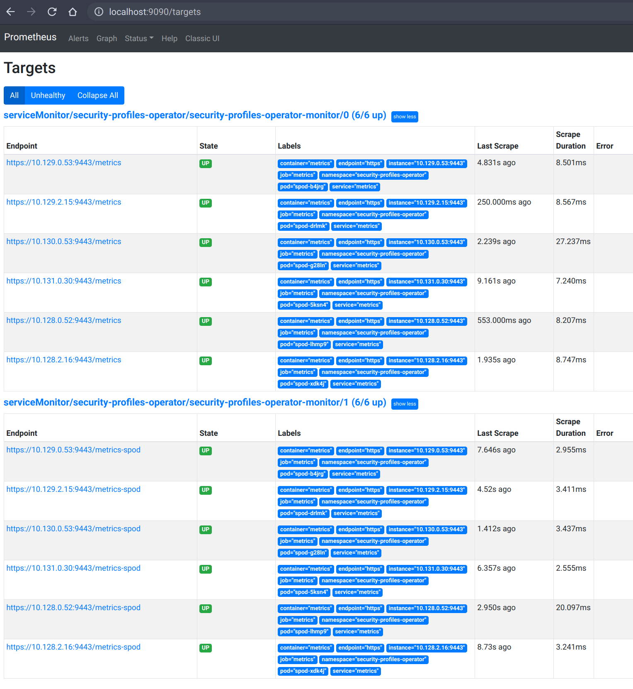
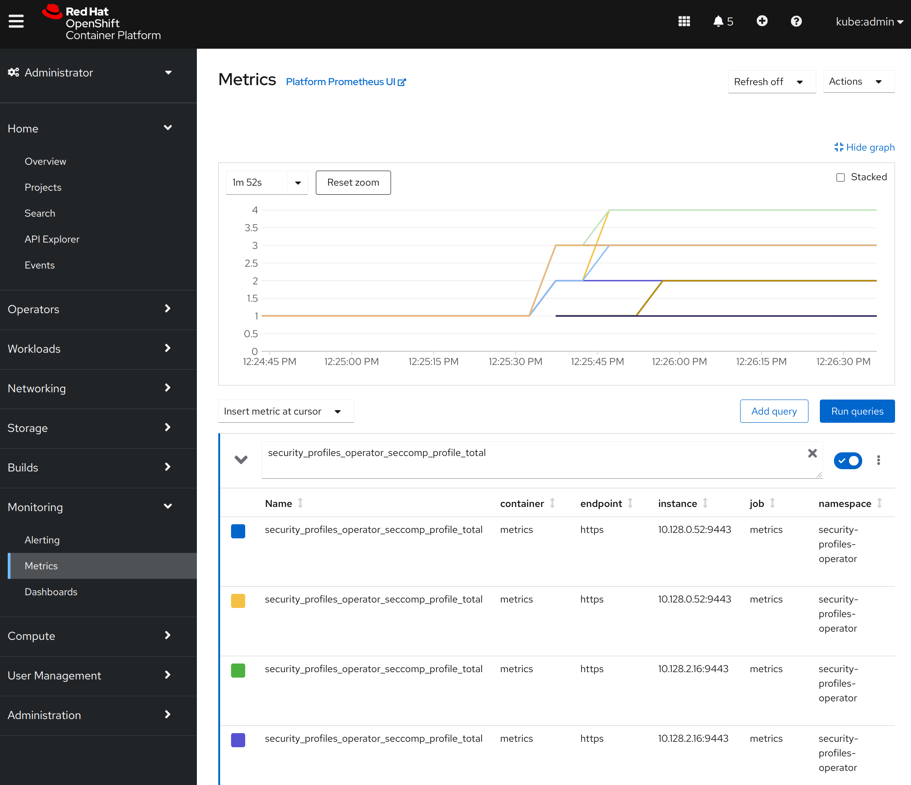

[Installation and Usage](installation-usage.md) | [Installation](installation.md) | [Profiles](profiles.md) | [CLI](cli.md) | **Metrics** | [Troubleshooting](troubleshooting.md)

<!-- toc -->
- [Metrics](#metrics)
  - [Available metrics](#available-metrics)
  - [Automatic ServiceMonitor deployment](#automatic-servicemonitor-deployment)
<!-- /toc -->

## Metrics

The security-profiles-operator provides two metrics endpoints, which are secured
by default using the [`WithAuthenticationAndAuthorization`](https://pkg.go.dev/sigs.k8s.io/controller-runtime/pkg/metrics/filters#WithAuthenticationAndAuthorization)
feature of the controller-runtime. All metrics are exposed via the `metrics` service within the
`security-profiles-operator` namespace:

```
> kubectl get svc/metrics -n security-profiles-operator
NAME      TYPE        CLUSTER-IP   EXTERNAL-IP   PORT(S)   AGE
metrics   ClusterIP   10.0.0.228   <none>        443/TCP   43s
```

The operator ships a cluster role and corresponding binding `spo-metrics-client`
to retrieve the metrics from within the cluster. There are two metrics paths
available:

- `metrics.security-profiles-operator/metrics`: for controller runtime metrics
- `metrics.security-profiles-operator/metrics-spod`: for the operator daemon metrics

To retrieve the metrics, just query the service endpoint by using the default
serviceaccount token in the `security-profiles-operator` namespace:

```
> kubectl run --rm -i --restart=Never --image=registry.fedoraproject.org/fedora-minimal:latest \
    -n security-profiles-operator metrics-test -- bash -c \
    'curl -ks -H "Authorization: Bearer $(cat /var/run/secrets/kubernetes.io/serviceaccount/token)" https://metrics.security-profiles-operator/metrics-spod'
…
# HELP security_profiles_operator_seccomp_profile_total Counter about seccomp profile operations.
# TYPE security_profiles_operator_seccomp_profile_total counter
security_profiles_operator_seccomp_profile_total{operation="delete"} 1
security_profiles_operator_seccomp_profile_total{operation="update"} 2
…
```

If the metrics have to be retrieved from a different namespace, just link the
service account to the `spo-metrics-client` `ClusterRoleBinding` or create a new
one:

```
> kubectl get clusterrolebinding spo-metrics-client -o wide
NAME                 ROLE                             AGE   USERS   GROUPS   SERVICEACCOUNTS
spo-metrics-client   ClusterRole/spo-metrics-client   35m                    security-profiles-operator/default
```

Every metrics server pod from the DaemonSet runs with the same set of certificates
(secret `metrics-server-cert`: `tls.crt` and `tls.key`) in the
`security-profiles-operator` namespace. This means a pod like this can be used
to omit the `--insecure/-k` flag:

```yaml
---
apiVersion: v1
kind: Pod
metadata:
  name: test-pod
spec:
  containers:
    - name: test-container
      image: registry.fedoraproject.org/fedora-minimal:latest
      command:
        - bash
        - -c
        - |
          curl -s --cacert /var/run/secrets/metrics/ca.crt \
            -H "Authorization: Bearer $(cat /var/run/secrets/kubernetes.io/serviceaccount/token)" \
            https://metrics.security-profiles-operator/metrics-spod
      volumeMounts:
        - mountPath: /var/run/secrets/metrics
          name: metrics-cert-volume
          readOnly: true
  restartPolicy: Never
  volumes:
    - name: metrics-cert-volume
      secret:
        defaultMode: 420
        secretName: metrics-server-cert
```

### Available metrics

The controller-runtime (`/metrics`) as well as the DaemonSet endpoint
(`/metrics-spod`) already provide a set of default metrics. Besides that, those
additional metrics are provided by the daemon, which are always prefixed with
`security_profiles_operator_`:

| Metric Key                    | Possible Labels                                                                                                                                                                                            | Type    | Purpose                                                                              |
| ----------------------------- | ---------------------------------------------------------------------------------------------------------------------------------------------------------------------------------------------------------- | ------- | ------------------------------------------------------------------------------------ |
| `seccomp_profile_total`       | `operation={delete,update}`                                                                                                                                                                                | Counter | Amount of seccomp profile operations.                                                |
| `seccomp_profile_audit_total` | `node`, `namespace`, `pod`, `container`, `syscall`                                                                                                                                                         | Counter | Amount of seccomp profile audit operations. Requires the log-enricher to be enabled. |
| `seccomp_profile_bpf_total`   | `node`, `mount_namespace`, `profile`                                                                                                                                                                       | Counter | Amount of seccomp profile bpf operations. Requires the bpf-recorder to be enabled.   |
| `seccomp_profile_error_total` | `reason={`<br>`SeccompNotSupportedOnNode,`<br>`InvalidSeccompProfile,`<br>`ProfileNotAllowed,`<br>`CannotPullSeccompProfile,`<br>`CannotSaveSeccompProfile,`<br>`CannotRemoveSeccompProfile,`<br>`CannotUpdateSeccompProfile,`<br>`CannotUpdateNodeStatus`<br>`}` | Counter | Amount of seccomp profile errors.                                                    |
| `selinux_profile_total`       | `operation={delete,update}`                                                                                                                                                                                | Counter | Amount of selinux profile operations.                                                |
| `selinux_profile_audit_total` | `node`, `namespace`, `pod`, `container`, `scontext`, `tcontext`                                                                                                                                            | Counter | Amount of selinux profile audit operations. Requires the log-enricher to be enabled. |
| `selinux_profile_error_total` | `reason={`<br>`CannotSaveSelinuxPolicy,`<br>`CannotUpdatePolicyStatus,`<br>`CannotRemoveSelinuxPolicy,`<br>`CannotContactSelinuxd,`<br>`CannotWritePolicyFile,`<br>`CannotGetPolicyStatus,`<br>`SystemModuleConflict`<br>`}` | Counter | Amount of selinux profile errors.                                                    |
| `apparmor_profile_total`       | `operation={delete,update}`                                                                                                                                                                                | Counter | Amount of AppArmor profile operations.                                                |
| `apparmor_profile_audit_total` | `node`, `namespace`, `pod`, `container`, `profile`, `operation`, `apparmor`                                                                                                                                | Counter | Amount of AppArmor profile audit operations. Requires the log-enricher to be enabled. |
| `apparmor_profile_error_total` | `profile`, `reason={`<br>`AppArmorNotSupportedOnNode,`<br>`CannotLoadAppArmorProfile,`<br>`CannotUnloadAppArmorProfile,`<br>`CannotUpdateAppArmorProfile,`<br>`CannotUpdateNodeStatus`<br>`}`               | Counter | Amount of AppArmor profile errors.                                                   |
| `apparmor_profile_denial_total`| `profile`, `operation`                                                                                                                                                                                     | Counter | Amount of AppArmor profile denials.                                                  |

### Automatic ServiceMonitor deployment

If the Kubernetes cluster has the [Prometheus
Operator](https://github.com/prometheus-operator/prometheus-operator) deployed,
then the Security Profiles Operator will automatically create a `ServiceMonitor`
resource within its namespace. This monitor allows automatic metrics discovery
within the cluster, which is pointing to the right service, TLS certificates as
well as bearer token secret.

When running on OpenShift and deploying upstream manifests or upstream OLM
bundles, then the only configuration to be done is enabling user workloads
by applying the following config map:

```yaml
apiVersion: v1
kind: ConfigMap
metadata:
  name: cluster-monitoring-config
  namespace: openshift-monitoring
data:
  config.yaml: |
    enableUserWorkload: true
```

Note that the above is not needed when deploying the Security Profiles Operator
on OpenShift from the Red Hat catalog, in that case, the Security Profiles
Operator should be auto-configured and Prometheus should be able to scrape
metrics automatically.

After that, the Security Profiles Operator can be deployed or updated, which
will reconcile the `ServiceMonitor` into the cluster:

```
> kubectl -n security-profiles-operator logs security-profiles-operator-d7c8cfc86-47qh2 | grep monitor
I0520 09:29:35.578165       1 spod_controller.go:282] spod-config "msg"="Deploying operator service monitor"
```

```
> kubectl -n security-profiles-operator get servicemonitor
NAME                                 AGE
security-profiles-operator-monitor   35m
```

We can now verify in the Prometheus targets that all endpoints are serving the
metrics:

```
> kubectl port-forward -n openshift-user-workload-monitoring pod/prometheus-user-workload-0 9090
Forwarding from 127.0.0.1:9090 -> 9090
Forwarding from [::1]:9090 -> 9090
```



The OpenShift UI is now able to display the operator metrics, too:


